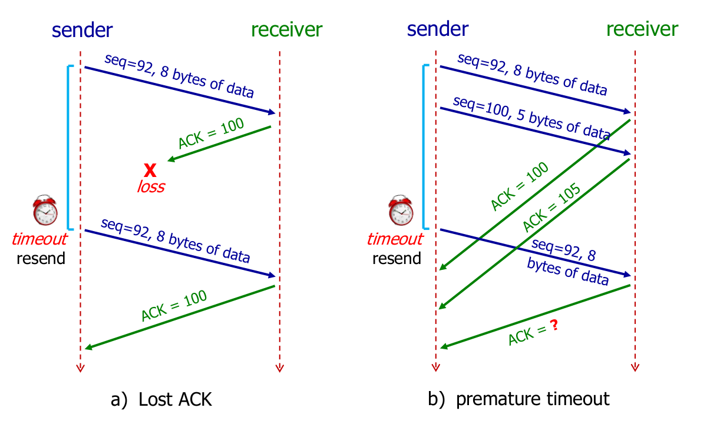

# Introduction

## The Internet

- Network of networks
- Organised into **Autonomous Systems** (AS) each owned by an organisation
- AS $\rightarrow$ Regional ISPs $\rightarrow$ Access ISPs $\rightarrow$ End users

## Circuit Switching

Network nodes establish a **dedicated communications channel** through the network before they communicate; Circuit functions as if the nodes were physically connected

- Setup/Teardown required
- Resources are reserved
- Service is guaranteed

## Packet Switching

Method of **grouping data** that is transmitted over a digital network into packets

- No setup
- Resources are not reserved
- Service is best effort

**The Internet is a packet switching network**:

- Data is segmented into smaller packets
- Store & Forward: entire packet must arrive at a router before it can be transmitted to next link

## Delays

1. **Processing** ($d_{proc}$)
   - Check bit error
   - Determine output link
   - Typically < msec
2. **Queuing** ($d_{queue}$)
    - Waiting in the queue for transmission
    - Dependent on congestion level of router
3. **Transmission** ($d_{trans}$)
    - Time taken to push all packet's bits onto the wire
    - $d_{trans} = \frac{L}{R}$, $L$ = packet size (bits), $R$ = link bandwidth (bps)
4. **Propagation** ($d_{prop}$)
    - $d_{prop} = \frac{d}{s}$, $d$ = length of physical link, $s$ = propagation speed
5. **End-to-End** ($d_{end-to-end}$)
    - $d_{end-to-end} = d_{proc} + d_{queue} + d_{trans} + d_{prop}$
    - Ensure units are consistent! (ie. bits vs bytes)
6. **Round Trip Time** (RTT)
    - Defined to be round trip propagation delay
    - $d_{prop} = \frac{\text{RTT}}{2}$

# Application Layer

An **application layer** is an [abstraction layer](https://en.wikipedia.org/wiki/Abstraction_layer) that specifies the shared [communications protocols](https://en.wikipedia.org/wiki/Communications_protocol) and [interface](https://en.wikipedia.org/wiki/Interface_(computing)) methods used by [hosts](https://en.wikipedia.org/wiki/Host_(network)) in a communications network

## Client-Server Architecture

|            Client             |                Server                |
| :---------------------------: | :----------------------------------: |
| Initiates contact with server |     Waits for incoming requests      |
| Requests service from server  | Provides requested service to client |

## P2P Architecture

- No always-on server
- Peers request service from other peers
- Complex to manage as peers are intermittently connected and IP can change

## HTTP 1.0

- **Non-persistent**
  - New TCP connection request has to be sent for each web resource/object
    - At most one object sent per TCP connection
    - Downloading multiple objects require multiple connections
  - Requires 2 RTTs per object
- **Sequential**
  - Files have to be loaded 1-by-1
  - Massive overhead

## HTTP 1.1

- **Persistent**
  - Server **leaves connection open** after sending response
  - Only requires **1 TCP connection** to load **ALL** required server objects
  - As little as one RTT to *fetch* referenced objects
- **Pipelined**
  - New requests can be made even before receiving responses for older requests
  - They still need to be received back in the order of request (head-of-line blocking)

## HTTP 2.0

- Retains all HTTP 1.1 properties
- **Multiplexing**
  - Allow fractions of a file to be received at different times (any order, any time)
  - Thus, heavy requests will not block the server

> In all cases, the **HTML file must be loaded first**

## HTTP Request

- `OPTIONS`: request for information about the communication options available on the request/response chain
- `GET`: retrieve whatever information identified by the Request-URI
- `HEAD`: identical to `GET` except that the server *MUST NOT* return a message-body in the response (ie. only headers are sent)
- `POST`: sends data to a specific URI and expects the resource at that URI to handle the request
  - The web server at this point can determine what to do with the data in the context of the specified resource
- `PUT`: puts a file or resource at a specific URI, and exactly at that URI
  - If there's already a file or resource at that URI, `PUT` **replaces** that file or resource 
  - If there is no file or resource there, `PUT` creates one
- `DELETE`: requests that the origin server delete the resource identified by the Request-URI
- `TRACE`: invoke a remote, application-layer loop- back of the request message

```bash
GET /~cs2105/demo.html HTTP/1.1\r\n
HOST: www.comp.nus.edu.sg\r\n
User-Agent: Mozilla/5.0\r\n
Connection: close\r\n
\r\n # Empty line marks end of headers
```

- Line 1 is the request line, `<METHOD, URI, HTTP_VERSION>`
  - `METHOD`: `GET`, `POST`, `PUT`, etc. 
  - `URI`: Uniform Resource Identifier
  - `HTTP_VERSION`
- Line 2-4 are the header lines,
  - `HOST`: where the object resides (`HOST` + `URI` = URL)
  - `User-Agent`: the browser type making the request
  - `Connection`: whether to keep the connection persistent or not

## HTTP Response

```sh
HTTP/1.1 200 OK\r\n
Date: Wed, 23 Jan 2019 13:11:15 GMT\r\n
Content-Length: 606\r\n
Content-Type: text/html\r\n
...
\r\n
# Start of content body
DATA DATA ... DATA
```

- Line 1 is the status line
  - Contains response code (`200 OK`, `403 Forbidden`, `404 Not Found`, )
- Lines 2-4 are the header lines,
  - `Date`: refers to date and time at which the message was originated
  - `Content-Length`: Number of bytes of data in the content body (line 7 onwards)

### Conditional GET

Objects shouldn't be sent if client has an up-to-date cached version

1. Client sends date of cached copy when requesting : `If-modified-since: <DATE>`
2. Server respond with `304 Not Modified` with **empty** content body

|           Code            |                           Details                            |
| :-----------------------: | :----------------------------------------------------------: |
|          200 OK           |                      Request succeeded                       |
|        201 Created        |                     Resource is created                      |
|       202 Accepted        | Indicates that request has been accepted for processing, <br />but the processing has not been completed |
|      204 No Content       | Server declines to send back any status message in response message's body |
|   301 Moved Permanently   | Requested object moved, new location specified later in message |
|     304 Not Modified      |               Sent during a conditional `GET`                |
|      400 Bad Request      |  Generic error code: syntax errors, invalid parameters etc.  |
|     401 Unauthorised      | Client tried to operate on a protected resource without providing the proper authorisation |
|       403 Forbidden       |        Server declines to show the requested webpage         |
|       404 Not Found       |         Requested document not found on this server          |
| 500 Internal Server Error |   Server's own runtime exception; never the client's fault   |

## Cookies

- HTTP is designed to be stateless (server maintains no info about past client requests)
- Cookies are **used to maintain state**


## DNS (Domain Name System)

- Translates hostname (www.google.com) to its corresponding IP address (293.185.23.65)
- Runs on **UDP**
  - UDP is much faster than TCP since 3-way handshake is needed for TCP
  - Much smaller packet header overhead for UDP
- **Recursive**:
  - DNS client requests information from a DNS server that is set to query subsequent DNS servers until a definitive answer is returned to the client
  - Subsequent DNS queries made from first DNS server are iterative queries
  - Vulnerable to:
    - DDOS attacks
    - DNS cache poisoning
    - Easily hijacked
    - Root name server performance degradation
- **Iterative**:
  - Ask a central hub DNS to search the other DNS
  - DNS server is queried and returns an answer without querying other DNS servers, even if it cannot provide a definitive answer
- **TLD (Top-Level Domain) Servers**: responsible for `com`, `org`, `net`, `edu`, etc. and all top-level country domains like `uk`, `sg`, ...
- **Authoritative Servers**: organisations own DNS server(s), providing authoritative hostname to IP mappings for organisations named host
- **Root Servers**: Answers requests for records in the root zone by returning a list of the authoritative name servers for the appropriate TLD

Assuming **non-persistent** and **non-parallel** protocol, time taken to fetch a web page is:

1. Time taken to **lookup IP via UDP** (if IP not cached)
2. Time taken to **get HTML page via TCP** (1 connection needed)
3. Time taken to **get all objects referenced in HTML via TCP** (opens as many connections as there are objects)


## RR (Resource Record)

- Mapping between host names and IP addresses
- format: `<NAME, TTL, CLASS, TYPE, VALUE>`
  - `TTL`: Time to live
  - `CLASS`: Almost always `IN` for Internet
  - eg. `www.google.com.        196    IN    A    74.125.68.104`

| TYPE  |          NAME           |                 VALUE                 |
| :---: | :---------------------: | :-----------------------------------: |
|   A   |        hostname         |              IP Address               |
|  NS   | domain (eg. nus.edu.sg) | hostname of authoritative name server |
| CNAME |       alias name        |         canonical (real) name         |
|  MX   |        hostname         |          name of mail server          |

## DNS Caching

- Every ISP has a local DNS server (also called **default name server**)
- Resources cached as RR, stored on local DNS servers
  - Cached entries may be out of date and only expire after `TTL` expires
  - If name host changes IP address, it may not be know until ALL TTLs expire
- Every DNS query from host is first sent to local DNS server
    1. If server has cached RR, just return the RR
    2. If server does not have cached RR, local DNS server acts as proxy to forward query into hierarchy

## UDP Socket

- Client attaches destination IP address and port number to **every packet**
- Server extracts client's IP address and port number from the received packet
- Only uses **one socket to serve all clients**
- Transmitted data may be lost or received out of order

```python
#### SERVER ####
# SOCK_DGRAM is the UDP socket
serverSocket = socket(AF_INET, SOCK_DGRAM)
# bind socket to local port number 2105
# throws error if port number is already in use
serverSocket.bind(('localhost', 2105))

# receive 2048B of data
message, clientAddress = serverSocket.recvfrom(2048)
print(f"Message: {message}; From: {clientAddress}")

serverSocket.close()
```

```python
#### CLIENT ####
clientSocket = socket(AF_INET, SOCK_DGRAM)

# send "hello", together with server IP and port number
clientSocket.sendto("hello".encode(), ('localhost', 2105))

clientSocket.close()
```

## TCP Socket

- **Maintains a welcome socket** (to help usher client)
  - A new socket is made when contacted by a client
  - $n+1$ sockets needed for $n$ connections
  - Allows server to talk to multiple clients simultaneously
- Client do not have to attach IP address and port number after handshake is initialised
- Identified by 4-tuple: `(srcIP, srcPort, destIP, destPort)`

```python
#### SERVER ####
serverSocket = socket(AF_INET, SOCK_STREAM)

# throws error if port number is already in use
serverSocket.bind(('localhost', 2105))

# Welcome socket, listening for new connections
serverSocket.listen(1)

# Returns a NEW socket to communicate with client
connectionSocket, clientAddr = serverSocket.accept()
message = connectionSocket.recv(2048)
print(f"Message: {message}; From: {clientAddr}")

connectionSocket.close()
```

```python
#### CLIENT ####
clientSocket = socket(AF_INET, SOCK_STREAM)
# initialise handshake with TCP server on port 2105
clientSocket.connect(('localhost', 2105))
# After handshake, port number that clientSocket binds to is randomly chosen (OS dependent) and NOT 2105 -> used for welcome port

# Note: no need to attach server IP and port
clientSocket.send("hello".encode())

clientSocket.close()
```

# Transport Layer

The protocols of this layer provide host-to-host communication services for applications.

## UDP (User Datagram Protocol)

- Transmission is **unreliable** (often used by streaming services)
- No initial handshake (less delay compared to TCP)
- Simple; no connection state at client/server
- Small header size
- No congestion control (for speed)
- Connection-less de-multiplexing
  - Every datagram must be specified with destination IP and port
  - IP datagrams (from different sources) with the same destination port will be directed to the same UDP socket at destination

### UDP Header (8 Bytes)


- **Length**: total size in bytes of the UDP header and UDP data 
  
  - Minimum length $= 8$B (just the UDP header alone)
  - Theoretical max length $= 65535$B ($8$B header + $65527$B of data)
  
- **Checksum**: to detect errors in both header and data
  
  - To compute:
    1. do bitwise addition

       ```
            1111 0100
       +    1001 0101
       +    1101 1101
       = 10 0110 0110
       ```

    2. if carry, add carry to LSB

       ```
         0110 0110
       +        10
       = 0110 1000
       ```

    3. take 1s complement (invert 1s and 0s)

       ```
         0110 1000
       = 1001 0111
       ```

> **Checksum vs Sum**
>
> Checksum is used to simplify client code; Client simply takes the sum of all 16-bit words of the segment together with the checksum. If no errors, result should be all bits `1`. If any `0` is detected, receiver knows immediately that there is an error

## RDT (Reliable Data Transfer)

### RDT 1.0

Assumption

1. Channel is perfectly reliable

> Extremely naive approach

### RDT 2.0

Assumptions

1. Packets may **only be corrupted**
2. ACK is **not corrupted**

Solution to handle corrupted packets:

- Receiver sends NAK when corrupted packet received

Flaw:

- Possible for ACK to be corrupted

### RDT 2.1

Assumptions

1. Packets may be corrupted
2. ACK/NAK may be corrupted

Solution to handle duplicates:

- Sender adds **sequence number** to each packet
- Receiver discards duplicate packet

### RDT 2.2 (NAK-free)

Assumptions

1. Packets may be corrupted
2. ACK may be corrupted

Solution:

- Receiver sends ACK for **last non-corrupted received packet**
- Receiver sends sequence number of last correctly received packet in ACK message

### RDT 3.0

Assumption:

1. Packets may be **lost**
2. Packets may be **corrupted**
3. Packets may be **delayed**
4. But packets **will not be re-ordered**

Solution to handle packet delay:

1. Receiver waits for a reasonable amount of time for ACK
2. Sender re-transmit on timeout of waiting for ACK

Example: packet size, $L = 8000 bits$, link rate, $R = 1 Gbps$, $RTT = 30 msec$,

$d_{trans} = \frac{L}{R} = \frac{8000 bits}{10^9 bits/sec} = 0.008 msec$
$throughput = \frac{L}{RTT + d_{trans}} = \frac{8000}{30.008} = 267 kbps$

$U_{sender} = \frac{d_{trans}}{RTT + d_{trans}} = \frac{0.008}{30 + 0.008} = 0.00027s$

>Performance is bad: even though link rate is $1Gbps$, in practice only $267kbps$ is achieved, and only $0.00027s$ of time is spent actually sending something

| Version |                          Scenario                           |                        Features Used                         |
| :-----: | :---------------------------------------------------------: | :----------------------------------------------------------: |
|   1.0   |                          No error                           |                             None                             |
|   2.0   |                      Corrupted Packet                       |                   Checksum<br />ACK & NAK                    |
|   2.1   |           Corrupted Packet<br />Corrupted ACK/NAK           |         Checksum<br />ACK & NAK<br />Sequence Number         |
|   2.2   |           Corrupted Packet<br />Corrupted ACK/NAK           |            Checksum<br />ACK<br />Sequence Number            |
|   3.0   | Corrupted Packet<br />Corrupted ACK/NAK<br />Dropped Packet | Checksum<br />ACK<br />Sequence Number<br />Timeout/Re-transmission |

## GBN (Go-Back-N)

### Sender/Server

- Maintains timer for the **oldest** unACKed packet
  - on timeout, re-transmit packet $n$ and all subsequent packets in the window
- Has size $N$ buffer to keep track of $N$ unACKed packets
  - Transmission will stop if buffer is full
  - Potential max buffer size = $s$, where $s$ is the maximum sequence number, if sender is not limited by memory

### Receiver/Client

- Cumulative ACK
  - only ACK packets that arrive in order
  - `ACK(M)` means receiver has received **all bytes up till `M`**
  - On receiving `ACK(n)`, advance start of window to $n + 1$
- Has no buffer
- only keeps track of expected sequence number
  - discards all out of order packets

**Receiver upon receiving out of order packets:**


**Sender packet loss:**


**Receiver ACK loss:**


## SR (Selective Repeat)

### Sender/Server

- Maintains individual timer for **each** unACKed packet
  - On timeout, re-transmit **only that unACKed packet**
- On receiving `ACK(n)`, if $n$ is smallest unACKed packet, advance window to $n + 1$
- Has buffer to buffer out-of-order packets

### Receiver/Client

- **Individually acknowledges** all correctly received packets
- Non-cumulative ACK
  - Able to hold out of order packets
  - `ACK(M)` means receiver has **received packet `M` only**
- Has buffer to buffer out-of-order packets

- Max window size = $0.5s$, where $s$ is the maximum sequence number
  - Cannot shift window forward should a packet in the first window be dropped (duplicated ACK if this happens)


## TCP (Transmission Control Protocol)

- Bi-directional data flow **between exactly two endpoints**
  - Broadcast messages are **not allowed**
- Reliable, in-order byte stream
- Maximum Segment Size (MSS) usually $\approx$ 1,460 bytes
  - Max amount of **application data**; does not take into account **header data**
  - Maximum size of a TCP message is thus $>$ MSS
- Fast re-transmission
  - if sender receives 4 ACKs for the same segment, sender will immediately send the packet specified by the ACKs (no need to wait for timeout)

### TCP Header (20 Bytes)


- **ACK**: value is the next sequence number of packet that receiver is expecting
  - Cumulative , 32 bits long
  - If receiver sends `ACK(M)` it means receiver has received **all bytes up till `M-1`**
    - Given two sequence numbers $ S_{start}$ and $S_{end}$, and size of a segment, $MSS$, find all possible number of ACK segments, $k$ sent
      - Usually: $k_{usually} = \frac{S_{start} - S_{end} + MSS}{MSS}$
      - Least: $k_{least} = \left \lceil{\frac{k_{usually}}{2}}\right \rceil $ $\rightarrow$ packets arrive within 500ms of one another
      - Most: $k_{most} = \infty \rightarrow$ packets keep constantly getting lost
- **Sequence Number**: byte number of the **first byte** of data in the segment
  - 32 bits long, randomly chosen at the start within [$0$, $2^{32} - 1$] inclusive
  - If max range is exceeded, number wraps around to 0
  - For every **byte of data sent**, sequence number increases by 1 (thus, total of $2^{32}$ possible numbers before sequence number is reused/exhausted)
    - Given two sequence numbers $ S_{start}$ and $S_{end}$, total size of data sent, $size_{total}$,
      - If no wraparound: $size_{total} = S_{end} - S_{start} + MSS$
      - If wraparound: $size = (2^{32} - S_{start}) + (S_{end}) + MSS$
- **SYNbit**: to synchronise sequence numbers and **only** set to `1` during 3-way handshake
- **FINbit**: used to end connection
- **Checksum**: error-checking of both the header and data

### Receiver Events

1. **In-order** segments
   - All data already ACKed
     - Wait up to 500ms for next segment (only done once)
     - Send ACK if no segment arrives
   - Previous segment not yet ACKed (due to 500ms wait)
     - Send cumulative ACK immediately
2. **Out-of-order** segment with higher sequence number than expected (gap created)
   - Immediately send duplicate ACK of expected byte
3. Segment partially or completely fills gap
   - send cumulative ACK immediately

### Timeout Value

$RTT_{estimated} = (1 - \alpha)RTT_{estimated} + (\alpha)RTT_{sample}$, $\alpha = 0.125$ typically

$RTT_{dev} = (1 - \beta)RTT_{dev} + (\beta)|RTT_{sample} - RTT_{estimated}|$, $\beta = 0.25$ typically

$Timeout = RTT_{estimated} + 4RTT_{dev}$

|                     Establish Connection                     |                       Close Connection                       |
| :----------------------------------------------------------: | :----------------------------------------------------------: |
|  |  |



# Network Layer

The network layer is responsible for [packet forwarding](https://en.wikipedia.org/wiki/Packet_forwarding) including [routing](https://en.wikipedia.org/wiki/Routing) through intermediate [routers](https://en.wikipedia.org/wiki/Router_(computing)) and provides for the means of transferring variable-length [network packets](https://en.wikipedia.org/wiki/Network_packet) from a source to a destination [host](https://en.wikipedia.org/wiki/Host_(network)) via one or more networks.

## IP Address (Internet Protocol)

- Used to identify a host or a router
- Either manually configured or automatically assigned by a DHCP server
- ISPs can get a block of addresses from **ICANN** (Internet Corporation for Assigned Names). Other things they do include allocating addresses, managing DNS, and assigning domains names

|                    Special Addresses                     |                         Present Use                          |
| :------------------------------------------------------: | :----------------------------------------------------------: |
|                       `0.0.0.0/8`                        |          Non-routable meta-address for special use           |
|                      `127.0.0.0/8`                       | Loop back address. A datagram sent to an address within this block loops back inside the host. |
| `10.0.0.0/8` <br />`172.16.0.0/12`<br />`192.168.0.0/16` | Private addresses, can be used without any coordination with IANA or an internet registry |
|                   `255.255.255.255/32`                   | Broadcast address. All hosts on the same subnet receive a datagram with such a destination address |

### Subnet/CIDR (Classless Inter-Domain Routing)

| Network/Subnet Prefix |   Host ID   |
| :-------------------: | :---------: |
|        n bits         | 32 - n bits |

- "Directly" interconnected hosts
- Hosts in same subnet have same network prefix
- Hosts in same subnet can physically reach each other without intervening router
- Connect to the outside world through a **router**
- Subnet prefix is of arbitrary length
- **Format**: `a.b.c.d/x` where `x` MSB of IP address is the subnet prefix
- **Maximum** number of **IP addresses in subnet** $= 2^{32 - x}$, where $x$ is the number of bits of the subnet prefix
- **Subnet Mask**: to determine which subnet an IP address belongs to
  - Set all subnet prefix bits to `1` and host ID bits to `0`
  - eg. for `200.23.16.42/23`, subnet mask = `255.255.254.0`

### Private IP

- The IANA (Internet Assigned Numbers Authority) has reserved 3 blocks of IP address space for private networks: `10.0.0.0/8`, `172.16.0.0/12`, `192.168.0.0/16`
- An enterprise can decide to use these private IP addresses without coordination with IANA or an internet registry
- Private IP does not have IP connectivity to any host outside of the local enterprise
- NAT/Application layer gateways are needed to map private to public address and vice versa

### Hierarchical Addressing

- Allows for efficient advertisement of routing information

### DHCP (Dynamic Host Configuration Protocol)

- Allows a machine to **dynamically** (and automatically) obtain an IP address (ie. when connecting to NUS network)
- Runs over **UDP**
  - Client has no idea what DHCP server's IP address is, thus "DHCP discover" message needed
  - "DHCP discover" message is a broadcast message (TCP doesn't support broadcasts)

#### 4-Step Process

1. Host broadcasts "**DHCP discover**" message
2. DHCP server responds with "**DHCP offer**" message
   - IP address offered is in `yiaddr` field
   - IP address of **first hop router** and **DNS server** is also given
3. Host requests offered IP address: "**DHCP request**" message 
   - Host can have multiple DHCP offers, but can only accept one
4. DNS server sends "**DHCP ACK**" message to acknowledge host


## Intra-AS Routing

- Finding APSP within an AS (Autonomous System)
- $c(x,y)$: cost of link between routers $x$ and $y$
  - $c(x,y) = \infty$ if $x$ and $y$ are **not direct neighbours**
- $d_x(y)$: cost of least-cost path from $x$ to $y$ (from $x$'s view)

### Distance Vector (DV) Algorithm

- DV: a table containing the shortest distances discovered to all other node

- Every router ($x,y,z$) sends its distance vectors to its directly connected neighbours
- When $x$ finds out that $y$ has a path to $z$ that is cheaper than $x$ currently knows,
  - $x$ updates its distance vector to $z$ accordingly
  - $x$ will note down that all packets for $z$ should be sent via $y$ (creating forwarding table of $x$)
- After several rounds of exchanges, all routers will know least-cost paths to one another

Steps:

1. Routers only know direct neighbours at start up
2. Routers exchange this information to their direct neighbours
3. When neighbours exchange their information, update own local view
4. Recursively do step 2, 3 till end

> $$d_x(y) = min_v\{c(x,v) + d_v(y)\}$$
>
> where $min$ is taken over all direct neighbours $v$ of $x$

### RIP (Routing Information Protocol)

- Implements the DV algorithm: **uses hop count** as the cost metric
  - Thus, **insensitive to network congestion**
- Entries in the routing table are aggregated subnet masks (so we are routing to destination subnet)
- Exchange routing table every 30 seconds over **UDP port 520**
- **Self repairing**: If no update from a neighbour router for 3 minutes, assume neighbour has failed

## NAT (Network Address Translation) Router

- Within local network, hosts use private IP addresses for communication
  - **Ease**: addresses of hosts in local network can change without troubling outside world
  - **Security**: hosts inside local network not explicitly addressable and visible to outside world
- All IP datagrams leaving local network will have their source IP address in the IPv4 header changed to be the same as the NAT's IP address

### NAT Router

1. Replace `[Source IP, Port]` of every outgoing datagram to `[NAT IP, New Port]`
2. Remembers the mapping from `[Source IP, Port]` to `[NAT IP, New Port]` in the NAT Translation Table
3. Replace `[NAT IP, New Port]` in destination field of every incoming datagram with corresponding `[Source IP, Port]` found in the NAT Translation Table

**New Port** have to be used to distinguish between 2 senders who used the same port number to NAT. If not, NAT cannot distinguish between these 2 senders when the data is received from destination


## IPv4 Datagram Format

### IPv4 Header (20 Bytes)


- **Version**: IP protocol version number
- **Total Length**: entire packet size in bytes, including header and data
  - Minimum size = $20$ Bytes (header without data)
  - Max size = $65535$ Bytes
- **Identification**: for IP Fragmentation/Reassembly (refer to next section under IP Fragmentation)
  - Group of fragments of a single IP datagram will have the same unique indentifier
- **Flags**: for IP Fragmentation/Reassembly
  - Use to control or identify fragments
- **Fragment Offset**: for IP Fragmentation/Reassembly
- **TTL**: number of remaining hops
  - Decrements by 1 for every hop
  - When TTL hits 0, router discards the packet and sends *ICMP Time Exceeded* error message to datagram's source IP address
  - Prevents data from being circulated forever
- **Protocol**: defines protocol used in the data portion of the IP datagram (ie. UDP, TCP, etc.)
- **Header Checksum**: error-checking of the header only
  - Packet is discarded if error is detected
  - Errors in the data field must be handled separately by the encapsulated protocol
  - **Recalculated whenever a packet arrives at a router**, since TTL field needs to be decremented
- **Source/Destination IP Address**: may be changed in transit by NAT

### IP Fragmentation

- **MTU** (Max Transfer Unit): maximum amount of data a link-level frame can carry
- Different links have different MTU, some routers will need to break up original payload to smaller ones
- Destination host will be responsible for reassembling the packet
- If any **fragment is lost**, entire datagram will also be lost
- **ID**: never changes for fragments of an original packet
- **Frag flag** is set to
  - `1` if there is next fragment from same segment
  - `0` if this is the last fragment
- **Fragment Offset** $= \frac{\sum\text{IP Payload}}{8}$
  - The number of bytes is guaranteed to be able to be divided by 8 (the why is out of syllabus)
  - First fragment will have an offset of $0$
  - Maximum offset of $2^{13}-1\times 8 = 65528$ Bytes
    - This exceeds maximum IP packet length of $65535$B, with IP header length included ($65528+20 = 65548$)
- Transport layer protocol (UDP/TCP) has no knowledge of IP fragmentation even happening
  - UDP/TCP headers will **only appear for first fragmented message**
  - Checksum in the UDP/TCP protocols will only be calculated and checked after reassembly
- New 20 byte IPv4 headers will be attached to each individual fragments

#### Example


Given MTU $= 500$ bytes, IP Header $= 20$ bytes, and total $1200$ bytes of data to send,

- Total of 3 fragments will be generated
- Fragment 3's flag is set to `0` (since it is the last packet)
- Only fragment 1 will contain original UDP header from original IP datagram
- Offset for fragment 2 $= \frac{(500-20) + (500-20)}{8} = 120$
- Total size of all fragments $= 500+500+240=1240$ bytes
  - Overhead of 40 bytes due to adding of two new IPv4 headers

## ICMP (Internet Control Message Protocol)

- Used by hosts and routers for **error reporting/debugging**
- ICMP messages are **carried in IP datagrams**
- ICMP headers starts after IP header

| Type | Code |         Description          |
| :--: | :--: | :--------------------------: |
|  8   |  0   |     Echo request (ping)      |
|  0   |  0   |      Echo reply (ping)       |
|  3   |  1   | Destination host unreachable |
|  3   |  3   | Destination port unreachable |
|  11  |  0   |         TTL expired          |
|  12  |  0   |        Bad IP header         |

# Network Security

- **Confidentiality**: others cannot tell what you are sending
- **Integrity**: message isn't modified from source
- **Authenticity**: message can be traced back to original sender
- **Verifiable**: receiver can verify that sender and no one else, has signed the document
- **Non-repudiation**: a third party can verify exactly who signed the document
- Decided upon during TCP handshake

## Symmetric Key

- Involves use of **one** key shared by sender and receiver
- Popular algorithms: DES (Data Encryption Stanard), AES (Advanced Encryption Standard)
- Requires sender and receiver to share a key
  - Difficult for both to agree and share same key

## Public Key

- Involves use of a pair of keys
- Public encryption key, $K^+$, is known to the world
- Private decryption key, $K^-$, is known only to receiver

1. Receiver generates public and private keys
2. Receiver gives public key to sender (or the world, doesn't matter since only receiver have private decryption key)

## RSA (Rivest, Shamir, Adelson Algorithm)

- Public key is the product of 2 very large primes
- Private key is derived from these 2 large primes
- Given a public key, it should be statistically very difficult (*not impossible*), to derive private key
- Encrypting with private key then decrypting with public key will yield correct/same result as encrypting with public key and decrypting with private key
  - $K^-(K^+(m)) = m = K^+(K^-(m))$
- Is computationally intensive (DES $\geq$ 30 times faster than RSA)
  - Use RSA to exchange a session/DES Symmetric Key
  - Use this Symmetric Key to communicate for this session

## Cryptographic Hash Functions

### Message Digest

**MD5** (Message Digest, 128 bits), **SHA-1** (Secure Hash Algorithm, 160 bits)

- Generates a **fixed length string/hash** using the input
- **One-way function**: unable to compute original message from hash
- Computationally infeasible (*not impossible*) to find 2 different messages that make the same hash
- Can verify the **integrity** of the original message (has not been modified)
- **Cannot prove the authenticity**/origin of the message

Sending example:

1. Sender **creates message** $m$ and **calculate hash** $H(m)$
2. Append $H(m)$ to $m$, making $(m,H(m))$ $\rightarrow$ send this to receiver
3. Receiver **calculates** his own $H(m)$, and **compares** with received $H(m)$

### MAC (Message Authentication Code)

- When a **shared secret key** is used as part of the MD generation: $H(m, K)$
  - **Repudiable**: cannot prove to a third party exactly who produced the MAC
- Can **detect accidental/intentional changes** to message and **affirm message's origin** *for receiver*

Sending example:

1. Sender **hashes the message** and the **key**: $H(m,K)$

2. Append $H(m,K)$ to $m$. making $(m,H(m,K)) \rightarrow$ send this to receiver

3. Receiver can calculate his own $H(m,K)$ to check if either $m$ or $K$ has been altered

### Digital Signature (Encrypted Hash)

- Digital signature should be **unique to everybody**

- Sender sends original message, together with message encrypted by private key
- Receiver (anybody) can use the public key to decrypt encrypted message and compare with original message

Sending example:

1. Sender signs $m$ by encrypting it with his private key $K^-$, creating **signed message** $K^-(m)$
2. Append $K^-(m)$ to $m$, making $(m,K^-(m)) \rightarrow$ send this to receiver
3. Receiver has sender's public key $K^+$, and can decrypt $K^-(m)$ and compare with original $m$

> Since a message can be **arbitrarily long**, this method can be **computationally slow** as every $m$ has to be encrypted/decrypted via RSA

To improve efficiency:

1. Sender **hash** the **message** first: $H(m)$ (since hashes are fixed length, this improves efficiency)
2. Then **encrypts the hash** via RSA (**Signed Message Digest**): $K^-(H(m))$
3. Sender sends both the encrypted hash and original message: $(m,K^-(H(m)))$
4. Receiver decrypts $K^-(H(m))$ with sender's public key $K^+$
5. Receiver hashes original $m$ and compares with decrypted $H(m)$ in step 4

## Digital Certificate

- To verify **authenticity** and certify ownership of a **public key**
  - If not, Alice can use her own public key but claim it's Bob's
- Certificate Authority (CA) will encrypt Alice's public key $K_A^+$ with CA's private key $K_{CA}^-$ to get $K_{CA}^-(K_A^+)$
- Bob can decrypt $K_{CA}^-(K_A^+)$ using CA's public key $K_{CA}^+$ to get Alice's public key
- Recursively go up the CA levels if you don't trust the current level

# Link Layer

Sends datagram between adjacent nodes (hosts or routers) over a single link. IP datagrams are encapsulated in link-layer frames for transmission.

## Framing

- Encapsulates datagram into frame, adding header and trailer to payload
- Every node will **remove** header and trailer and **add** a new header and trailer
  - As different nodes may use different protocols

## EDC (Error Detection and Correction)

- Some errors might still be missed $\rightarrow$ the larger the EDC fields, the better the detection

### Parity Checking

Single Bit Parity:

- Can **only detect single bit** errors

Steps:

1. Take individual sum of all the bits (ignore carry)

Two-dimensional Bit Parity:

- Can **detect** and **correct single bit** errors
- Can **detect** but **not correct** any **two bit** errors

Steps:

1. Divide bits equally to form matrix
2. Compute **row parity bits**, **col parity bits**, and **parity bit of row parity bits and col parity bits** (since row parity bits and col parity bits themselves can be corrupted)
3. Send all computation to receiver

### CRC (Cyclic Redundancy Check)

$R = D \, \% \, G$,
$R$ is CRC of $r$ bits,
$D$ is binary, 
$G$ is generator of $r+1$ bits, agreed by sender and receiver

- Sender sends $(D, R)$
- Receiver divides $(D, R)$ by $G$
- **Error when remainder is non-zero**

To compute, do bit-wise XOR operation without carry or borrow:

1. If numbers are the same, next number $= 0$
2. If numbers are different, next number $= 1$


## Network Links

### Point-to-Point

- Sender and receiver connected by a dedicated link (or through a switch)

### Broadcast

- Multiple nodes connected to a shared broadcast channel
- When a node transmits a frame, the channel broadcasts the frame and each node receives a copy
- If two or more nodes transmit simultaneously, collisions will happen $\rightarrow$ requires Multiple Access Protocols to work properly

## Multiple Access Protocols

### TDMA (Time Division Multiple Access)

- Round robin access to channel
- Assign **fixed** length time slot for each node
- Unused slots will leave channel idle
  - Other nodes cannot use unused slots if it is not their slots

### FDMA (Frequency Division Mutiple Access)

- Assign **fixed** frequency band for each node
- Nodes transmit simultaneously, but at different frequencies

> FM Radios are an example of FDMA usage

### Polling

- Master node "invites" slave nodes to transmit in turn

Cons:

- Inefficient: polling overhead (1 RTT to ask if slave nodes have data to send)
- Not robust: single point of failure at the master node

### IBM Token Ring (IEEE 802.5)

- Control token is passed from one node to next sequentially

Cons:

- Inefficient: token overhead
- Not robust: single point of failure (token)

## Random Access Protocols

### Slotted ALOHA

- All frames to be transmitted are of equal size
- Time is divided into slots of equal length (length = time to transmit 1 frame)
- Nodes transmit only at the beginning of a slot
- Nodes transmit (or re-transmit) with a probability $p$
- Nodes listens to channel while transmitting and if collision happens, node will drop frames and go to next slot 


### Pure Unslotted ALOHA

- Transmit immediately when there is a fresh frame
- No slots, no time frames
- Chance of collision increases (slight overlap is already considered a collision)

### CSMA (Carrier Sense Multiple Access)

- Sense the channel before transmission
- If other nodes are transmitting, do not transmit
- Collisions may still exist $\rightarrow$ 2 nodes start transmitting at the same time simultaneously
- Due to **propagation delay**, the number of collisions is *not small/trivial*
  - Signal from Node B takes time to reach Node A
  - Node A may sense empty channel and start transmission only for Node B's message to reach later

### CSMA/CD (Collision Detection)

- Transmission is aborted straight away once collision is detected
- No need to waste time/resources transmitting when collision already has happened

(algorithm in next section under Ethernet CSMA/CD)

#### Frame Size

- Frames **cannot be too small**, taking example of $A-B-C$, where $A$ and $C$ are transmitting simultaneously:
  - If $d_{prop} > d_{trans}$, frame from $A$ can reach $C$ after $C$ has finished transmitting his frame (and vice versa), and both $A$ and $C$ will not realise that there was a collision
  - However, $B$ is in the middle of $A$ and $C$ and will clearly have a collision since frames from $A$ and $C$ will reach $B$ simultaneously
- **Minimum frame size** $= 2 \times d_{prop} \times r$, given a link rate of $r$, and propagation delay between the two furthest nodes of $d_{prop}$ 
  - In the time for $1RTT$ ($2 \times d_{prop}$), node A must not finish transmitting, else node A can never detect a collision

> Ethernet requires a minimum frame size of $64$ bytes

### CSMA/CA (Collison Avoidance)

- 2 senders out of range of one another, but in range of an intermediate router. Senders cannot detect collisions with one another

- Receiver needs to return ACK if a frame is received

## Switched LAN

|              MAC Address              |                IP Address                |
| :-----------------------------------: | :--------------------------------------: |
|               Permanent               |                 Dynamic                  |
|           Hardware Assigned           |             Network Assigned             |
|                48 bits                |                 32 bits                  |
|              Link Layer               |              Network Layer               |
| Used to move frames from Node-to-Node | Used to move datagrams from Host-to-Host |
|                 Flat                  |                Hierarchy                 |

### MAC Address (Media Access Control)

- **Every adapter/NIC (Network Interface Controller) has a MAC Address**
  - If router has 3 ports (NICs), router will have 3 MAC addresses 
- Used to send and receive link layer frames
- When adapter receives frame, it checks if destination MAC address of frame matches its own
- Typically 48 bits, permanently set in hardware
- MAC address allocation is administered by IEEE
  - First 3 bytes identifies vendor of an adapter
- For device to device communication

#### MAC vs IP

- IP comprises of 2 parts, network prefix and host ID, to facilitate routing
  - Routers check prefix and deliver packet to aggregated destination network
- MAC address does not support hierarchical routing (as they are permanently burnt in ROM)
  - Devices in a subnet may not have common prefixes which makes routing difficult

### ARP (Address Resolution Protocol)

- **Each IP node (host, router) has an ARP table**
  - Stores the mappings of IP address and MAC address of other nodes in the same subnet
    - `< IP address; MAC address; TTL >`
  - Maximum entries in the table is the **number of hosts with a MAC address in the same subnet**

If A wants to figure out B's MAC address in **same subnet**:

1. A **broadcasts** ARP query packet, containing B's IP address
    - Broadcast address: `FF:FF:FF:FF:FF:FF`
    - All other nodes in same subnet receives this query, but only B will reply
2. B **replies** to A with B's MAC address
3. A **caches** B's IP-to-MAC address mapping in its ARP table (until TTL expires)

> If A doesn't even have B's IP address, A can ask DNS for it

If A wants to send packet to B in **another subnet**:

1. A should create a link-layer frame with Router's MAC address and B's IP address as destination
    - A to Router in same subnet is device-to-device communication, thus, the use of link-layer protocols

### Ethernet (IEEE 802.3)

- Bus topology: all nodes connected to every other node
- Star topology: nodes connected to a switch in center
- **Connectionless**: no handshaking between sending and receiving NICs
- **Unreliable**: doesn't send ACK or NAK
  - Data in dropped frames will be recovered only if higher layer protocol used supports it (eg. TCP)

#### Frame Structure

|  BYTES   |    8     |     6     |    6     |  2   | 46-1500 |  4   |
| :------: | :------: | :-------: | :------: | :--: | :-----: | :--: |
| CONTAINS | Preamble | Dest Addr | Src Addr | Type | Payload | CRC  |

- Preamble: 7 bytes with pattern `10101010` followed by 1 byte `10101011`; used to synchronise receiver/sender clock rates
- Src/Dest addr: If NIC receives frame with matching destination address, or with broadcast address, it passes data in the fram to network layer protocol; otherwise, NIC discards frame
- Type: indicates higher layer protocol (most likely `IP`)

### Ethernet CSMA/CD

1. NIC receives datagram from network layer, and **creates frame**
2. If NIC senses **channel idle**, starts frame transmission. If NIC senses channel busy, waits until channel idle, then transmits
3. If NIC transmits entire frame **without detecting another transmission**, NIC is done with frame
4. If NIC detects another transmission while transmitting, aborts and sends jam signal
5. After aborting, NIC enters binary back-off:
    1. After $m^{th}$ collision, NIC chooses $K$ at random from {$0, 1, 2, \dots , 2^m - 1$}.
    2. NIC waits $K \times 512$ bit times, return to step 2

### Ethernet Switch

- A link-layer device used in LAN to:
  1. Store and forward Ethernet frames to the correct host
  2. Examine incoming frame’s MAC address, selectively forward frame to one-or-more outgoing links

- **Transparent** to hosts
  - **No IP address, no MAC address**
  - Hosts are unaware of the presence of switches and cannot directly address a switch
- **Buffers** frames and is **full duplex**
  - A and D can send frames to each other simultaneously

#### Switch Forwarding Table

- Maintains a self-learning switch table
- Format of entry: `< MAC address of host, interface to reach host, TTL >`
- Device-to-device: checks MAC address, not IP address

Switch **learns** which host can be reached via which interfaces:

1. When receiving a frame from $A$, **note down** the location of $A$ in the switch table
2. If destination $B$ **can be found** on the table, **forward** frame to that link
3. Else if $B$ **cannot be found**, **broadcast** frame to all outgoing links

# Physical Layer

Physical layer moves data in the form of electro-magnetic signals across transmission medium

## Digital Transmission

- Has a limited number of defined values
- Encode `0` and `1` with different voltages to be transmitted over the wire
- Used by **Ethernet**

### NRZ (Non-Return-to-Zero)

- **NRZ-L**: voltage level = value of a bit (ie. just follow bit pattern)
- **NRZ-I**: inverts the voltage if bit `1` is encountered
  - Used by **USB**
- Susceptible to bit slips (when clocks on sender and receiver are not synchronised)
  - Use header bytes to sync clocks: `preamble` in Ethernet frame


### RZ (Return-to-Zero)

- Uses three voltage levels
- Returns voltage to $0$ halfway through a bit interval
- Bit slips can never occur since transition is guaranteed
- Requires higher bandwidth, clock ticks effectively doubled


### Manchester

- Manchester coding inverts the signal in the middle of a bit
- Susceptible to polarity flips
  - Inversions are undetectable


## Analogue Transmission

- Used by **WiFi**
- $A \sin (2 \pi ft + \phi)$
  - $A =$ peak amplitude 
  - $f =$ frequency in $Hz$
  - $\phi =$ phase
- **Channel Bandwidth**, $B$: difference in the highest frequency and lowest frequency that can pass through a channel
  - Bandwidth used in practice is normally in the middle of the range to avoid noise in either extremes
- **Signal to Noise Ratio**, $SNR$: measures strength of signal over noise

### Shannon Channel Capacity

- $C = B \times \log_{2}(1 + SNR)$
  - $C =$ Theoretical maximum bit rate ($bps$) of a noisy channel
  - $B =$ Bandwidth ($Hz$) of the channel
  - $SNR =$ Signal to noise ratio

### ASK (Amplitude Shift Keying)

- Peak amplitude of the signal varies with data values
- Susceptible to noise

### FSK (Frequency Shift Keying)

- $A$ and $\phi$ remains constant
- Modulate $f$
- Can break the frequency up to multiple frequency bands to decode more bits of info 
  - ie. $1000hz =$ `00`, $2000hz =$ `01` $\dots$
- Limited by the bandwidth of the channel

### PSK (Phase Shift Keying)

- Change $\phi$, others remain constant
- **QPSK**: break the phases up to multiple parts to decode more bits of info
  - ie. $0^{\circ} =$ `00`, $90^{\circ} =$ `01`, $180^{\circ} =$ `10`, $270^{\circ} =$ `11` 
  - Now every signal contains $2$ bits of data

### QAM (Quadrature Amplitude Modulation)

- Combines ASK and PSK
- A signal unit in a $2^k$-QAM scheme is a combination of $A$ and $\phi$ that represents $k$ bits
  - As $k$ increases, constellation diagram becomes **more dense**, **susceptibility to noise** increases
- **Baud Rate**: number of signal units per second
- **Bit Rate**: number of bits per second
  - Given an $N$-QAM scheme and Baud Rate $R_{baud}$, Bit Rate $= \log_2(N) \times R_{baud}$

# Miscellaneous

## Web Request Walkthough

Scenario: turning a PC on and visiting www.facebook.com

### Step 1: Getting an IP Address

On start-up, PC needs an **IP address**

1. PC will make a **DHCP discover** message to the DHCP server, this message is encapsulated in **UDP segment**, then in **IP datagram**, then in **Ethernet frame**
2. Frame is **broadcasted** onto the subnet (since PC does not know where the DHCP server is)
3. DHCP server responds with **DHCP offer** message (which also contains IP address of **first-hop router** and **local DNS server**)
4. PC requests the offered IP address with **DHCP request** message
5. DHCP server ack with **DHCP ACK**
6. Intermediate switches will learn/store PC's position in the **Switch Forwarding Table** as they are forwarding PC's frames

### Step 2: Getting Facebook's IP Address

When typing in www.facebook.com, browser needs to know **IP address of the website**

1. PC will broadcast an **ARP query** to get the MAC address of the local DNS server
2. Local DNS server replies with its MAC address
3. PC then makes a **DNS query** to the DNS server to get IP address of www.facebook.com, this query is encapsulated in **UDP segment**, then in **Ethernet frame**
4. Local DNS server replies PC with IP address of www.facebook.com

### Step 3: Initiating TCP Connection

PC can now start to send a **HTTP request** to www.facebook.com

1. PC opens **TCP sockets** with www.facebook.com via **3-way handshake**
   1. HTTP messages can then be exchanged after setup
2. Link-layer frames are sent to **first-hop router**
3. IP datagrams are **forwarded** from **local network** to an **ISP**
4. PC's **private IP translated** by NAT router
   1. Replace `[source IP, Port]` of every outgoing datagram to `[NAT IP, new Port]`
   2. Remember mapping from `[source IP, Port]` to `[NAT IP, new Port]` in the **NAT Translation Table**
5. IP datagrams **routed** through the Internet using RIP or other routing protocols

### Step 4: Ensuring Security

After www.facebook.com is contacted,

1. www.facebook.com will negotiate for **secure connection**
   1. https = http + SSL/TLS
2. **Verify digitical certificate** of www.facebook.com via a trusted CA
3. Messages sent to/fro will be **encrypted** and have **authentication**

## Layer Encapsulation


## URI vs URL

URI (Uniform Resource Identifier)

- Can be a name, locator, or both for an online resource

URL (Uniform Resource Locator)

- Just a locator
- A subset of URIs (ie. all URLs are URIs)

## Layers

|                      Application Layer                       | Transport Layer | Network Layer |                          Link Layer                          | **Physical Layer** |
| :----------------------------------------------------------: | :-------------: | :-----------: | :----------------------------------------------------------: | :----------------: |
| SMTP, SFTP, HTTP, DNS, DHCP, RIP, SSH, TLS/SSL, IMAP, POP, Command Line Utilities |  TCP, UDP, RDT  |   IP, ICMP    | ARP, MAC, 802.111 (WiFi), Ethernet, Multiple Access Protocols |   QAM, NRZ, TDM    |

## Command Line Utilities

### DIG (Domain Information Groper)

- Used to query the DNS

Example, calling `dig www.google.com`:

```
;; QUESTION SECTION:
;www.google.com.			IN	A
```

The question section repeats/confirms the query we sent

---

```
;; ANSWER SECTION:
www.google.com.	   20      IN	    A     172.217.194.105
```

The answer section gives the RR result: `<NAME, TTL, CLASS, TYPE, VALUE>`

---

```
;; Query time: 8 msec
;; SERVER: 127.0.0.53#53(127.0.0.53)
;; WHEN: Fri Oct 04 22:00:16 +08 2019
;; MSG SIZE  rcvd: 139
```

This section gives the query time. **If query time is very short** (<10 msec), it means **DNS have been cached in the local server**

### NSlookup

- Used to query DNS to obtain domain name or IP address mapping, or other DNS records

Example, calling `nslookup www.google.com`:

```
Server:		127.0.0.53
Address:	127.0.0.53#53

Non-authoritative answer:
Name:	www.google.com
Address: 172.217.194.105
```

**Non-authoritative answer**: non-authoritative name servers do not contain original source files of domain’s zone. They have a cache file for the domains that is constructed from all the DNS lookups done previously. A DNS server that responded for a DNS query which doesn’t have original file is known will give a "Non-authoritative answer".

### Telnet

- Allows connection to remote hosts over a **TCP**/IP network

- For example, run `telnet <host> <port>`
  - Replace `port` with port number of which service runs (eg. `80` for HTTP)

### Ping

- Uses **ICMP** to ascertains if a remote host will respond

Running `ping 127.0.0.1`:

```
PING 127.0.0.1 (127.0.0.1) 56(84) bytes of data.
64 bytes from 127.0.0.1: icmp_seq=1 ttl=64 time=0.050 ms
64 bytes from 127.0.0.1: icmp_seq=2 ttl=64 time=0.087 ms
64 bytes from 127.0.0.1: icmp_seq=3 ttl=64 time=0.074 ms
64 bytes from 127.0.0.1: icmp_seq=4 ttl=64 time=0.075 ms
64 bytes from 127.0.0.1: icmp_seq=5 ttl=64 time=0.078 ms
```

- `time`: RTT

### Traceroute

- Uses **ICMP** to attempt to display the route (or path) that the messages would take to get to a remote host

Running `traceroute www.google.com`:

```
traceroute to www.google.com (74.125.24.106), 30 hops max, 60 byte packets
 1  172.17.76.3 (172.17.76.3)  16.042 ms * *
 2  172.18.21.221 (172.18.21.221)  2.917 ms  2.885 ms  2.830 ms
 3  core-cc-vlan21.priv.nus.edu.sg (172.18.20.5)  2.750 ms  4.910 ms  4.867 ms
 4  172.18.20.202 (172.18.20.202)  3.795 ms  3.768 ms  5.973 ms
 5  fus-border1-cc-po160.100.priv.nus.edu.sg (172.18.20.98)  3.624 ms  5.806 ms  5.774 ms
 6  border1-cc-l3-po110.priv.nus.edu.sg (172.18.20.102)  16.185 ms  13.963 ms  13.893 ms
 7  * * *
 8  * * *
```

- `1` means it is the first hop/router
- The `* * *` means router has dropped your packet, doesn't want to respond (for security purposes)

## Routers/NAT vs Switches

|                        Routers/NAT                        |                  Switches                   |
| :-------------------------------------------------------: | :-----------------------------------------: |
| 2 IP addresses<br />$\geq1$ MAC addresses (for each NICs) |              No IP/MAC address              |
|                       Network Layer                       |                 Link Layer                  |
|           NAT Translation Table<br />ARP Table            |                Switch Table                 |
|                     Checks IP Address                     |             Checks MAC Address              |
|                     Store-and-Forward                     |              Store-and-Forward              |
|              Computes routes to destination               | Forward frame to outgoing link or broadcast |


## Ports

|    FTP     | SFTP/SSH | SMTP | DNS  | MTP  |             DHCP              | HTTP | RIP  |
| :--------: | :------: | :--: | :--: | :--: | :---------------------------: | :--: | :--: |
| 20<br />21 |    22    |  25  |  53  |  57  | 67 (server) <br />68 (client) |  80  | 520  |

- 0 to 1023 Well-Known Ports
- 1024 to 49151 are Registered Ports
- 49152 to 65535 are Public Ports