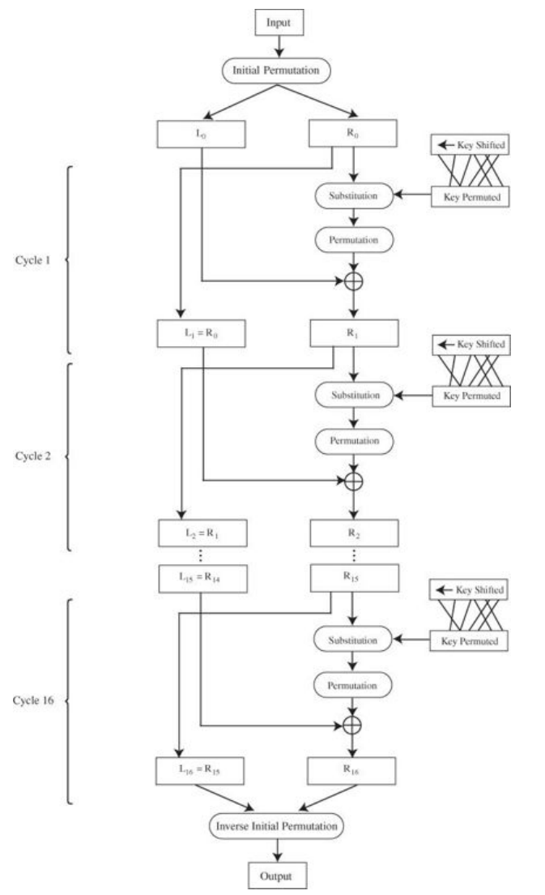
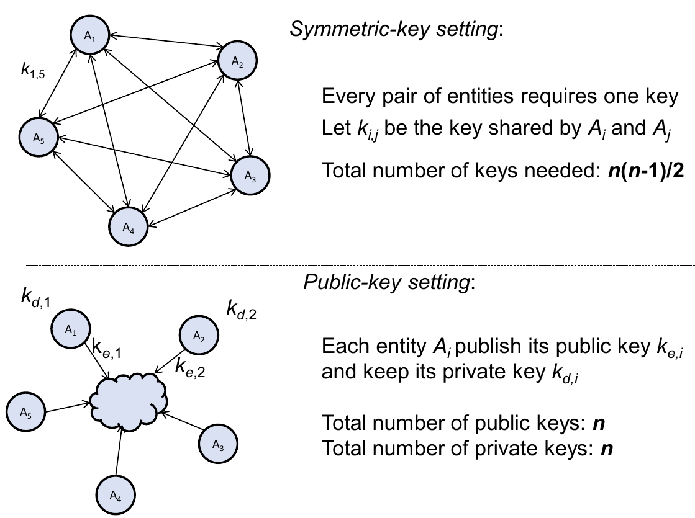
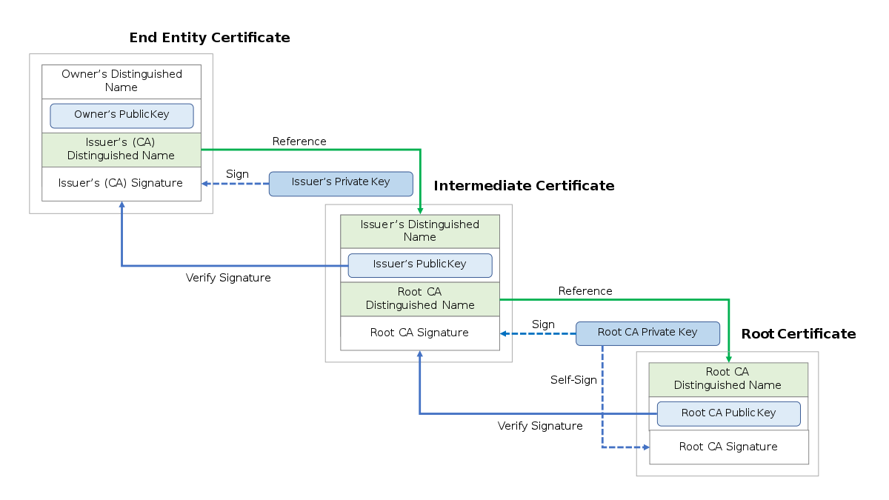
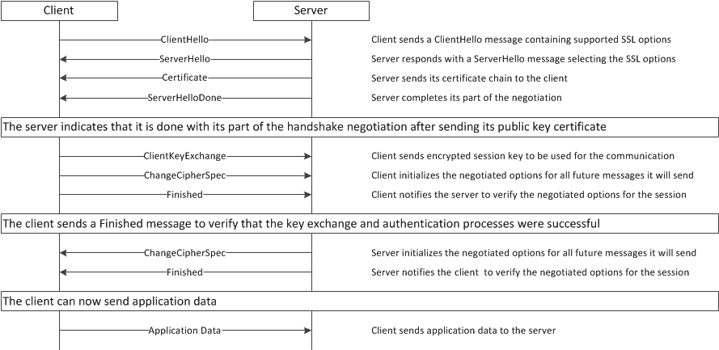
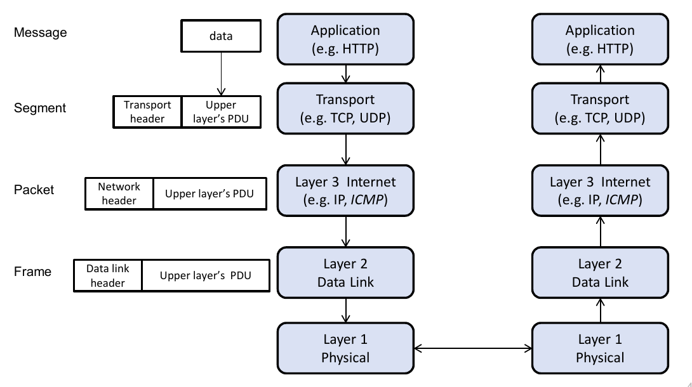
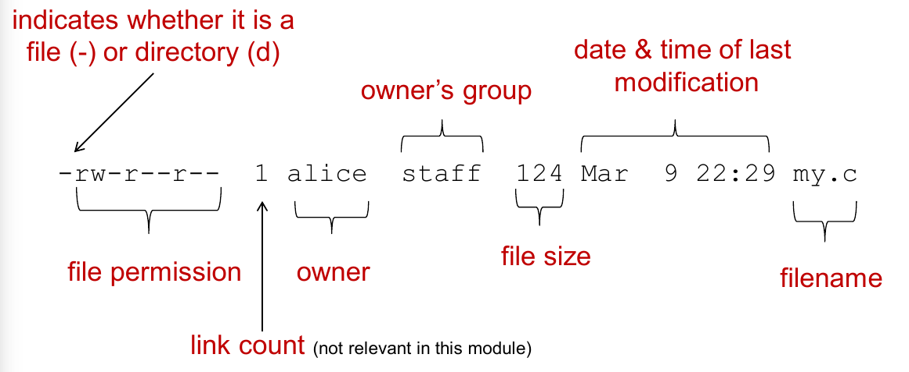

<!-- omit in toc -->
# CS2107

- [Definitions](#definitions)
  - [Security terminology](#security-terminology)
  - [Attacks](#attacks)
  - [Miscellaneous](#miscellaneous)
  - [Linux & access control](#linux--access-control)
  - [Applications](#applications)
  - [Biometrics](#biometrics)
- [Substitution Cipher](#substitution-cipher)
- [Confusion and Diffusion](#confusion-and-diffusion)
  - [Attacks on Cipher](#attacks-on-cipher)
- [One-Time-Pad (OTP)](#one-time-pad-otp)
  - [Encryption](#encryption)
  - [Decryption](#decryption)
  - [Proof of correctness](#proof-of-correctness)
  - [Remarks](#remarks)
- [Stream Cipher](#stream-cipher)
  - [Example](#example)
    - [Encryption](#encryption-1)
    - [Decryption](#decryption-1)
  - [Why is IV needed?](#why-is-iv-needed)
- [Block Cipher](#block-cipher)
  - [Keyed Pseudorandom Permutation (PRP)](#keyed-pseudorandom-permutation-prp)
  - [Electronic Codebook (ECB)](#electronic-codebook-ecb)
  - [Cipher Block Chaining (CBC)](#cipher-block-chaining-cbc)
    - [Meet in the middle attack (3DES)](#meet-in-the-middle-attack-3des)
    - [Padding oracle attack](#padding-oracle-attack)
  - [Data Encryption Standard (DES)](#data-encryption-standard-des)
    - [How it works](#how-it-works)
  - [Bit flip attacks](#bit-flip-attacks)
  - [Parallelisability](#parallelisability)
- [Misuse of encryption for authenticity](#misuse-of-encryption-for-authenticity)
- [Authentication](#authentication)
  - [Authenticity and integrity](#authenticity-and-integrity)
  - [Authenticity and non-repudiation](#authenticity-and-non-repudiation)
  - [Password system](#password-system)
  - [Attacks on bootstrapping](#attacks-on-bootstrapping)
  - [Salted hashed password](#salted-hashed-password)
  - [Public Key Cryptography (PKC)](#public-key-cryptography-pkc)
    - [Public key vs symmetric key management](#public-key-vs-symmetric-key-management)
  - [Rivest–Shamir–Adleman (RSA)](#rivestshamiradleman-rsa)
    - [Classroom setup](#classroom-setup)
  - [Cryptographic hash](#cryptographic-hash)
    - [Hash collision](#hash-collision)
  - [Data origin authenticity](#data-origin-authenticity)
    - [MAC (Message Authentication Code)](#mac-message-authentication-code)
    - [Digital signature (encrypted hash)](#digital-signature-encrypted-hash)
- [Public key distribution](#public-key-distribution)
  - [Public Key Infrastructure (PKI)](#public-key-infrastructure-pki)
    - [Certificate Authority (CA)](#certificate-authority-ca)
    - [Certificate](#certificate)
    - [Certificate chain verification](#certificate-chain-verification)
    - [Null-byte injection attack](#null-byte-injection-attack)
- [Secure communication channel](#secure-communication-channel)
  - [Secure Sockets Layer (SSL) and Transport Layer Security (TLS)](#secure-sockets-layer-ssl-and-transport-layer-security-tls)
    - [TLS renegotiation attack](#tls-renegotiation-attack)
  - [Diffie-Hellman (DH) key exchange](#diffie-hellman-dh-key-exchange)
  - [Security protocols at different layers](#security-protocols-at-different-layers)
    - [Steps required](#steps-required)
  - [Firewalls](#firewalls)
- [Authenticated encryption](#authenticated-encryption)
  - [Encrypt-and-MAC (E&M)](#encrypt-and-mac-em)
  - [MAC-then-Encrypt (MtE)](#mac-then-encrypt-mte)
  - [Encrypt-then-MAC (EtM)](#encrypt-then-mac-etm)
- [Access control model](#access-control-model)
  - [Object access rights and ownership](#object-access-rights-and-ownership)
  - [Access control representation](#access-control-representation)
  - [Intermediate control](#intermediate-control)
  - [Linux files and files system permissions](#linux-files-and-files-system-permissions)
  - [Real and effective UID](#real-and-effective-uid)
    - [Example usage](#example-usage)
- [SQL injection](#sql-injection)
- [Defensive and preventive measures](#defensive-and-preventive-measures)
  - [Filtering and sanitising input](#filtering-and-sanitising-input)
  - [Bounds checking and type safety](#bounds-checking-and-type-safety)
  - [Canary to protect the stack](#canary-to-protect-the-stack)
    - [Bypass stack canary](#bypass-stack-canary)
    - [No detection of heap overflow](#no-detection-of-heap-overflow)
- [Web security](#web-security)
  - [Cookies](#cookies)
  - [Same-Origin Policy (SOP)](#same-origin-policy-sop)
  - [Cross Site Scripting (XSS)](#cross-site-scripting-xss)
  - [Cross Site Request Forgery (CSRF)](#cross-site-request-forgery-csrf)

## Definitions

> More elaboration may be provided at their relevant sections

### Security terminology

- **Confidentiality**
  - Ensure that assets are **viewed** only by authorised parties
  - Prevention of **unauthorised disclosure** of resources
- **Availability**
  - Ensure that assets can be **used** by any authorised parties
  - Prevention of **unauthorised withholding** of resources
- **Integrity**
  - Ensure that assets are **modified** only by authorised parties
  - Prevention of **unauthorised modification** of resources
- **Authenticity**
  - Ensure that assets are **produced** by the sender (or who we think the sender is)
  - Prevention of **unauthorised forgery** of resources
- **Non-repudiation**
  - A situation where a statement's author cannot successfully dispute its authorship or the validity of an associated contract

### Attacks

- **Virus**: self-replicates upon user action or system startup and is contained within *a system*
- **Worm**: similar to virus, but *replicates over the internet/network*
- **Rootkit**: malicious software that allows an unauthorised user to have privileged access to a computer and to restricted areas of its software
- **Trojan**: any malware which misleads users of its true intent
- **Ransomeware**: type of malware that threatens to publish the victim's data or perpetually block access to it unless a ransom is paid
- **Spyware**: software with malicious behavior that aims to gather information about a person or organization and send such information to another entity in a way that harms the user
- **Phishing**: contacting victims via email, telephone or text message by someone posing as a legitimate institution to lure them into providing sensitive data
- **Spear phishing**: targeted phishing attacks on a small group of users
- **Vishing**: voice + phishing (verbal form of phishing)
- **Smishing**: SMS + phishing (text messages instead of email)
- **Pharming**: farming + phishing (redirecting a legit website to a malicious website)
- **Shoulder surfing**: look-over-the-shoulder attack
- **Sniffing**: monitoring and capturing all packets passing through a network
- **Spoofing**: disguising a communication as being from a known, trusted source
- **Denial of Service (DoS)**: flooding the targeted machine or resource with superfluous requests in an attempt to overload systems and prevent some or all legitimate requests from being fulfilled
- **SYN flood**: a form of DoS attack; attacker rapidly initiates a connection to a server without finalising the connection. The server has to spend resources waiting for half-opened connections, which can consume enough resources to make the system unresponsive to legitimate traffic
- **DNS spoofing**/**cache poisoning**: corrupt DNS data is introduced into the DNS resolver's cache, causing the name server to return an incorrect resource record
- **Side channel**: any attack based on information gained from the implementation of a computer system (e.g OS, hardware etc.), rather than weakness in the crypto algorithm itself
- **Covert channel**:  create capability to transfer information between processes that are not supposed to be allowed to communicate by the computer security policy
- **Frequency analysis**: the study of frequency of letters in a ciphertext
- **Fuzzing**: automated process of finding vulnerabilities by randomly feeding different permutations of data
- **Zero day**: exploiting a vulnerability which either the developers were unaware of or did not have sufficient time to address
- **Typosquatting**/**URL hijacking**: target users who incorrectly type a website address into their web browser (eg. `googl.com` instead of `google.com`)
- **Man in the middle**: where attacker secretly relays/alters the communications between 2 parties who believe they are directly communicated with each other
- **Meet in the middle**: attack against encryption schemes that rely on performing multiple encryption operations (like 3DES: $2^{112}$ operations to brute force the $168$-bit key)
- **Birthday**: exploits the high likelihood of collisions for mathematically random values
- **Replay/playback**: a form of network attack in which a valid data transmission is maliciously or fraudulently repeated or delayed
- **Skimming**: used by identity thieves to capture credit card information from a cardholder surreptitiously
- **Drive-by download**: unintentional download of malicious code from the internet; may happen when visiting a website, opening an email or clicking a link
- **Web bug**: a file object that is placed on a web page or in an email message to unobtrusively (usually invisibly) monitor user behaviour
- **Clickjacking**: malicious technique of tricking a user into clicking on something different from what the user perceives, thus potentially revealing confidential information or allowing others to take control of their computer while clicking on seemingly innocuous objects, including web pages
- **Click fraud**: occurs when a person, automated script, or computer program imitates a legitimate user of a web browser, clicking on an advertisement without having an actual interest in the target of the ad's link (to inflate the number of clicks on the ad)
- **XSS**: type of *injection attack* on web apps, where an attacker attacks another web user by running a malicious script in the execution context of a page from an involved web server
- **CSRF**: type of *authorisation attack* on web apps, where an attacker attacks a web user by issuing a forged request to a vulnerable web server on behalf of the victim user

### Miscellaneous

- **Nonce**: an arbitrary number that can be used just once in a cryptographic communication
- **Key escrow**: arrangement in which the keys needed to decrypt encrypted data are held in escrow so that, under certain circumstances, an authorized third party may gain access to those keys
- **End-to-end encryption**: secure communication which prevents third-parties from accessing data while it's transferred from one end system or device to another
- **Fully-homomorphic encryption**: enables a third party to modify a ciphertext $C=E(K,M)$ to $C'=E(K,F(M))$ without ever decryption the initial ciphertext $C$ (ie. given ciphertext, modify plaintext data, without decrypting the ciphertext)
- **Pseudorandom number generator**: deterministic algorithm for generating a sequence of numbers whose properties approximate the properties of sequences of random number
- **Hardware random number generator**: generates random numbers from physical processes (rather than by means of an algorithm)
- **Kerckhoffs' Principle**: states that the security of a cryptosystem must lie in the choice of its *keys* only; everything else (including the algorithm itself) should be considered public knowledge
- **Authenticated encryption**: forms of encryption which simultaneously assure the confidentiality and authenticity (and hence integrity) of data
- **Self-signed certificate**: a certificate that is not signed by a CA, but signed by the owner's own private key (typically used by root CA, or developers in the early stages of development when a suitable certificate cannot be obtained)
- **Certification chain/path**: made up of a list of certificates that start from a server's certificate and terminate with the self-signed root certificate; a server's certificate has to be traceable back to its root CA for it to be trusted
- **Secure channel**: a data channel between two parties that has confidentiality, integrity, and authenticity against a computationally-bounded network attacker
- **Insider threat**: malicious threat to an organisation that comes from people within the organisation, such as employees, former employees, contractors or business associates, who have inside information concerning the organisation's security practices, data and computer systems
- **Format string vulnerability**: occurs in certain C formatting functions like `printf`, which may cause program to print data from its call stack or other locations in memory

### Linux & access control

- **Reference monitor**: set of design requirements for an access control policy
  - **Non-bypassable**: attacker cannot bypass the mechanism and violate the policies
  - **Evaluable**: can be verified by analysis and tests
  - **Always invoked**: disallow attackers to circumvent the policies
  - **Tamper-proof**: disallow attackers to tamper with the policies
- **Mandatory Access Control (MAC)**: OS constrains the ability of a *subject*/*initiator* to access or perform some operation on an *object*/*target*; centrally controlled by a security policy administrator, and users do not have the ability to override the policies
- **Discretionary Access Control (DAC)**: similar to MAC, but users have the ability to override the policies (if they are able to)
- **Intermediate access control**: use of groups and protection rings to manage the size of access control matrices
- **Role-Based Access Control (RBAC)**: implements DAC or MAC; used to restrict system access to authorised users

### Applications

- **Wireshark**: free OSS for analysing network packets
- **Tor**: free OSS for enabling anonymous communication through an overlay network
- **`nmap`**: scan for ports
- **`ping`**: probe if a host is "alive"
- **`nslookup`/`dig`/`host`**: query DNS servers for their IP address and the URL's IP address
- **`nc`/`netcat`**: open, send, and listen to TCP and UDP sockets

### Biometrics

- **False match rate (FMR)**: measures the percent of invalid inputs that are incorrectly accepted
- **False non-match rate (FNMR)**: measures the percent of valid inputs that are incorrectly rejected
- **Equal error rate (EER)**: rate when FNMR = FMR
- **Failure to enrol rate (FEF)**: rate at which attempts to create a template from an input is unsuccessful
- **Failure to capture rate (FTC)**:  probability that the system fails to detect a biometric input when presented correctly

## Substitution Cipher

- **Key space**: set of all possible keys
- **Key space size**: total number of possible keys
- **Key size** or **key length**: number of bits required to represent a particular key

**Caesar cipher**:

- Key space $= 27$
  - Characters `a` to `z` and `_`
- Key space size $= 27$
  - Can only shift a character up to a maximum of $27$ times
- Key size $\geq \lceil \log_2(27) \rceil \approx 5$ bits
  - $5$-bit number needed to store the shifting information

**Vignere cipher**:

- Key space $= 27$
  - Characters `a` to `z` and `_`
- Key space size $= 27^k$, where $k$ is the key length
  - For example, if key length is $3$, then for each of these $3$ characters, we can choose $27$ characters $= 27 \times 27 \times 27 = 27^3$
- Key size $\geq \lceil \log_2(27^k) \rceil$ bits

**Substitution cipher**:

- Key space $= 27$
  - Characters `a` to `z` and `_`
- Key space size $= 27!$
  - `a` can map to 27 other char, `b` can map to 26 other char, $...$
- Key size $\geq \lceil \log_2(27!) \rceil \approx 94$ bits
  - Lower bound is 94 bits
  - Let an array/table contain all the keys, then there needs to be $27!$ indices (which $\lceil \log_2(27!) \rceil$ bits can represent)

## Confusion and Diffusion

- **Confusion**: interceptor should not be able to predict what will happen to the ciphertext by changing one character in the plaintext
  - Substitution achieves confusion
- **Diffusion**: changes in the plaintext affect many parts of the ciphertext
  - Good diffusion means that the interceptor needs access to much of the ciphertext to be able to infer the algorithm
  - Transposition achieves diffusion

### Attacks on Cipher

- **Ciphertext only** scenario: using a large number of ciphertexts that are all encrypted using the same key
- **Known plaintext** scenario: using pairs of ciphertext and the corresponding plaintext

## One-Time-Pad (OTP)

### Encryption

Given an $n$-bit plaintext: $x_1x_2\dots x_n$, and $n$-bit key: $k_1k_2\dots k_n$, output the ciphertext:

$$
C = (x_1 \oplus k_1)(x_2 \oplus k_2)\dots(x_n \oplus k_n)
$$

### Decryption

Given an $n$-bit plaintext: $c_1c_2\dots c_n$, and $n$-bit key: $k_1k_2\dots k_n$, output the plaintext:

$$
X = (c_1 \oplus k_1)(c_2 \oplus k_2)\dots(c_n \oplus k_n)
$$

### Proof of correctness

Want to prove:

- Encryption: $\text{plaintext} \oplus \text{key} \rightarrow \text{ciphertext}$
- Decryption: $\text{ciphertext} \oplus \text{key} \rightarrow \text{plaintext}$

$$
\begin{aligned}
\forall x,k&: (x \oplus k) \oplus k\\
  &= x \oplus (k \oplus k) \text{ (associativity)}\\
  &= (x \oplus 0) \text{ (self-inverse)}\\
  &= x \text{ (identity element)}
\end{aligned}
$$

### Remarks

- **Key** should only be **used once**
- Can be shown to be **unbreakable**
- Key must be at least as long as message (not feasible in many applications)

## Stream Cipher

- **Definition**: a symmetric key cipher where each plaintext bit is bitwise combined with a pseudorandom keystream
- Very similar and inspired from OTP (aka "pseudo/simulated OTP")
- **High confusion**, but **low diffusion**

How it works:

- To encrypt $2^{20}$ bits plaintext with a $256$ bits secret key, the cipher generates a $2^{20}$ bits sequence as the "OTP key"
- A cryptographically-secure pseudorandom generator is used to generate the longer sequence
- Longer sequence is generated from secret key and a Initial Value (IV)
- IV can be randomly chosen, or from a counter
- Final ciphertext contains IV and output of the OTP encryption

### Example

Given:  
$15$-bit plaintext $X = 000001111100000$  
Short key $= 0101$,

#### Encryption

1. Randomly generate IV: $IV = 0001$
2. From short key and IV, generate $15$-bit sequence $K = 011010100100110$
3. Output IV, and $K \oplus X$

#### Decryption

1. Extract the IV from the ciphertext
2. From short key and IV, generate long sequence $K$
3. Perform XOR to get plaintext

### Why is IV needed?

Suppose plaintexts $X$ and $Y$ are encrypted to ciphertexts $U$ and $V$,

$$
\begin{aligned}
U \oplus V &= (X \oplus K) \oplus (Y \oplus K) \\
  &= X \oplus Y
\end{aligned}
$$

Thus, attacker can obtain information about $X \oplus Y$ (similar to having an image of $X$ superimposed on $Y$).

## Block Cipher

- **Definition**: a symmetric key cipher where a block of plaintext (rather than one bit at a time) is encrypted via a deterministic alogorithm
- **Examples**: Data Encryption Standard (DES), Advanced Encryption Standard (AES)
- Can provide **high confusion** and **high diffusion**
- The longer the key, the more secure and the slower it is

### Keyed Pseudorandom Permutation (PRP)

- Different from PRG
- A bijective function $E : K \times X \rightarrow X$
- Output "looks random": is indistinguishable from a random function

### Electronic Codebook (ECB)

- Message is divided into blocks
- Each block is encrypted separately


### Cipher Block Chaining (CBC)

- Each block of plaintext is XORed with the previous ciphertext block before being encrypted
- Each ciphertext block depends on all plaintext blocks processed up to that point
- IV must be used in first block to make each message unique


#### Meet in the middle attack (3DES)

Susceptible when both plaintext and ciphertext are known; used to find out the actual keys used. Assume 3DES (168-bits) is used, where $C = E_{K_3}(E_{K_2}(E_{K_1}(P)))$. We can do the following:

1. Encrypt the plaintext $P$ using all $2^{56}$ possible keys of $K_1$, and store all results in set $V$
2. Decrypt the ciphertext $C$ with all $2^{112}$ possible combinations of $K_2$ and $K_3$, ie. all possible values of $D_{K_2}(D_{K_3}(C))$
3. Check if any of the decrypted messages match any of the result in $V$

Total number of operations required $= 2^{56} + 2^{112} \approx 2^{112}$, space required $= 2^{56} \times \text{size of key}$ (size of set $V$)

#### Padding oracle attack

Susceptible when **given only the ciphertext** and an oracle that gives validation upon whether a given ciphertext is correctly padded or not.

Variable-length plaintext messages have to be padded to be compatible with the underlying cryptographic cipher.

For plaintext $P$, decryption function $D$, secret key $K$, ciphertext $C$, and block number $i$,

$$
\begin{aligned}
P_i &= D_K(C_i) \oplus C_{i-1}\\
C_0 &= IV
\end{aligned}
$$

A singly-byte modification in $C_1$ will result in a single byte change in $P_2$.

Thus, exploit that to find out what the padding is:

- Padding is always done on the last block (ie. last plaintext block contains the padding information)
- Use guess and check method by:
  1. Changing the 2nd last ciphertext block, byte by byte, from left to right (which will affect decoded data of the last plaintext block, and hence potentially affecting the padding information)
  2. Checking each change with the decryption service till a padding error is thrown (byte where the error is thrown till the end of the block is the length of the padding)

After getting initial padding, proceed to guess and check the plaintext:

1. Let the cipher blocks $B = [B_1, B_2, B_3, B_4, B_5]$
2. From $B_4$ down to $B_1$, do:
   1. Let current cipher block be $B_i$
   2. If $B_i = B_4$, padding length $P_l$ is as discovered above, else $P_l$ is 0
   3. Let the bytes of the current blocks $= [b_0, b_1, \dots, b_{14}, b_{15}]$
   4. From the last non-padding byte $b_n$ to $b_0$ of the current block, do:
      1. Transform all the padding bytes as per `PKCS #5`, by adding $1$ to each padding byte (since we want to transform $b_n$ to a padding byte)
      2. Exhaustively try $b_n$ for values from $0$ to $255$ to get the value $b_v$ where the decryption service will decrypt successfully (thus, $b_v$ is the new padding byte)
      3. Let the new padding length $P_n = P_l + 1$ (since we have found the new padding byte $b_v$)
      4. Using $b_v$, recover the plaintext byte $b_P = b_v \oplus P_n \oplus b_n$
   5. Remove last block $B_{i+1}$ from blocks $B$ (important step)

### Data Encryption Standard (DES)

- Block length: 64 bits
- Key length: 56 (too short for modern times, can be easily brute forced)

#### How it works

Plaintext is affected by a series of cycles of a substitution followed by a permutation

1. Input is divided into blocks of 64 bits
2. 64 data bits are permuted by a so-called initial permutation
3. Data bits are transformed by 64-bit key (of which only 56 bits are used)
   - Missing bits are parity bits that carry no info in the key
4. Next begins the 16 cycles:
   1. 64 permuted data bits are broken into left and right half of 32 bits each
   2. 32-bit right half is expanded to 48 bits by repeating certain bits (expansion permutations): this becomes the new left data half
   3. 56-bit key is reduced to 48 bits by choosing only certain bits according to tables called S-boxes (permuted choice)
   4. Key is then combined with right half, then with left half: this becomes the new right data half



### Bit flip attacks

Attacker modifies ciphertext in a way that predictably changes the decryption result. This way, an attacker can tamper with data even if it is encrypted. How this works depends on the **mode of operation** that is used.

Assuming ciphertext block $C_i$ decrypts to plaintext block $P_i$, and that the single bit flip occurs in $C_i$:

- **ECB**: $P_i$ is not recoverable
- **CBC**: $P_i$ is not recoverable, flips single bit in $P_{i+1}$
- **PCBC**: $P_i$ itself and all blocks after are not recoverable
- **CFB**: flips single bit in $P_i$, $P_{i+1}$ is not recoverable
- **OFB**: flips single bit in $P_i$
- **CTR**: flips single bit in $P_i$

### Parallelisability

Some mode of operation can take advantage of parallel processing to efficiently encrypt or decrypt:

- **ECB**: both encryption and decryption
- **CBC**: only decryption
- **PCBC**: none
- **CFB**: only decryption
- **OFB**: none
- **CTR**: both encryption and decryption

## Misuse of encryption for authenticity

- Encryption is designed to provide **confidentiality**
- It **does not** guarantee **integrity** or **authenticity**
- It **does not** protect data against modification
  - Attacker can simply change the ciphertext bits (and the resulting plaintext will be modified)
  - However, receiver has no way to find out if the ciphertext was modified

## Authentication

- **Authentication**: process of assuring that the communicating entity is the one that it claims to be
  - **Entity authentication**: for connection-oriented communication
    - Communicating entity is an entity involved in a connection
    - Mechanisms: password, challenge and response, biometrics
  - **Data-origin authentication**: for connectionless communication
    - Communicating entity is the origin of a piece of information
    - Mechanisms: MAC or digital signature

### Authenticity and integrity

- Authenticity implies integrity, but integrity *does not* imply authenticity
- Authenticity is a stronger requirement than integrity

### Authenticity and non-repudiation

- Non-repudiation implies authenticity, but authenticity *does not* imply non-repudiation
  - In other words, **non-repudiation provides authenticity as a by-product**
- **Authenticity is about one party** (Alice) interacting with another (Bob) to convince Bob that the data really did come from Alice
  - As such, **MAC provides authenticity** even though Alice can forge Bob's MAC and claim that it is from Bob (because Alice knows the only person that could forge the MAC is her; if she knew she did not forge it, the only person it could come from is Bob)
- **Non-repudiation** is about Alice proving to Bob and **any other third party** that the data really did come from Alice
  - As such, **MAC does not provide non-repudiation** because Bob can forge Alice's MAC and claim to any other third parties that it came from Alice

### Password system

1. **Stage 1: bootstrapping**
   - Server and user establish common password
   - Server keeps track of a file recording the identity and password (i.e. `<username, password>`)
2. **Stage 2: authentication**
   - Server authenticates an entity
   - Entity gives the correct password corresponding to the claimed identity, the entity is deemed authentic

> What are "sniff" and "spoof"?

### Attacks on bootstrapping

- Attacker may intercept the password
  - If password is sent through postal mail
- Attacker uses the default passwords
  - IOT devices comes with default passwords

### Salted hashed password

- Users may have the same password, which when hashed will be the same hashed values
- Salting is done by appending every password with a random string
- The resulting password is then hashed

### Public Key Cryptography (PKC)

**Public Key (Asymmetric Key)**: uses two different keys for encryption and decryption

Formally defined as algorithms ($G$, $E$, $D$) over sets ($K_e$, $K_d$, $M$, $C$):

- $K_e$: set of all public keys (public key space)
- $K_d$: set of all private keys (private key space)
- $M$: set of all plaintexts (plaintext space)
- $C$: set of all ciphertexts (ciphertext space)
- $G$: generates a key pair ($K_e$, $K_d$)
- $E$: encryption algorithm
- $D$: decryption algorithm

#### Public key vs symmetric key management



### Rivest–Shamir–Adleman (RSA)

A public-key cryptosystem widely used for secure data transmission.

#### Classroom setup

1. Randomly choose 2 large primes $p$, $q$
2. Compute $n=p \cdot q$ as the public composite modulus
3. Choose an encryption exponent $e$, such that $gcd(e, \phi(n)) = 1$, where $e < \phi(n)$ and $e$ is relatively prime to $\phi(n)$
4. Determine the decryption exponent $d = e^{-1}(\mod\phi(n))$
5. Publish $(n,e)$ as public key, and keep $(n,d)$ as private key

**Encryption**: given plaintext $m$, ciphertext $c = m^e(\mod n)$

**Decryption**: given ciphertext $c$, plaintext $m = c^d(\mod n)$

### Cryptographic hash

A function that takes an *arbitrarily* long input message, and outputs a fixed-size digest.

Formally defined as a function which takes a message $m$ and produces an $n$-bit digest: $H:\{0,1\}^* \rightarrow \{0,1\}^n$ with the following requirements:

1. **Efficient**: given $m$, it is computationally efficient to compute $y=h(m)$
2. **One-way**: given $y$, it is computationally infeasible to find a $m$ such that $h(m)=y$
3. **Collision-resistant**: it is computationally infeasible to find any pair of messages $(m_1,m_2)$ where $m_1\neq m_2$, such that $h(m_1) = h(m_2)$

#### Hash collision

In general, given total number of balls $M$ (or number of generated messages), and number of bins $T$ (or number of possible messages), probability that a collision occurs:

$$
Pr = 1 - e^{\frac{-M^2}{2T}}
$$

### Data origin authenticity

#### MAC (Message Authentication Code)

- When a **shared symmetric key** is used as part of the digest generation: $H(m, K)$
- **Repudiable**: cannot prove to a third party exactly who produced the MAC
- Can **detect accidental/intentional changes** to message and **affirm message's origin for receiver**
- Guarantees **integrity** to everybody, but **authenticity** only to receiver (since it is repudiable)
- Sender **can deny previously sent message** by claiming that the receiver spoofed it and sent it to himself

Sending example:

1. Sender **hashes the message** and the **key** to form the **MAC** (aka **Authentication Tag**): $H(m,K)$
2. Append $H(m,K)$ to $m$, making $(m,H(m,K)) \rightarrow$ send this to receiver
3. Receiver can calculate his own $H(m,K)$ to check if either $m$ or $K$ has been altered

#### Digital signature (encrypted hash)

- When a **public-private key** is used as part of the digest generation: $K^-(H(m))$
- **Non-repudiable**: digital signature should be **unique to everybody**
- Guarantees **integrity** and **authenticity** to everybody (but not confidentiality - the message is sent as plaintext)

Sending example:

1. Sender signs $m$ by encrypting it with his private key $K^-$, creating **signed message** $K^-(m)$
2. Append $K^-(m)$ to $m$, making $(m,K^-(m)) \rightarrow$ send this to receiver
3. Receiver has sender's public key $K^+$, and can decrypt $K^-(m)$ and compare with original $m$

Since a message can be **arbitrarily long**, this method can be **computationally slow** as every $m$ has to be encrypted/decrypted via RSA. To improve efficiency:

1. Sender **hash the message** first: $H(m)$ (since hashes are fixed length, this improves efficiency)
2. Then **encrypts the hash** via RSA (**Signed Message Digest**): $K^-(H(m))$
3. Sender sends both the encrypted hash and original message: $(m,K^-(H(m)))$
4. Receiver decrypts $K^-(H(m))$ with sender's public key $K^+$
5. Receiver hashes original $m$ and compares with decrypted $H(m)$ in step 4

## Public key distribution

Three possible methods for public key distribution:

1. Public announcement
2. Publicly available directory
3. Public Key Infrastructure (PKI)

### Public Key Infrastructure (PKI)

A standardised system to **distribute public keys**.

#### Certificate Authority (CA)

- Issues and signs digital certificates
- Keeps a directory of public keys
- We assume that the CA's public key **is securely distributed** to all entities involved
  - OSes and browsers will pre-load CA's public keys (known as *root CAs*)

Responsibilities:

- Verify information given is correct
  - eg. check if requester actually owns the domain

#### Certificate

A digital document to **verify authenticity** and **certify ownership of a public key**. If not, Alice can use her own public key but claim it is Bob's.

Contains **at least** the following:

- Identity of owner (eg. alice@google.com)
- Public key of owner
- Time window for validity
- Signature of the CA

How it works:

- The owner's **identity**, **public key**, and the **validity** is combined to form the data message $m$
- CA hashes $m$ to generate the hash $H(m)$
- CA encrypts $(m, H(m))$ with CA's private key $K_{CA}^-$ to get $K_{CA}^-(m, H(m))$
- A third party can decrypt $K_{CA}^-(m, H(m))$ with the CA's public key to recover $m$ (which contains the owner's public key) and $H(m)$ (to verify integrity of $m$)
- Recursively go up the CA levels (till the root) if you don't trust the current level

Types of certificates:

- **Domain Validation** SSL certificate
  - Demonstrate the right to **administratively manage a domain name**
- **Organization Validation** SSL certificate
  - Has the organisations actual existence as a **legal entity**
- **Extended Validation** (EV) SSL certificate
  - Persuade CA of legal identity, including **manual verification checks** by a human
  - Shown in Chrome as a green padlock with the name of the organisation

#### Certificate chain verification

For each certificate:

- Issuer matches the subject of the next certificate
- Signed by the private key of the next certificate



#### Null-byte injection attack

Older browsers were vulnerable because:

- When **displaying URL**: substrings after the null character `\0` are **ignored**
- When **verifying certificate**: substrings after the null character `\0` are **included**

As such, when a user enters a malicious URL like `www.comp.nus.edu.sg\0.hacker.com`, the user will think that he is connecting via HTTPS to `www.comp.nus.edu.sg`, but the certificate actually comes from `www.comp.nus.edu.sg\0.hacker.com`.

## Secure communication channel

Consider a channel that is subjected to sniffing and spoofing, how can we establish a secure channel using cryptographic primitives?

- Confidentiality: using encryption
- Integrity: using MAC or digital signature
- Authenticity: using MAC or digital signature

### Secure Sockets Layer (SSL) and Transport Layer Security (TLS)

> SSL is deprecated and replaced with TLS, but these two terms are largely synonymous now

- Sits on top of **transport layer**
- **End-to-end encryption** is performed

Works via **ciphers negotiation** and **authenticated key exchange** (exchange of session keys which authenticates the parties involved):



#### TLS renegotiation attack

- During TLS renegotiation, client uses the established symmetric key to send the client `hello`

### Diffie-Hellman (DH) key exchange

A method of securely exchanging cryptographic keys over a public channel between two parties that have no prior knowledge of each other.

Let the public values have $_+$ suffix, and the secret values have the $_-$ suffix:

1. Alice and Bob public agree to use a modulus $p_+=23$ and base $g_+=5$
2. Alice chooses a secret integer $a_-=4$, then sends Bob $A_+ = g_+^{a_-}\mod p_+$
3. Bob chooses a secret integer $b_-=3$, then sends Alice $B_+ = g_+^{b_-} \mod p_+$
4. Alice computes $s_- = B_+^{a_-} \mod p_+$
5. Bob computes $s_- = A_+^{b_-} \mod p_+$
6. Alice and Bob now shares the secret $s_-$ successfully

### Security protocols at different layers



- When analysing an attack, need ot figure out at what layer the attacker resides
- **Guideline**: security protocol which protects layer $K$ would also protect layers $K+1$ and above against an attacker at layer $K-1$ and below

#### Steps required

Example: Alice wants to visit Bob.com, and we want to establish a secure channel between Alice's browser and Bob.com's server to maintain CIA triad.

1. Alice and Bob.com carry out a **unilateral authenticated key exchange** (via STS protocol for example) using Bob's private/public key, for Alice to authenticate Bob.com
   - After authentication, both Bob and Alice know two randomly selected session keys $k$ (secret key for symmetric-key encryption)and $t$ (secret key for MAC)
2. Subsequent communication between Alice and Bob.com will be protected by $k$, $t$ and a sequence number $i$
   - Suppose $m_1, m_2, \dots$ are the sequences of message exchanged, the actual data sent can be $m_i = [E_k(i,m_i), MAC_t(E_k(i,m_i))]$ (*encrypt-then-MAC* technique)

### Firewalls

- Enforces a set of rules
- Table is processed in a **top-down manner**
- **First matching rule** determines the action taken (**put most specific rule first**)

**Types of firewalls**:

- **Traditional packet filter**: filters packets based on information in the *packet headers*
- **Stateful-inspection**: filters packets based on active connection states
- **Application proxy**: understands and filters messages at the *application layer* (HTTP, FTP, etc.) rather than traditional packet filtering

## Authenticated encryption

- **Symmetric encryption** that returns both ciphertext and authentication tag
- Ensures **confidentiality** and **authenticity**

### Encrypt-and-MAC (E&M)

- Sender computes cipthertext $C$ and tag $T$ separately
- Performs encryption using 2 keys $K_1$ and $K_2$ and sends $[E(K_1,M), MAC(K_2, M)]$ to receiver
- Used in **SSH**

### MAC-then-Encrypt (MtE)

- Sender computes tag $T = MAC(K_2, M)$
- Generates and sends ciphertext $C = E(K_1, M || T)$
- Used in **SSL** and **TLS** up to v1.2

### Encrypt-then-MAC (EtM)

- Sender generates the ciphertext $C = E(K_1, M)$
- Computes tag $T = MAC(K_2, C)$
- Sends $(C,T)$
- Used in **IPsec**

## Access control model

A way to specify and enforce restrictions of access to a place or other resource.

- **Object**: a file or resource which contains some operation
- **Principal**/**subject**: wants to access an object with some operation; **subjects** (entities within a system) operates on behalf of **principals** (human users)
- **Reference monitor**: either grants or denies the access
- **Access**: classified as *observe* (read), *alter* (write/delete), or *action* (execute)

### Object access rights and ownership

- **Discretionary Access Control (DAC)**: the owner of the object decides the rights
  - Linux uses DAC, since a user with certain permissions to a file is able to alter that file's permissions
- **Mandatory Access Control (MAC)**: a system-wide policy decides the rights, which must be followed by everyone in the system
  - Unlike DAC, users do not and cannot change the policies themselves

### Access control representation

The **access control matrix** can be implemented in 2 ways:

- **Access Control List (ACL)**: object stores list of subjects' access rights
  - Difficult to retrieve all access rights of a particular *subject*
  - Used by Linux
- **Capabilities**: subject stores list of capabilities, where each capability is the access rights to an object
  - Difficult to retrieve all subjects who can access a particular *object*

### Intermediate control

The size of access control matrix can be too large to manage in practice. Thus, we can define logical groups and place the access rights on these groups.

- **Group**: objects and subjects are grouped together, and the access control are defined on these groups
- **Protection rings**: each object and subject are assigned a number $i$ (said to be running in ring $i$)
  - The smaller the number, the higher the privilege
  - A subject in ring $t$ can access objects in rings $\geq t$
  - UNIX users have two protection rings: `superuser` (UID 0) and `user`

### Linux files and files system permissions



File permissions are grouped into 3 triplets for **owner** (the "user"), **group**, and **others** (the "world"), with each triplet having the following definitions:

- `-`: access not granted
- `r`: read access
- `w`: write access (including delete)
- `x`: execute access (`s`: allow user to execute with permission of file owner)

### Real and effective UID

- **Real UID**: inherited from the user who invokes the process
  - Identifies the real owner of the process
- **Effective UID**: for processes created by executing a file; 2 cases:
  1. If `set-UID` is **disabled** (permission bit is `x`), then process' effective UID is same as real UID
  2. If `set-UID` is **enabled** (permission bit is `s`), then process' effective UID is inherited from UID of the file owner

> Set with `chmod +s ./file` or `chmod 4755 ./file`

#### Example usage

When a process wants to access a file, the **effective UID of the process is checked against the file permissions** to decide access.

```sh
-rw-------    1 root    staff    6 Mar 18 08:00 sensitive.txt
```

- File is owned by `root` (UID `0`)
- Only if effective UID of the process is `root` (UID `0`), will the process be allowed to read this file

## SQL injection

SQL allows for variables prefixed with `$`. A script may first get the user's input, stores it in the variable `$userinput`, and runs:

```sql
SELECT * FROM client WHERE name = "$userinput"
```

This statement is vulnerable to SQL injection, as the user can simply enter the following as `$userinput`:

```sql
-- inject this:
Bob" OR 1=1 --
```

Which makes the SQL statement return the whole `client` table:

```sql
SELECT * FROM client WHERE name = "Bob" OR 1=1 --"
```

## Defensive and preventive measures

### Filtering and sanitising input

- **White list**: accept list of valid inputs (more secure; but may lead to bad UX as some legitimate inputs may be blocked)
- **Black list**: reject list of known bad inputs

**Problems/disadvantages**:

- Difficult to ensure that filtering is complete (ie. doesn't miss out any malicious strings)
- Multiple representations of malicious strings due to different encoding standards (UTF8/UTF16)

### Bounds checking and type safety

- Some languages (eg. Java, Rust) perform bounds checking **at runtime** unlike C/C++
- If bounds are exceeded, the process will be halted

### Canary to protect the stack

- **Canary**: secret values inserted into the **stack** during runtime
- **Detects stack overflow**: by checking if the canary has been modified/destroyed
- **Does NOT detect heap overflow**: no sane way to alter layout of data within a `struct` as fields need to maintain same data between shared modules/libraries
- By default, Linux's `gcc` will compile with canary-based stack protection (turn off with flag `-fno-stack-protector`)

#### Bypass stack canary

However, **canaries can fail to work in certain cases**:

```cpp
#include <stdio.h>
#include <string.h>

int main(int argc, char **argv) {
    char before[8] = "";
    char buffer[8] = "";
    char after[8] = "";

    strcpy(buffer, argv[1]);
    printf("Stack buffer overflow demo\n");
    printf("before: %s\n", before);
    printf("buffer: %s\n", buffer);
    printf("after: %s\n", after);

    return 0;
}
```

```sh
# when run with `./a.out 123456781234`:
Stack buffer overflow demo
before:
buffer: 123456781234
after: 1234
```

- If `after` is of type `int`, linux will detect the stack smashing due to `buffer`'s corrupted *terminator canary* (ie. `buffer` does not end with the `\0` character)
- However, attack works because `after` is of type `char`, and the `buffer` will detect `after`'s terminator canary

#### No detection of heap overflow

The following snippet shows that **canary does not defend against buffer overflow attacks within the heap**:

```cpp
#include <stdio.h>
#include <stdlib.h>
#include <string.h>

struct HeapData {
    int before;
    char buffer[8];
    int after;  // can be of type int, since no canary is in heap
};

int main(int argc, char **argv) {
    struct HeapData *data = malloc(sizeof(struct HeapData));

    strcpy(data->buffer, argv[1]);
    printf("Heap buffer overflow demo\n");
    printf("before: %d\n", data->before);
    printf("buffer: %s\n", data->buffer);
    printf("after: %d\n", data->after);
    free(data);

    return 0;
}
```

```sh
# when run with `./a.out 123456781234`:
Heap buffer overflow demo
before: 0
buffer: 123456781234
after: 875770417
```

- Unlike the stack attack, `after` can be of any type since no canary is inserted into the heap

## Web security

### Cookies

- A name-value pair set by web server in the HTTP `Set-Cookie` header field
- Stored on user's browser which the user can use for new requests to server
- To identify a user's session via *token-based authentication* (aka. *Session ID*)
- **Secure cookies** strictly require HTTPS, other cookies can work over HTTP

### Same-Origin Policy (SOP)

- Scripts running in the browser can access cookies
- For security reasons, browsers employ the SOP access control
- Script in webpage `foo` can access cookies stored by another webpage `bar` only if both `foo` and `bar` have the same *origin*
- **Origin** is defined as the combination of **protocol**, **hostname**, and **port number**

### Cross Site Scripting (XSS)

A type of **injection attack** on web apps, where an attacker attacks another web user by running a malicious script in the execution context of a page from an involved web server. This **exploits the client's trust of the server**.

- **Privilege escalation**: malicious script from attacker has the privilege of the web server
- **Bypasses SOP**: Since malicious script comes form target web server, it can access cookies sent by web server

**Two types of attack**:

- **Reflected (non-persistent)**: attacker embeds malicious script within an otherwise trusted URL
  - eg. Using phishing or social engineering to lure victims to visit `www.posb.com/search?term=<script>MaliciousFunction(...)</script>`
- **Stored (persistent)**: attacker injects malicious script into the target web server, which will be embedded into any HTML page the server renders
  - More dangerous than reflected XSS attacks as there is no need to lure victims into clicking a malicious link
  - eg. Injecting a script into the database which will be queried by all users when visiting the trusted webpage

**Defences**:

1. Sanitise user input and filter any malicious HTTP tags (or encode it properly using HTML entities)
2. Use of the `noscript` region, which disallows JS to run in that region

### Cross Site Request Forgery (CSRF)

A type of **authorisation attack** on web apps, where an attacker attacks a web user by issuing a forged request to a vulnerable web server on behalf of the victim user. This **exploits the server's trust of the client**.

**With the victim clicking on a URL**:

1. Suppose client Alice is already authenticated by a target website $S$, and $S$ accepts an authentication-token cookie
2. Attacker Bob tricks Alices to click on a URL (via a phishing attack), which contains a malicious request (like transferring $1,000 to Bob: `www.bank.com/transfer?account=Alice&amount=1000&to=Bob`)
3. Alice's cookie will be automatically sent to $S$
4. $S$ cannot differentiate this malicious request from any other genuine requests and will thus carry out the transaction

**Without the victim clicking on a URL**:

1. Suppose client Alice is already authenticated by a target website $S$, and $S$ accepts an authentication-token cookie
2. Alice visits the attacker's site, whose page contains the following HTML tag:
   ```html
   <!-- width and height set to minimum so the image is not visible -->
   
   ```
3. Alice's browser issues another HTTP request to obtain the image
4. Alice's cookie will be automatically sent to $S$
5. $S$ cannot differentiate this malicious request from any other genuine requests and will thus carry out the transaction

**Defences**:

- Authentication-token cookie is insufficient in this case
- Server should generate a *dynamic information*, the **anti-CSRF token**:
  - Known as the **authorisation-token cookie**
  - Is a pseudorandom value (ie. unique and unpredictable) generated by the server, and sent as a cookie on initial visit to the same-origin client (ie. should not send for cross-origin requests)
  - Assumes only JS running on the same-origin client will be able to read the cookie's value (`httpOnly` flag must NOT be set)
- Any request coming from the same-origin client should include this anti-CSRF token
