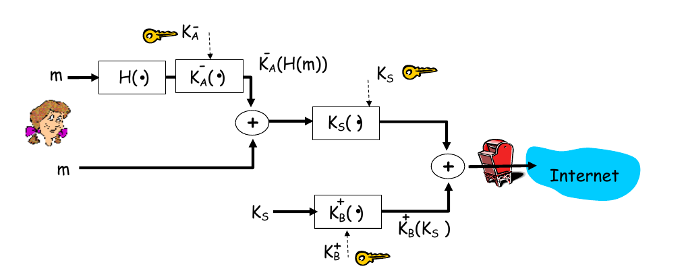

<!-- omit in toc -->
# CS3103

- [OSI 7 layers](#osi-7-layers)
- [Misc](#misc)
- [Subnets](#subnets)
- [Address Resolution Protocol (ARP)](#address-resolution-protocol-arp)
  - [Broadcast vs Multicast](#broadcast-vs-multicast)
  - [Proxy ARP](#proxy-arp)
  - [Properties](#properties)
- [Dynamic Host Configuration Protocol (DHCP)](#dynamic-host-configuration-protocol-dhcp)
  - [Relay Agent](#relay-agent)
  - [Packet format](#packet-format)
  - [Option format](#option-format)
  - [DHCP server design](#dhcp-server-design)
  - [Questions](#questions)
- [Virtual LAN (VLAN)](#virtual-lan-vlan)
  - [Trunking](#trunking)
  - [LAN vs VLAN](#lan-vs-vlan)
  - [Example](#example)
  - [Dynamic VLAN](#dynamic-vlan)
  - [Questions](#questions-1)
- [IP](#ip)
  - [Classful IP addresses](#classful-ip-addresses)
  - [Private IP addresses](#private-ip-addresses)
  - [IP Datagram](#ip-datagram)
  - [Encapsulation in eternet frame](#encapsulation-in-eternet-frame)
  - [IP fragmentation](#ip-fragmentation)
  - [`options` format](#options-format)
    - [Record-route option](#record-route-option)
    - [Loose source routing](#loose-source-routing)
    - [Strict source routing](#strict-source-routing)
    - [`ping -R` vs `traceroute`](#ping--r-vs-traceroute)
- [ICMP](#icmp)
  - [ICMP error messages](#icmp-error-messages)
  - [ICMP query messages](#icmp-query-messages)
- [HTTP](#http)
  - [Persistence vs non-persistence](#persistence-vs-non-persistence)
  - [Cookies](#cookies)
- [FTP](#ftp)
  - [Active mode](#active-mode)
  - [Passive mode](#passive-mode)
- [Email](#email)
  - [Push vs Pull](#push-vs-pull)
- [DNS (Domain Name Space)](#dns-domain-name-space)
  - [Root domain](#root-domain)
  - [Fully qualified domain names](#fully-qualified-domain-names)
  - [Root DNS servers](#root-dns-servers)
  - [Top-Level Domain (TLD) servers](#top-level-domain-tld-servers)
  - [Authoritative DNS servers](#authoritative-dns-servers)
  - [Local DNS servers](#local-dns-servers)
  - [Iterative name resolution](#iterative-name-resolution)
  - [Recursive name resolution](#recursive-name-resolution)
  - [Resource Records (RR)](#resource-records-rr)
    - [Start of Authority (SOA) records](#start-of-authority-soa-records)
- [P2P architecture](#p2p-architecture)
  - [File distribution (client-server vs P2P)](#file-distribution-client-server-vs-p2p)
  - [BitTorrent](#bittorrent)
    - [Piece selection policies](#piece-selection-policies)
    - [Upload policies](#upload-policies)
- [Wireless LANs](#wireless-lans)
  - [CSMA/CD](#csmacd)
  - [Hidden node problem](#hidden-node-problem)
  - [Exposed node problem](#exposed-node-problem)
- [IoT applications](#iot-applications)
  - [Constrained Application Protocol (CoAP)](#constrained-application-protocol-coap)
    - [Type (2 bits)](#type-2-bits)
    - [Message ID (16 bits)](#message-id-16-bits)
    - [Tokens](#tokens)
  - [Message Queuing Telemetry Transport (MQTT)](#message-queuing-telemetry-transport-mqtt)
- [Link state routing](#link-state-routing)
  - [Open Shortest Path First (OSPF)](#open-shortest-path-first-ospf)
    - [Point-to-point link](#point-to-point-link)
    - [Transient link](#transient-link)
    - [Stub link](#stub-link)
    - [Virtual link](#virtual-link)
    - [Neighbour discovery and maintenance](#neighbour-discovery-and-maintenance)
    - [Exchange of link-state information](#exchange-of-link-state-information)
    - [Database synchronisation](#database-synchronisation)
- [Network security](#network-security)
  - [Secure Sockets Layer (SSL/TLS)](#secure-sockets-layer-ssltls)
  - [Pretty good privacy (PGP)](#pretty-good-privacy-pgp)
- [Data formats](#data-formats)
  - [JSON](#json)
  - [BSON](#bson)
  - [CBOR](#cbor)
- [Real-time Transport Protocol (RTP)](#real-time-transport-protocol-rtp)
- [Session Initiation Protocol (SIP)](#session-initiation-protocol-sip)
  - [Components](#components)
  - [Peer-to-peer flow](#peer-to-peer-flow)
  - [Proxy flow](#proxy-flow)
  - [Gateway flow](#gateway-flow)
- [Software Defined Networking (SDN)](#software-defined-networking-sdn)
  - [OpenFlow protocol](#openflow-protocol)
    - [Flow table](#flow-table)

## OSI 7 layers

1. **Physical**: transmission and reception of raw bit streams over a physical medium
2. **Link**: transmission between two nodes connected by a physical layer
   - ARP
3. **Network**: responsible for packet forwarding, including routing through intermediate routers
   - IP, ICMP, IPsec, RIP, OSPF
4. **Transport**: provides host-to-host communication services for applications; services include connection-oriented communication, reliability, flow control, multiplexing etc.
   - UDP, TCP, RDP
5. **Session**: provides mechanism for opening/closing and managing a session between end-user application processes
   - RPC, RTCP
6. **Presentation**: establishes context between application-layer entities; ensures the information that the application layer of one system sends out is readable by the application layer of another system
   - Telnet
7. **Application**: the user interface responsible for displaying received information to the user
   - HTTP, FTP, TFTP, SSH, SMTP, DNS, POP, IMAP, SMTP, LDAP, MQTT, BGP

## Misc

- PoP: Points of Presence
- IXP: Internet Exchange Point
- Linux: `cat etc/services` to get all the well known port numbers

## Subnets

In this course, the first subnet/address and last subnet/address are **not considered usable**.

**Address**: first address refers to network address, last address refers to broadcast address.

**Subnet**: for example, NUSNET's network is `137.132.0.0/16`, and there are 256 subnets from `137.132.0.0` to `137.132.255.0`. If subnets `0` or `255` exists, does `137.132.0.0` refer to NUSNET's host address, or subnet `0`'s host address? Does `137.132.255.255` refer to NUSNET's broadcast address, or subnet `255`'s broadcast address?

> In modern times, by taking into account subnet masks, we can find out which is which. For example, `137.136.255.255/24` refers to subnet `255`'s broadcast address and `137.136.255.255/16` refers to NUSNET's broadcast address

## Address Resolution Protocol (ARP)

A **link layer protocol**; to find out the MAC address of a node given its IP address.

### Broadcast vs Multicast

- **Broadcast**: everyone receives the messages
- **Multicast**: need to join the group to receive messages

**Steps**:

1. **ARP Request**: broadcast ARP request to all stations on network
2. **ARP Reply**: unicast by the unknown target router with its MAC address

### Proxy ARP

Responding to ARP Request that arrives from one of its connected networks for a host that is on another side of its connected networks.

> To avoid configuration troubles when linking subnets together

### Properties

- **If ARP Request is made for non-existing host**: more requests are made with exponential backoff, and then eventually stops
- **Gratuitous ARP Requests**: a host sends ARP Request for its own IP
  - To detect if an IP address has already been assigned
- **ARP does not authenticate requests or replies**: can be forged
- **ARP is stateless**: ARP Replies can be sent without first receiving an ARP Request
- **Node must update its local ARP cache** with the info in the ARP packet (according to the ARP protocol specification)
  - Will take the latest information regardless
  - Can easily reroute packets to another party

Loopholes are intentionally let in for simplicity's sake. Any exploitation will only happen in the local network, which is easy to patch and detect.

## Dynamic Host Configuration Protocol (DHCP)

An **application layer protocol**; allows allocation of IP addresses from a pool through:

- Static configurations (specific address for indefinite amount of time)
- Automatic configurations (for indefinite time)
- Dynamic configurations (for specific duration; normally a few hours)

**Steps**:

1. **DHCP Discover**: client broadcast to the LAN; DHCP servers will ping an unused address to check if it is really unused
2. **DHCP Offer**: DHCP servers will offer client with an IP address and relevant info (broadcasted since the client does not have an IP at this point)
3. **DHCP Request**: client will choose one of the offered IP addresses, and broadcast decision to all the DHCP servers (so that other DHCP server know whether the IP they offered has been used or not)
4. **DHCP ACK**: DHCP server responds with ACK
5. **DHCP Release**: when leaving the network

### Relay Agent

Every IP subnet may not need an individual DHCP server.

- Router listens on port 67, intercepts DHCP Discover message and unicasts the request to one or more DHCP servers
  - Changes Router-address field to Router incoming IP address
  - Increments hop-count by 1
- DHCP server recognises this request is coming from Router and not the client
  - Sends unicast reply to the router
  - router replies to the client

### Packet format

- Client IP address: filled by client when renewing DHCP lease (since client knows its address already)
- Your IP address: filled by the DHCP server when offering the IP to client
- Server IP address: filled by client when renewing DHCP lease (since client knows server address already)
- Gateway IP address: filled by relay agent

### Option format

Used mostly in DHCP Reply; for additional information to client, and vendor specific information.

**Format**: `| TAG | LENGTH | VALUE |`

Refer to http://www.iana.org/assignments/bootp-dhcp-parameters/

### DHCP server design

- DHCP server stores `<key, value>` pair for each client. Default `key` is `<IP-subnet number, MAC address>`.
- Servers will often choose the LRU address to give to clients
- Servers should perform conflict detection using ICMP echo requests (`ping`)
- Clients should probe received address (with ARP)
- Time is always expressed in relation to client's clock
- Lease expiration time = DHCP Request time sent + DHCP ACK lease duration

### Questions

1. **Is DHCP really required?** Can we use MAC address (48 bits) which is itself unique?
   - So that the underlying hardware can change, but retain the same IP address for others to access
   - To keep the routing table small and manageable
2. **What is DHCP FORCERENEW?**
   - When client receives this from server, client will change its state to the `RENEW` state, and try to renew lease according to normal DHCP procedures
3. **Should DHCP OFFER be a limited broadcast message or a unicast message?**
   - Can be either
   - By default, it is a unicast message where the destination IP of packet is the IP being offered, since the DHCP server has the MAC address of the client, and can use it for unicast.
   - It can be broadcast if client is unable to receive unicast IP datagrams until they know their IP. Clients that need this should set the `BROADCAST` flag to true for their discover message.

## Virtual LAN (VLAN)

Deficiencies of classical subnets/LAN:

- Very static: difficult to change a single host (will affect all hosts in the subnet)
- Difficult to expand a subnet

### Trunking

- **Trunk**: a point-to-point link between two switches or between switches and routers
- Allows communication between devices on the *same VLAN* across *different switches*
- Rule of thumb: use switches and trunking where possible, and routers where truly necessary

### LAN vs VLAN

|                    LAN                     |                             VLAN                             |
| :----------------------------------------: | :----------------------------------------------------------: |
|   Broadcast domain under a single switch   |       Broadcast domain created by one or more switches       |
| Grouped based on the switch/hub physically | Grouped based on logical function, department or application |
|      Traffic is routed using a router      |             Traffic can be routed with a router              |

### Example

- Host P cannot ping Host Q: different subnets (even though they are in the same VLAN)
- Host Q cannot ping Host S: different VLANs (even though they are in same subnet)
- Host R cannot ping Host S: different subnets (even though they are in the same VLAN)
- Host P cannot ping Host R: different VLANs (even though they are in same subnet)

Suppose we swap the VLAN assignment of port 2 and 3, then:

- Host P cannot ping Host Q
- Host Q can ping Host S
- Host R cannot ping Host S
- Host P can ping Host R

### Dynamic VLAN

Switch ports can automatically determine a user's VLAN assignment based on MAC / physical address. Dynamic VLANs allow for membership based on the MAC address of the device connected to the switch port.

1. Device enters network
2. Switch that device is connected to queries (using VLAN Query Protocol) a database on the VLAN Configuration Server (VMPS Server) for VLAN membership

### Questions

- What is the highest VLAN number?
  - Only 12 bits are used for VLANs in 802.1q, and 0 and 4095 are reserved; thus, **4094 total**

## IP

### Classful IP addresses

### Private IP addresses

- Class A: `10.0.0.0` to `10.255.255.255`
- Class B: `172.16.0.0` to `172.31.255.255`
- Class C: `192.168.0.0` to `192.168.255.255`

### IP Datagram

The order of bytes of an IP datagram is transmitted by **big endian** ordering (also called **network byte**). Transmission is row by row, from least significant bit to most significant bit.

> Many computers (incl. Intel processors) store 32-bit words in little endian format; need to convert between the format when sending/receiving.

### Encapsulation in eternet frame

- **Why is there a minimum length of 46 bytes?**
  - To reliably detect collisions
- **Why is there a maximum length (MTU)?**
  - The larger the frame, the higher the chance of error
  - An adversary can also hijack the network with infinite-length frame

### IP fragmentation

**636 bytes of data to be transferred with MTU of 256 bytes.**

- Max possible data length $= 256 - 20 = 236$ bytes
  - Since each IP header is 20 bytes
- However, length must be divisible by 8, except for last fragment, thus max possible length in each fragment $= 232$ bytes
- Thus, length of each fragment: 232, 232, 172

**Why must the data length in each fragment be divisble by 8?**

- The `fragment offset` field in the IP header is only 13 bits long (the other 3 bits are used for the `flags`)
- Thus, to still specify a data length of $2^{16}$ (using only 13 bits), the value in the `fragment offset` is multiplied by 8 to make up for the loss of the 3 bits

**A packet has arrived with an $M$ bit value of 1 and a fragmentation offset value of zero. Is this the first fragment, the last fragment, or a middle fragment?**

First fragment.

**A packet has arrived in which the offset value is 100, the value of HLEN is 5 and the value of the total length field is 100. What is the number of the first byte and the last byte of the IP payload?**

Header size $= 5 \times 4 = 20$ bytes (since each bit in HLEN represents 32 bits or 4 bytes)

First byte $= 100 \times 8 = 800$  
Last byte $= 800 + 100 - 20 - 1 = 879$ bytes

### `options` format

Total 40 bytes:

- `type`: 8 bits
- `length`: 8 bits
- `value`: variable length (max 38 bytes)

#### Record-route option

Record IP addresses in every hop. Each IP address requires 4 bytes of memory. Total number of addresses able to be stored $= \lfloor \frac{38}{4} \rfloor = 9$.

#### Loose source routing

- Set of routers a packet must visit is recorded in `options`
- Destination of the packet is replaced with the next router the packet must visit
- Compared to strict source routing, packet can visit intermediate destinations as long as the routers are visited

#### Strict source routing

- Compared to loose source routing, every step of the route is decided in advance where the packet is sent

#### `ping -R` vs `traceroute`

`ping -R` displays outgoing IP addresses, i.e. addresses when leaving the routers, while `traceroute` displays addresses when entering the routers.

If the 9-address limit of `ping -R` is sufficient to display all the addresses encountered in a round trip, we can see first the addresses opposite to the source, then the addresses towards the source. With `traceroute` you only see the addresses towards the source.

## ICMP

- An error reporting mechanism, and can only report condition back to the original source
- Allows routers and hosts to send error or control messages to other routers/hosts

- Header: 8 byte
  - Format for first 4 bytes is common to all ICMP packets
  - `type`: ICMP message type
  - `code`: reason for the message type generated
- Data: variable size (up to 28 bytes)

### ICMP error messages

- Max length of ICMP error messages = 576 bytes
- Contains a copy of the entire IPv4 header (20 bytes) and at least the first 8 bytes of data from the IPv4 packet which caused the error
- The port numbers (if any) are assumed to be in the first 8 bytes of original datagram data

---

1. **What if a datagram carrying ICMP error message causes another error?**
   - No error message will be generated (infinite loop)
2. **Do we need ICMP error message for each fragment of a fragmented datagram that causes the error?**
   - No, only fragment 0
3. **ICMP error messages will not be for a datagram whose source address is not a single host, 0.0.0.0, 127.x.x.x, broadcast or multicast address, Why?**
   - Broadcast addresses: too many message will be generated which will flood the system
   - Localhost addresses: No point generating to localhost

### ICMP query messages

The `timestamp-request` and `timestamp-reply` messages can be used to synchronize two clocks in two machines if the exact one-way time duration is known.

- RTT = (returned timestamp - transmit timestamp) + (receive timestamp + original timestamp)
- If the 2 clocks are not synchronised, the RTT *will still be correct* (the errors cancel out)

---

The `echo-request` and `echo-reply` messages can test the reachability of a host. This is usually done by invoking the `ping` command.

---

The `time-exceeded` message is used by the `traceroute` utility to identify gateways on the path between two hosts:

1. Client sends a UDP datagram to destination with TTL field in IP header set to `1`
2. Causes router to generate `time-exceeded` ICMP error
3. Increment TTL progressively until final destination is reached

> Some firewalls disable UDP messages. In this case, use TCP sync to probe instead.

## HTTP

- Uses **TCP service**
- **Default port**: 80
- **Stateless**: note that TCP maintains connection state, application layer is not maintaining the application/user state
  - Server maintains no info about past client requests
  - If server/client crashes, their views of "state" may be inconsistent and must be reconciled

### Persistence vs non-persistence

Persistence:

- Server leaves TCP connection open after sending a response
- Subsequent requests (referenced objects) between the same client and server will use the same connection

Non-persistence:

- Server terminates connection after transferring a file/object
- New connection is established each time (new set of TCP variables and buffers)

### Cookies

- Used to manage user identity
- Have 4 components:
  - HTTP response header: by web server upon initial request from client
  - HTTP request header: every subsequent request by client
  - Cookie file: maintained by the client
  - Backend database: of the web server

## FTP

- **Two TCP connections** required
- **Ports**: 21 for control connection, 20 for data connection
- **Stateful**: state about the user is maintained throughout the session

### Active mode

1. Client's command port contacts server's command port and sends the command `PORT 1027`
2. Server sends ACK
3. *Server initiates* connection from its data port to client's data port
4. Client sends ACK

This normally results in issues since client side firewall normally blocks external systems from initiating connections.

### Passive mode

1. Client's command port contacts server's command port and sends the command `PASV`
2. Server then replies with port `2024`
3. *Client initiates* connection from its data port to server's data port (in step 2)
4. Server sends ACK

## Email

Three major components:

1. **User Agents (UA)**: eg. Outlook, Mozilla Thunderbird
2. **Message Transfer Agents (MTA)**: eg. SMTP (port 25)
3. **Message Access Agents (MAA)**:eg. POP3 (port 110), IMAP4 (port 143)

- Send to MTAs via HTTP/SMTP
- Receive from MAAs via HTTP/POP3/IMAP4

### Push vs Pull

- **Push**: TCP connection is initiated by machine that wants to *receive* file
- **Pull**: TCP connection is initiated by machine that wants to *send* file

## DNS (Domain Name Space)

- **Hierarchical**: a tree consisting of discrete elements that are related to one another
  - Easy to avoid conflicts
- **Domain**: a *complete subtree* of the domain name space
- **Zone**: *any region* on the tree where a server has authority over
  - A node/machine can belong to multiple overlapping zones

- **Primary server**: stores information about the zone it is an authority for
  - Creates, maintains, and updates zone file
- **Secondary server**: has the complete information about a zone
  - Cannot create nor update zone file
- **Both are authoritative**: both provide authoritative answer for their zone

### Root domain

- Does not have a formal name (is actually an empty string `""`)
- Thus, any domain name must end in a full stop `.` to denote the root domain

### Fully qualified domain names

**NOTE**: the last dot `.` represents the `Root` domain and should be there! Modern browsers do it for us automatically and leave it out.

### Root DNS servers

- Publishes the **root zone file**, which contains RR for the authoritative servers of all TLDs
- Does not store information for specific IP addresses, but can redirect client to the appropriate TLD servers

### Top-Level Domain (TLD) servers

- Responsible for all top-level country domains, and `com`, `org`, `net`, `edu`, `aero`, `jobs`, `museums`, etc.

### Authoritative DNS servers

- Organisation's own DNS server
- Provides authoritative hostname to IP mappings for organisation's named hosts

### Local DNS servers

- Does not strictly belong to hierarchy
- Each ISP has one (called `defauly name server`)
- When a host makes DNS query, query is sent to local DNS server
- Acts as proxy and forwards query into hierarchy

### Iterative name resolution

### Recursive name resolution

### Resource Records (RR)

- **Format**: `<name, value, type, ttl>`

#### Start of Authority (SOA) records

- Indicates authority for this domain data

| `name` |                `value`                |         `ttl`         |
| :----: | :-----------------------------------: | :-------------------: |
| domain | hostname of authoritative name server | when cached by others |

## P2P architecture

- No always-on server
- End systems directly communicate and serve each other (each host is both server and client)
- eg. BitTorrent, Skype

### File distribution (client-server vs P2P)

Let size of file $= F$,  
number of clients $= N$,  
upload speed $= u_s$,  
minimum download speed $= d_{min}$.

**Client-server approach**:

Time taken to send $N$ clients using a single server $= N\frac{F}{u_s}$,  
minimum client download time $= \frac{F}{d_{min}}$,  
thus, total time taken:

$$
T_{CS} \geq \max\left({N\frac{F}{u_s},\frac{F}{d_{min}}}\right)
$$

Thus, $T_{CS}$ increases linearly with $N$.

**P2P approach**:

Server must upload at least one copy, thus time to send one copy $= \frac{F}{u_s}$,  
minimum client download time $= \frac{F}{d_{min}}$,  
each client $i$ can start to upload file as well, thus max upload rate $= u_s + \sum u_i$,  
thus, total time taken:

$$
T_{P2P} \geq \max\left({\frac{F}{u_s}, \frac{F}{d_{min}}}, N\frac{F}{u_s+\sum u_i} \right)
$$

Thus, $T_{CS}$ does not increase linearly with $N$, as $\sum u_i$ increases with $N$ (since each peer brings uploading capacity).

### BitTorrent

#### Piece selection policies

- At any given time, different peers have different subsets of file chunks
- Order in which pieces are selected by different peers is critical for good performance
- If an inefficient policy is used, then peers may end up in a situation where each has all identical set of easily available pieces, and none of the missing ones

**Policies**:

- **Random first piece**: in beginning, randomly get a complete piece ASAP
- **Rarest piece first**: download the pieces that are most rare amongst peers (most commonly available pieces are left till end to download)
- **Endgame mode**: near completion, missing pieces are requested from every peer who has them (ensures that download isn't hampered by a single peer with slow transfer rate)

#### Upload policies

- **Choking**: temporary refusal to upload to free riders
- **Tit-for-tat strategy**: Alice send chunks to four peers currently sending her chunks at highest rate (thereby choking other peers)
  - Re-evaluate top 4 every 10 seconds
  - Optimistically unchoke a random peer every 30 seconds (this peer then has a chance to join top 4) to find if better peer exists
- **Upload-only mode**: occurs when peer has finished uploading
  - Upload to those with the best upload rate (to ensure pieces get replicated faster, and thus spawn new seeders)

## Wireless LANs

### CSMA/CD

> Listen while you talk

- Error free delivery is not guaranteed
- **No need for ACK**: reliable delivery is implemented by higher level protocols
- **Not used for wireless**: due to *hidden node problem*
- **IFS**: used to define priority of a station/frame (higher IFS = lower priority)
- **Contention Window**: random number of slots chosen as wait time before sending

### Hidden node problem

Use reservation scheme (CTS) to prevent this issue:

- **Interface space (IFS)**: minimal pause between frames
- **Distributed coordination function IFS (DIFS)**: longest IFS
  - Used as minimum delay of asynchronous frames contending for access
- **Short IFS (SIFS)**: shortest IFS
  - Used as minimum delay of immediate response actions (`ACK`, `CTS`)

### Exposed node problem

## IoT applications

Anything that:

- is **internet-addressable** (cloud connectivity)
- can **perform computation** (embedded systems, micro OS)
- can **collect data** (sensors)
- can **interact with the environment** (actuators)
- can **move** (automobiles, PMDs, drones, etc.)

### Constrained Application Protocol (CoAP)

A specialised web transfer protocol for use with constrained nodes and constrained networks in IoTs. Think of it as a **lightweight and faster HTTP**.

- Proxy can be thought of as an *IoT gateway*: a single device to decide which IoT device to route requests to
- Proxy communicates with both sides (ie. understands HTTP and CoAP) and translates between them
- When the client requests from the IoT device using HTTP, the proxy translates to lightweight CoAP for the IoT device

#### Type (2 bits)

| Message |                            Description                            |
| :-----: | :---------------------------------------------------------------: |
|  `CON`  |               Expects a corresponding `ACK` message               |
|  `NON`  |              Does not expect a confirmation message               |
|  `ACK`  |   Acknowledge that a `CON` has been received; may carry payload   |
|  `RST`  | Indicates that it had received a message but could not process it |

#### Message ID (16 bits)

**Response messages will have the same Message ID as request**. Used to detect message duplication and to match messages of type `ACK`/`RST` to messages of type `CON`/`NON`.

#### Tokens

Optional field whose size is indicated by the Token Length field, whose values is generated by the client. The server must echo every token value without any modification back to the client. It is intended for use as a client-local identifier to provide extra context for certain concurrent transactions.

### Message Queuing Telemetry Transport (MQTT)

A lightweight, pub-sub network protocol, usually running over TCP/IP.

- Clients connect to a *broker* (server)
- Client *subscribe* to topics
- Client can *publish* messages to topics
- Client receives all messages published to topics they are subscribed to
- Messages can be anything (text, image, etc.)

## Link state routing

In link state routing, each node in the domain has and knows the entire topology of the domain. In contrast, in distance vector, the router only knows the cost to each destination.

### Open Shortest Path First (OSPF)

An **intra-domain routing protocol** based on link state routing. Its domain is also an Autonomous System.

- All routers maintain the same topology database
- No knowledge of network topology outside their area
- Area Border Routers (ABR) and AS Boundary Routers (ASBR) summarise information about their area and send it to other areas

#### Point-to-point link

- **Connects routers directly** without any other host/router in between

#### Transient link

- Network with **several routers** attached to it
- Every router in this network will broadcast to every other router
- Thus, with $N$ routers, LSA message complexity could potentially be $O(N^2)$ (each router broadcast $N$ messages to all other routers)
- As such, network contains a **Designated Router (DR)** and **Backup Designated Router (BDR)** (elected via Hello protocol) to represent the subnet and broadcast subnet info
- Routers only send LSA to DR/BDR
- DR/BDR sends LSA to all routers

Two rules to elect a DR and BDR:

1. Router with the highest OSPF priority will become the DR
   - By default, all routers have a priority of 1
   - Manually configure a router priority using `ip opsf priority <value>` (set to 0 to not participate in election at all)
2. If tie, router with the highest router ID wins; router with the second highest OSPF priority or router ID will become the BDR

#### Stub link

- Network connected to **only one router**
- Thus, the router must be DR

#### Virtual link

- Created when link between two routers is broken in the backbone

#### Neighbour discovery and maintenance

- Discover neighbours via `Hello` messages. Content includes:
  - Router's IP address for that interface
  - `Hello` interval
  - List of neighbours whose `Hello`s the sender has already heard
- `Hello` messages are  multicast to all OSPF routers using the address `224.0.0.5` every 10 secs
- Failure to receive any `Hello` from a neighbour for 40 secs means the neighbour is down

#### Exchange of link-state information

Each entity in an area (eg., a router, a broadcast network/ABR) distributes information about its local environment in packets called **Link State Advertisements (LSAs)**.

LSAs are sent only if:

- Router discovers a new neighbour
- Link to a neighbour goes down
- Cost of a link changes
- Basic refresh packets are sent every 30 mins

Every router in an area receives the LSAs generated by other routers in the area (that contain the respective router's local environment information) and builds a database of LSAs that describes the topology of the area.

#### Database synchronisation

LSA database initialisation occurs when new router is added to segment:

1. DR sends a *summary* (not full!) of its database of LSAs to the new router (**database description packets**)
2. New router responds with a list of LSAs that it does not have or that are outdated (**link-state request packets**)
3. DR forwards the *full* LSAs in the list to the new router (**link-state update/advertisement packets**)

## Network security

### Secure Sockets Layer (SSL/TLS)

> SSL is now deprecated with TLS taking its place; both of them are largely synonymous now

- **Not compatible with unreliable channels** (eg. UDP) due to message loss

1. Client initiates TCP 3-way handshake to establish TCP connection with server
2. Client sends cryptography and hash algorithms it supports to server in `Hello` message
3. Server selects a symmetric key algorithm, public key algorithm and MAC (hash) algorithm and sends choices to client with a **certificate** and server nonce
4. Client extracts server's public key, generates pre-master key (preMS), encrypts the preMS with server's public key, and sends encrypted preMS to server
5. Both client and server use the same key derivation function to generate MS and the **4 keys** from the MS
6. Client sends MAC of all handshake messages
7. Server sends MAC of all handshake messages

**Why 4 keys?** 2 each for sender and receiver, where 1 is used for data encryption and 1 for MAC. This is for greater security because even if one key is compromised, only one direction is compromised.

### Pretty good privacy (PGP)

Let Alice's private key be $K_A^-$, Bob's public key be $K_B^+$, and symmetric key be $K_S$:

## Data formats

### JSON

- No schema needed
- Human readable string format; no binary data
- Strings need to be escaped
- No extensibility

### BSON

- Similar to JSON; used by MongoDB
- Machine binary format
- Uses more space compared to JSON
- Unlike JSON, can represent more data types (like JS dates, boolean, integers, long, float, etc.)

### CBOR

- Similar to JSON; used by MongoDB
- Machine binary format
- Recommended data serialisation layer for the CoAP protocol
- Able to convert/encode most common data formats (like JSON)
- Extensible

## Real-time Transport Protocol (RTP)

UDP is more suitable than TCP for real-time traffic. RDP is designed to handle real-time traffic on the Internet and to make up for some deficiencies of UDP.

- Must be **used with UDP**
- Does not have delivery mechanism (multicasting, ports, etc)
- Features include: time stamping, sequencing, and mixing facilities
- Uses a temporary even-numbered UDP port
- **Uses RTCP**: a companion protocol which enables sender to monitor the network condition and react

## Session Initiation Protocol (SIP)

An IETF standard, application layer control (signalling) protocol for creating, modifying and terminating sessions with one or more participants.

- Relies on **either UDP or TCP** (chosen by developer)
- Used for voice, video, IM, gaming, etc.
- Can be used to establish two-party (unicast) or multiparty (multicast) sessions

### Components

- **User agent**: logical network endpoint that sends or receives SIP messages and manages SIP sessions; can either be client (UAC) or server (UAS)
- **Proxy server**: network server with UAC and UAS components that functions as an intermediary entity for the purpose of performing requests on behalf of other network elements
- **Registrar**: SIP endpoint that provides a location service; it accepts `REGISTER` requests, recording the address and other parameters from the user agent
- **Gateway**: used to interconnect a SIP network to other networks

### Peer-to-peer flow

### Proxy flow

- Clients always connect to server, which connects to destination by converting SIP address to IP address
- All clients should register with SIP server (via Registrar) with its current IP address (when they login)

### Gateway flow

## Software Defined Networking (SDN)

- **Data plane**: processing and delivery of packets
  - Based on state in routers and endpoints
  - Fast time-scales (per packet)
  - Eg. IP, TCP, Ethernet, etc.
- **Control plane**: establishing the state in routers
  - Determines how and where packets are forwarded
  - Slow time-scales (per control event, eg. new router joined)
  - Routing, traffic engineering, firewall state

**Main idea**: separate control plane from data plane entities

- Execute or run **control plane** software on general purpose hardware to decouple from specific networking hardware
- Have programmable **data planes** to maintain, control, and program state from a central entity

### OpenFlow protocol

A communication interface between the control and data plane of an
SDN architecture.

- Allows direct access to and manipulation of the forwarding plane of network devices, such as switches and routers, both physical and virtual
- Sits in Application Layer

#### Flow table

- Every switch will have their own flow table
- When packet arrives at a switch, the header fields are matched with the switch's flow table
- If any entry matches, perform the indicated `action` and update the `counter`
- If no entries match, switch asks controller by sending a message with the packer header

