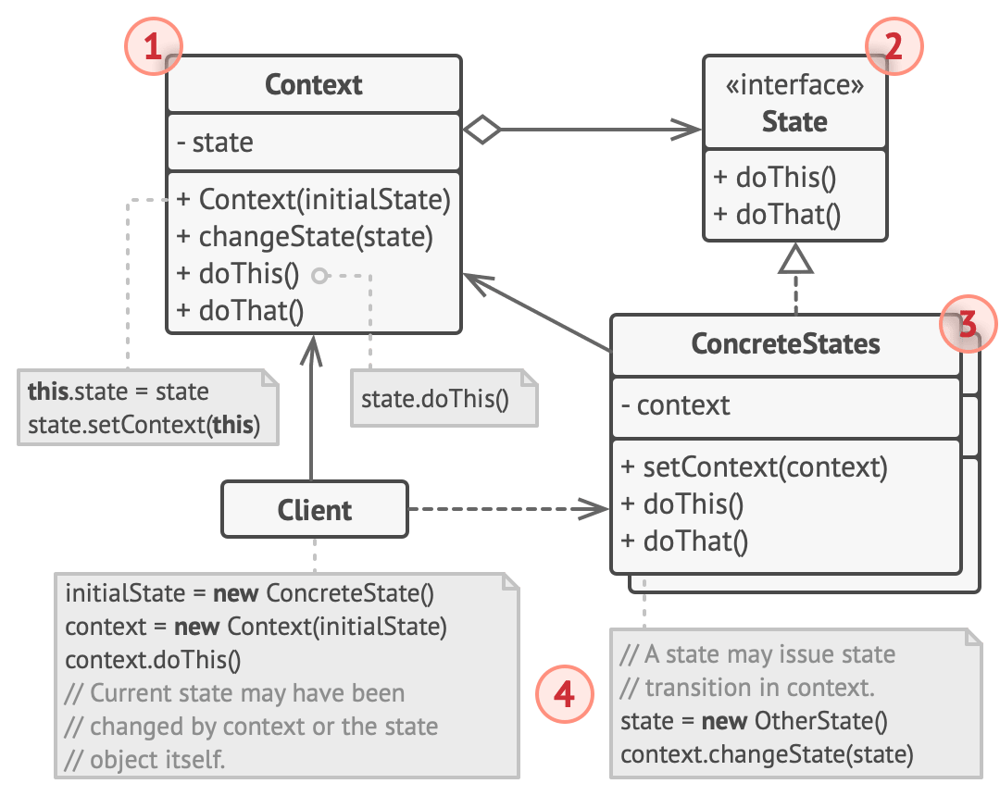

<!-- omit in toc -->
# CS3219

- [Software development process](#software-development-process)
  - [Embedded software](#embedded-software)
  - [Real-time software](#real-time-software)
  - [Concurrent software](#concurrent-software)
  - [Distributed software](#distributed-software)
  - [Edge-dominant software](#edge-dominant-software)
  - [Continuous Integration/Delivery/Deployment](#continuous-integrationdeliverydeployment)
- [Requirements](#requirements)
  - [Quality of requirements](#quality-of-requirements)
  - [Business rules](#business-rules)
  - [Business requirements](#business-requirements)
  - [Functional requirements](#functional-requirements)
  - [User requirements](#user-requirements)
  - [External interfaces](#external-interfaces)
  - [Quality attributes/requirements (NFR)](#quality-attributesrequirements-nfr)
  - [Constraints (NFR)](#constraints-nfr)
  - [Data requirements (NFR)](#data-requirements-nfr)
  - [System requirements (NFR)](#system-requirements-nfr)
  - [Software Requirements Specification (SRS)](#software-requirements-specification-srs)
  - [Requirements development phases](#requirements-development-phases)
  - [Requirements traceability](#requirements-traceability)
- [Software architecture design](#software-architecture-design)
  - [Layered architecture](#layered-architecture)
    - [2-tier architecture](#2-tier-architecture)
  - [Pipe and Filter architecture](#pipe-and-filter-architecture)
  - [Shared repository](#shared-repository)
  - [Command-Query-Responsibility Segregation (CQRS)](#command-query-responsibility-segregation-cqrs)
- [Software design principles](#software-design-principles)
  - [Information Hiding (IH)](#information-hiding-ih)
  - [Separation of Concerns (SoC)](#separation-of-concerns-soc)
  - [Open Close Principle (OCP)](#open-close-principle-ocp)
  - [Liskov Substitution Principle (LSP)](#liskov-substitution-principle-lsp)
    - [Example of violation](#example-of-violation)
  - [Interface Segregation Principle (ISP)](#interface-segregation-principle-isp)
  - [Dependency Inversion Principle (DIP)](#dependency-inversion-principle-dip)
- [Software architecture style](#software-architecture-style)
  - [Model View Controller (MVC)](#model-view-controller-mvc)
  - [Model View Adapter (MVA)](#model-view-adapter-mva)
  - [Model View Presenter (MVP)](#model-view-presenter-mvp)
  - [Presentation Model (PM)](#presentation-model-pm)
  - [Model View ViewModel (MVVM)](#model-view-viewmodel-mvvm)
  - [Flux](#flux)
- [Microservice architecture](#microservice-architecture)
  - [Domain Driven Design (DDD)](#domain-driven-design-ddd)
  - [Orchestration vs Choreography](#orchestration-vs-choreography)
  - [API gateway](#api-gateway)
  - [Refactoring monoliths into microservices](#refactoring-monoliths-into-microservices)
    - [Stop digging - law of holes](#stop-digging---law-of-holes)
    - [Split frontend and backend](#split-frontend-and-backend)
    - [Extract services](#extract-services)
- [Software deployment strategies](#software-deployment-strategies)
  - [Blue-Green deployment](#blue-green-deployment)
  - [Rolling deployment](#rolling-deployment)
  - [A/B testing](#ab-testing)
  - [Canary deployment](#canary-deployment)
- [Messaging patterns](#messaging-patterns)
  - [Message construction](#message-construction)
  - [Message channels](#message-channels)
  - [Message routing](#message-routing)
  - [Message transformation](#message-transformation)
  - [Message endpoints](#message-endpoints)
  - [Message queues](#message-queues)
  - [Pub-Sub pattern](#pub-sub-pattern)
  - [Observer pattern](#observer-pattern)
- [Object interaction design patterns](#object-interaction-design-patterns)
  - [Adapter](#adapter)
    - [Implementation](#implementation)
  - [Builder](#builder)
  - [Prototype](#prototype)
  - [Facade](#facade)
  - [Observer](#observer)
  - [Mediator](#mediator)
  - [Memento](#memento)
  - [State](#state)
  - [Strategy](#strategy)
  - [Data Transfer Object (DTO)](#data-transfer-object-dto)
- [Software design quality](#software-design-quality)
  - [Symptoms of structural erosion](#symptoms-of-structural-erosion)
  - [McCall's Triangle of Quality](#mccalls-triangle-of-quality)
    - [Product operation](#product-operation)
    - [Product revision](#product-revision)
    - [Product transition](#product-transition)
  - [Other qualities](#other-qualities)
  - [CK metrics suite](#ck-metrics-suite)
    - [Weighted Methods per Class (WMC)](#weighted-methods-per-class-wmc)
    - [Depth of Inheritance Tree (DIT)](#depth-of-inheritance-tree-dit)
    - [Number Of Children (NOC)](#number-of-children-noc)
    - [Coupling Between Classes (CBO)](#coupling-between-classes-cbo)
    - [Reponse For a Class (RFC)](#reponse-for-a-class-rfc)
    - [Lack of Cohesion in Methods (LCOM)](#lack-of-cohesion-in-methods-lcom)

## Software development process

### Embedded software

- Software that is placed permanently inside some kind of device to perform a very specific set of functions
- Commonly found in industrial or consumer devices

### Real-time software

- Software that must function within a time frame that the user senses as immediate or current
- Major run time consideration or constraint is time

Classification of real-time software is based on the consequences of missing a deadline:

- **Hard**: deadline misses lead to total system failure
  - eg. aeroplane calibration system, may mean deaths of people if deadline is missed
- **Firm**: infrequent deadline misses are tolerable, but may degrade the system's quality of service; the result is useless after missing the deadline
- **Soft**: the usefulness of a result degrades after its deadline (not useless)
  - eg. game engines, where the loss of frames are simply an annoyance

### Concurrent software

- Software with multiple computations/programs running in parallel

### Distributed software

- Software which runs across more than one computer
- Usually connected via a network

### Edge-dominant software

- Any type of software that delivers low latency nearer to the requests
  - eg. CDNs

### Continuous Integration/Delivery/Deployment


## Requirements

**Definition** of a requirement:

- A condition or capability needed by a user to solve a problem or achieve an objective
- A condition or capability that must be met or possessed by a system or system component to satisfy a contract, standard, specification, or other formally imposed document

### Quality of requirements

- Unambiguous
- Testable (verifiable that the requirement is met)
- Clear (concise, terse, simple, precise)
- Correct
- Understandable
- Feasible (realistic, possible)
- Independent
- Atomic
- Necessary
- Implementation-free (i.e. abstract)
- Consistent
- Non-redundant
- Complete

### Business rules

A policy, guideline, standard, regulation, or computational algorithms that defines or constrains some business requirement.  They are typically foundational, long-term and fairly static. Any changes to a rule will result in new or amended business requirements.

Note that we only **care about what** should happen, **not how** it should happen. For example:

- All staff must get 30% discount on travel expenses
- All users must have a valid email address

### Business requirements

Generally relates to what must be done in order to enable or achieve a business rule. For example:

- Reduce airport counter staff costs by 25%
- Increase market share in South Asia by 10% in the next 3 months

### Functional requirements

Specify what the system must do, and what the developer must implement, to enable users to accomplish their tasks (thereby satisfying the business requirements). For example:

- The system should allow passengers to print boarding passes for all flight segments for which he has checked in

### User requirements

Describe goals or tasks the user must be able to perform with the product, typically captured as use cases, user stories, or scenarios. For example:

- As a flight passenger, I can check for flight details using the airline's kiosk or website, so that I am updated with the latest details

### External interfaces

Describe connections between your system and the outside world. For example:

- Must import files in a CSV format
- Payment must be accepted only through Stripe

### Quality attributes/requirements (NFR)

Describe how well the system performs some function. For example:

- Mean time between failure must be less than 100 hours
- Noise level cannot exceed 70dB at 20 metres

### Constraints (NFR)

Specify a limitation on design or implementation choices. For example:

- Must be backwards compatible with 3.x.x versions
- Memory use cannot exceed 50% of system

### Data requirements (NFR)

Describe a data item or structure. For example:

- Format of a product number is a 3-character product name prefix, a hyphen, and a 6-digit project code
- Default value for the control temperature is 25.0 deg celsius

### System requirements (NFR)

Specify a hardware or software constraint. For example:

- The system must support Safari and IE browsers
- The invoice system must share data with the purchase order system

### Software Requirements Specification (SRS)

Also know as **Functional Requirements Specification (FRS)** is made up of:

- Functional requirements
- External interfaces
- Quality requirements
- Constraints

### Requirements development phases

1. **Elicitation**: discover the requirements via interview
2. **Analysis**: analyse, decompose, and identify gaps
3. **Specification**: write and illustrate requirements for review
4. **Prioritisation**: prioritise set of requirements to develop first
5. **Validation**: confirm set of requirements to allow developers to build the correct solution

### Requirements traceability

Requirements should be traced to:

- Use case reference
- Design document reference
- Code module reference
- Test case reference
- Others e.g. comments, modification
requests

**Validation**: whether you have the **right requirements**; do they trace back to business objectives?

**Verification**: whether you have the **requirements right**; do they have the desirable properties (eg. completeness, correctness, feasibility, etc.)?

## Software architecture design

### Layered architecture

Define one or more layers for the software under development, with each **layer having a distinct and specific responsibility**.

#### 2-tier architecture

Typical **client-server** architecture, where the client is the presentation layer, and the server is the application and resource management layer.

### Pipe and Filter architecture

Divide the application's tasks into several **self-contained data processing steps**, and connect these steps to a data processing pipeline via intermediate data buffers.

- Data enters the system and then flows through components one at a time until data ia assigned to some final destination (data sink)
- Similar to unix pipes (`|`)

### Shared repository

Maintain all data in a **central repository** shared by all components of the application, and let the availability, quality, and state of that data **trigger and coordinate** the control flow of the application logic.

### Command-Query-Responsibility Segregation (CQRS)

Separate commands from queries:

- **Commands**: stateful operations that change the application state and return no data
- **Queries**: stateless operations that return data but do not change application state

## Software design principles

### Information Hiding (IH)

1. Don't expose data items
2. Don't expose the difference between stored data and derived data
3. Don't expose a class's internal structure
4. Don't expose implementation details of a class

### Separation of Concerns (SoC)

Process of breaking a computer program into distinct features that overlap in functionality as little as possible. Related to **Single Responsibility Principle**.

### Open Close Principle (OCP)

- **Open for extension**: behaviour of the module can be extended
- **Closed for modification**: extending the behaviour of a module does not result in changes to the source

For example, you should be able to extend your existing code using OOP features like inheritance via subclasses and interfaces. However, you should never modify classes, interfaces, and other code units that already exist (especially if you use them in production), as it can lead to unexpected behaviour.

### Liskov Substitution Principle (LSP)

A parent object of type `T` may be substituted with any child object of a subtype `S`, without altering any of the desirable **properties** of the program.

While LSP forbids the violation of **contracts** of a supertype in a subtype, it **does not** forbid the changes of behaviours of any method that is *within bounds of that contract*. In other words, overriding a method in a subtype may, but not always, lead to a violation in LSP.

#### Example of violation

```java
class Rectangle {
  public int height;
  public int width;

  public void setHeight(int height) {
    this.height = height;
  }

  public void setWidth(int width) {
    this.width = width;
  }

  public int calculateArea() {
    return this.height * this.width;
  }
}

class Square extends Rectangle {
  @Override
  public void setHeight(int height) {
    super.height = height;
    super.width = height;
  }

  @Override
  public void setWidth(int width) {
    super.width = width;
    super.height = width;
  }
}
```

In here, the constraint of the parent class `Rectangle` is that the `height` and `width` can be set independently of each other. However, the child class `Square` overrides the behaviour such that `height` and `width` cannot be independently set. If we were to substitute `Rectangle` with `Square`, it violates LSP because we can no longer have independent `width` and `height`, and the behaviour is different from what we expect of a `Rectangle`:

```java
Rectangle rect = new Rectangle();
rect.setWidth(2);
rect.setHeight(3);
rect.calculateArea(); // area == 6
// now we substitute Rectangle with Square:
Rectangle rect = new Square();
rect.setWidth(2);
rect.setHeight(3);
rect.calculateArea(); // area == 9, violation of the Rectangle contract/properties!
```

This can be fixed by having a `Quadrilateral` interface which does not make any assumption of how the dimensions of a `Quadrilateral` can be set (since other child classes like `Trapezium` is possible which does not necessarily have well defined `height`/`width`). However, we know that there must be a `calculateArea` method, since any valid `Quadrilateral` has a calculable area.

```java
interface Quadrilateral {
  // contract for this method is that it must exist and return an int
  public int calculateArea();
}

class Rectangle implements Quadrilateral {
  public int height;
  public int width;

  public void setHeight(int height) {
    this.height = height;
  }

  public void setWidth(int width) {
    this.width = width;
  }

  @Override
  public int calculateArea() {
    return this.height * this.width;
  }
}

class Square implements Quadrilateral {
  public int length;

  public void setLength(int length) {
    this.length = length;
  }

  @Override
  public int calculateArea() {
    return this.length * this.length;
  }
}
```

### Interface Segregation Principle (ISP)

Classes which implement an interface should not be forced to depend on methods that they do not use.

In practice, avoid fat interfaces, and create smaller interfaces that can be implemented more flexibly.

### Dependency Inversion Principle (DIP)

High level modules should not depend on lower level modules; both should depend on abstractions.

Create an abstract layer for low-level classes, so that high-level classes can depend on the abstraction, which avoids tight coupling.

## Software architecture style

### Model View Controller (MVC)

Three decoupled parts:

- **Model**: contains data-related logic either being transferred between View and Controller, or any other business logic-related data
- **View**: retrieves and updates data from the model, and displays it to the user
- **Controller**: accepts user input as events, and translates to service requests for the model, or display requests for the view


**Applicability**:

- Respects SOC be separating user input handling from application state and transaction processing
- Respects OCP as a new View/Controller pair can be added for a new interface medium

### Model View Adapter (MVA)

Similar to MVC, but **all communication between Model and View must flow through the Adapter/Controller** (ie. no direct link between Model and View).


### Model View Presenter (MVP)

> https://stackoverflow.com/questions/15588562/whats-the-difference-between-model-view-presenter-and-model-view-adapter

Similar to MVA, but implies a strong triad. In MVA, there can be multiple different Adapters, but there should only be a single Presenter in MVP.

### Presentation Model (PM)

- **Model**: unlike MVC, it represents the state of the View, and might contain UI elements specific properties
- **View**: lightweight and simple, and only contains UI specific elements; any events raised by the user are transmitted to the Presenter
- **Presenter**: receives events from View, processes them, and updates the model; unlike MVP, presenter knows about Model and is responsible for updating the state changes and calling View to render

**Applicability**:

- For rich UI application

### Model View ViewModel (MVVM)

- **Model**: similar to Model in MVC, the business logic layer
- **View**: similar to View in PM, contains only the UI elements
- **ViewModel**: similar to Model in PM; encapsulates presentation logic and data for the View, and contains the state of the View
- Interactions between **View** and **ViewModel** happen via data binding, commands, and notification

**Applicability**:

- Uses two-way binding; effective for event-driven architecture
- Is overkill for simple UI applications

### Flux

- **Action**: raised by the View when the user interacts with the UI
- **Dispatcher**: holds the context to Store(s); receives Action from View, and notifies the Store(s)
- **Store**: contains main data; receives `update` event from Dispatcher and responds with a `change` event to which View is subscribed to
- **View**: responds to `change` events and make appropriate changes

**Applicability**:

- Unidirectional flow of data for better control
- Loose coupling since state of application can be contained in separate stores
- Redux, Vuex are examples of Flux architecture

## Microservice architecture

Individual microservices are each of them completely independent from one another. Communication between these services occurs via calls across a network rather than method calls within a process boundary.

**Characteristics**:

- Services can be *deployed* and *scaled* **independently**
- Services are created around business capabilities
- Each service can be different based on requirements
- Each service is completely responsible for its own data

### Domain Driven Design (DDD)

Advocates the organisation of code to be closely aligned to actual business contexts.

- **Subdomain**: an individual problem constrained by a bounded context
- **Entities**: have both an identity and a lifecycle; combination of data and behaviour (like a user or a product)
  - eg. bank account
- **Value objects**: are descriptors or properties important in the domain; unlike entities, they do not have an identity and simply describe the things that do have entities
  - eg. $20 that you want to put in the bank account
- **Bounded contexts**: define entities and value objects for a domain

### Orchestration vs Choreography

- **Orchestration**: rely on a central brain to guide and drive the
process
  - eg. Google Kubernetes Engine, which has a master node orchestrating all the other containers
- **Choreography**: inform each part of the system of its job, and let it work out the details
  - Think of implicit invocation, where each service reacts to another service's call

### API gateway

A server (or loadbalancer) that is the single entry point into all the microservices. It encapsulates the internal system architecture and provides an API that is tailored to each client. It can also have
other responsibilities such as authentication, monitoring, load balancing, caching etc.

### Refactoring monoliths into microservices

#### Stop digging - law of holes

Stop adding more code into the monolith, and put that code in a standalone microservice.

To still access the monolith's data, a service can:

- Invoke a remote API provided by the monolith
- Access the monolith's database directly
- Maintain a copy of the data that is synchronised with monolith

#### Split frontend and backend

This strategy is **only a partial solution**. It is very likely that one or both of the two applications will be an unmanageable monolith.

- **Frontend**: contains presentation components
- **Backend**: contains business and data-access logic
- Enables you to develop, deploy, and scale the two applications independently of one another
- Allows the presentation-layer developers to iterate rapidly on the user interfaces and easily perform A/B testing

#### Extract services

Turn existing modules within the monolith into standalone microservices.

Some steps to tackle breaking the monolithic database:

1. **Database refactoring**: each service should have a repository layer which is responsible for communicating with the DB (like an ORM)
2. **Break coupling between tables**: service A calls service B to access table B that is in used by service B (instead of accessing table B directly)
3. **Shared services**: alternative for point 2 is to create another service C, which both services A and B rely on; service C can then access table B when called on by services A and B
4. **Splitting shared tables**: alternative for point 2, split the table up into more specific tables that can only be used be a single service

## Software deployment strategies

### Blue-Green deployment

- Have two identical production deployments, "blue" and "green", where one of them is serving all traffic at any point of time
- The other deployment not serving traffic is the staging environment
- When staging is ready to deploy, the traffic gets redirected to it
- If problem is discovered, traffic can get redirected back to previous environment

### Rolling deployment

- Deployment happens over a period of time, during which, both new and old versions will coexist without affecting functionality

### A/B testing

- A *release strategy*
- Release to a chosen subset of **users** to test the new changes against the users
- Gradually roll out changes to users (or rollback) when feedback is gathered
- Focus is on testing out the new features (whether they are well liked by the users or not)

### Canary deployment

- Can be a *release* or a *deployment* strategy
- Deploy to a chosen subset of **servers** to test how the new changes affect the servers
- Gradually roll out changes to rest of the infrastructure when ready
- Focus is on risk aversion

## Messaging patterns

Messaging: technology which enables high-speed, asynchronous, program-to-program communication with reliable delivery.

### Message construction

Encapsulates requests and data structures to be sent across the network

Types of messages:

- **Command**: specifies a function/method of the receiver the sender wishes to invoke
- **Document**: enables sender to transmit one of its data structures to the receiver (without specific instructions on what to do with it)
- **Event**: notifies the receiver of a change in the sender  (without specific instructions on what to do with it)

### Message channels

Connects and facilitates the exchange of messages between senders and receivers. A channel transmits messages in **only one direction**; a two-way message needs a two-way channel, `Request` and `Reply`.

Types of channels:

- **Request/Reply**: a two-way channel; requestor sends and waits for reply, replier receives and responds
- **Point to Point (P2P)**: requests processed by a single consumer
- **Pub-Sub**: requests are broadcasts to all interested parties
- **Dead Letter**: handle messages that could not be delivered
- **Datatype**: each channel handles only a certain data type; receiver then knows what type the message is by knowing which channel it is received on

### Message routing

Message routers consume messages from one message channel and reinsert them into different messages channels, depending on a set of conditions.

- **Simple routers**: route messages from one inbound channel to one or more outbound channels
- **Composed router**: combine multiple simple routers to create more complex message flows
- **Content-based router**: examines the message content and routes the message onto a different channel based on the data contained in the message
  - Has to have knowledge of all possible recipients and their capabilities
- **Context-based router**: decide the message's destination
based on specific contexts, commonly used to perform **load balancing**/**failover** functionality
- **Message splitter**: splits a single message into multiple different messages
- **Message aggregator**: combines multiple messages into a single message
- **Message scatter-gather**: broadcasts a single message to a number of participants concurrently and aggregates the replies into a single message

### Message transformation

A **message translator** transforms data from one format in a system to another system (which accepts a different format). It resolves differences in message formats without changing the applications or having the applications know about each other's data formats.

**Advantages**:

- Decouples systems in terms of data format dependency

**Disadvantages**:

- Each pair of communicating applications require two message translator (from and to)
- Every use of a message translator **increases latency** and **decreases throughput**
- If one system changes its output data format, all existing message translators of that system must be changed

Thus, with many systems, better solution is to use **canonical data model**, where each message translator will translate to/from the canonical data model. With $n$ number of systems where they each want to take to one another:

- Without canonical data model, message translators required $= n \cdot (n-1)$
- With canonical data model, message translators required $= 2\cdot n$

### Message endpoints

A Message Endpoint can be used to send messages or receive them, but one instance does not do both. An endpoint is channel-specific, so a single application would use multiple endpoints to interface with multiple channels.

- **Polling consumer**: a message receiver which proactively reads messages when it is ready to consume them (at the rate in which it is able to consume, not at the rate of the incoming messages)
- **Event-driven consumer**: a message receiver which reactively processes a message on its arrival

### Message queues

- For 1-to-1 **asynchronous** communication
- Message will stay in the queue until a single consumer receives it (thereafter it is deleted permanently)
- Consumer will need to know which message (and thus which publisher) to consume
- Can effectively serve as a load balancer
- Makes use of **polling consumers**

### Pub-Sub pattern

- For 1-to-many **asynchronous** communication
- **Publishers** publishes messages to a topic, which will be received by all of the **subscribers** of that topic
- Messages stay in the topic for a defined period of time even after being consumed by all subscribers
- Publishers do not need to know who the subscribers are, merely sending to a specific topic $\rightarrow$ loose coupling
- Subscribers do not need to know who the publishers are, merely receiving from a specific topic $\rightarrow$ loose coupling
- Makes use of **polling consumers** (since publishers do not have knowledge of the consumers to inform them)

### Observer pattern

- For 1-to-many **synchronous** communication
- Subject maintains a list of its dependants (called observers) $\rightarrow$ high coupling
- Subject notifies all observers of any state change (usually by calling one of their methods)
- Makes use of **event-driven consumers**, where the subject notifies the observers of changes

## Object interaction design patterns

- **Creational patterns**: provide ways to instantiate single objects or groups of related objects
  - eg. Factory, Prototype, Singleton, Builder
- **Structural patterns**: provide a manner to define relationships between classes or objects
  - eg. Adapter, Facade, Bridge, Proxy
- **Behavioural patterns**: define manners of communication between classes and objects
  - eg. Observer, Memento, State, Command

### Adapter

> https://refactoring.guru/design-patterns/adapter

To adapt an incompatible module with an existing module without making any modifications to these existing modules.

- **Client**: communicates with the Target (contains main business logic of the program)
- **Target**: the existing interface which clients communicate with
- **Adaptee**: the incompatible interface that needs adapting
- **Adapter**: the new class that adapts the Adaptee to the Target

**Applicability**:

- Use when an existing class' interface is not compatible with the rest of codebase
  - However, overall complexity of the code increases since a set of new interfaces and classes are introduced
  - May be simpler just to change the Client instead (if the Client can be changed)
- Use when you want to reuse several existing subclasses that lack some common functionality that cannot be added to the superclass (since duplicating code in each subclass violates DRY)
- Respects SRP and OCP by separating the interface or data conversion code from the business logic of the main program, and by not altering base classes (only add new ones)

#### Implementation

```ts
// Target
interface Dog {
  woof(): string;
  playFetch(): boolean;
}

class GoldenRetriever implements Dog {
  public woof(): string {
    return "Woof! Woof! Wooooof!";
  }

  public playFetch(): boolean {
    return true;
  }
}

// 3rd party Client; communicates with Target
function playWithDog(dog: Dog) {
  console.log(dog.woof());
  console.log("Play fetch?", dog.playFetch());
}

// Adaptee; Target can't use this class directly
interface Cat {
  meow(): string;
  playFetch(): boolean;
}

class BritishShorthair implements Cat {
  meow(): string {
    return "meow...";
  }

  playFetch(): boolean {
    return false;
  }
}

// Adapter; changes Adaptee to Target
class CatToDogAdapter implements Dog {
  cat: Cat;
  constructor(cat: Cat) {
    this.cat = cat;
  }

  public woof() {
    return this.cat.meow();
  }

  public playFetch() {
    return this.cat.playFetch();
  }
}

const dog: Dog = new GoldenRetriever();
playWithDog(dog);

const cat: Cat = new BritishShorthair();
const adaptedCat: Dog = new CatToDogAdapter(cat);
playWithDog(adaptedCat);
```

### Builder

> https://refactoring.guru/design-patterns/builder

Separate the construction of a complex object from its representation so that the same construction process can create different representations.


1. **Builder**: interface to build the parts of the Product
2. **ConcreteBuilder**: concrete classes which implements Builder to construct and return finished Product
3. **Product**: represents actual product to create
4. **Director**: directs Builder to perform the steps in the order that is required to correctly build the Product

The Client does not need to know process of creating Products, and only needs to provide the Director a ConcreteBuilder to use. It is the responsibility of the Director to instruct ConcreteBuilder on the construction process and the ConcreteBuilder will in turn create the finished Product.

**Applicability**:

- When classes whose constructors or static factories have many parameters, especially if many of them are optional/identical (to get rid of telescopic constructors or many overloaded constructors)
- Use when construction of various representations of the product involves similar steps that differ only in the details (ie. maybe only 1 step out of many is different)

### Prototype

> https://refactoring.guru/design-patterns/prototype

Create a single object, called a *prototype*, and then make copies of it for each client requesting the object.


1. **Prototype**: interface declaring the cloning methods
2. **ConcretePrototype**: define actual cloning methods

**Applicability**:

- Use when some object creation involves time consuming operations like network communication, database reads etc. (avoids these costly operations by just cloning from an initialised object)
- Use when code shouldn't depend on the concrete classes of objects that you need to copy

### Facade

> https://refactoring.guru/design-patterns/facade

Provide a simplified interface to a library, a framework, or any other complex set of classes. Clients interact with the facade instead of the individual subsystem.


1. **Facade**: direct the clients' requests to the correct Subsystems
2. **Additional Facade**: can be used to prevent polluting a single facade with all the complex features
3. **Subsystem**: are not aware of Facade's existence; operate within the system and work with each other directly

**Applicability**:

- Use when you need to have a limited but straightforward interface to a complex subsystem
- Use when you want to structure a subsystem into layers

### Observer

Define a subscription mechanism to notify multiple observers about any events that happen to the object they are observing.


1. **Publisher**: contains a subscription infrastructure that lets new subscribers join and current subscribers leave the list
2. When a new event happens, the publisher goes over the subscription list and calls the notification method declared in the subscriber interface on each subscriber object
3. **Subscriber**: notification interface, often consisting of a single `update` method
4. **Concrete Subscriber**: implements Subscriber; performs some actions in response to notifications issued by the publisher

**Applicability**:

- Use when changes to the state of one object may require changing other objects, and the actual set of objects is unknown beforehand or changes dynamically
- Respects OCP: can introduce new subscribers without having to change the publisher's code
- Subscribers are notified in random order since a subscriber can join and leave a publisher's list at any point of time

### Mediator

> https://refactoring.guru/design-patterns/mediator

Reduces chaotic dependencies between objects by restricting direct communications between the objects and forces them to collaborate via a mediator object only.


1. **Component**: contains main business logic and a reference to a mediator
2. **Mediator**: interface to declare methods of communication with other components (usually just a single `notify` method)
3. **Concrete Mediator**: encapsulates relations between the various components; often keeps references to all components they manage
4. **Components must not be aware of one another**, and must strictly communicate through the Concrete Mediator only

**Applicability**:

- Use when it's hard to change some of the classes because they are tightly coupled to a bunch of other classes
- Respects SRP and OCP, by encapsulating communication logic in one component and be able to introduce new mediators without changing the actual component logic
- Reduce coupling between the components $\rightarrow$ leads to higher chance of reuse

### Memento

> https://refactoring.guru/design-patterns/memento

When trying to do a full snapshot of states, most objects will have private fields which cannot be accessed. This pattern delegates the creation of snapshots to the actual owner (the *Originator* object). In essence, instead of an external object trying to get the values out of the owner, the owner itself creates the snapshots.


1. **Originator**: product snapshots of its own state, and restore states if needed
2. **Memento**: object that acts as a snapshot of the originator's state
3. **Caretaker**: keep tracks of the Originator's history by storing stack of Mementos

**Applicability**:

- Use when you want to produce snapshots of the object's state to be able to restore a previous state of the object
- Use when direct access to the object's fields/getters/setters violates its encapsulation

### State

> https://refactoring.guru/design-patterns/state

There is a finite number of states which a program can be in. Within any unique state, the program behaves differently, and the program can be switched from one state to another instantaneously. The State pattern suggests a concrete class for each possible state of an object, and encapsulate all state-specific behaviours into these classes.



1. **Context**: provides an interface for client to perform some action and delegates state specific requests to the **ConcreteStates**; communicates with state object via the **State** interface
2. **State** interface: declares state-specific methods which all **ConcreteStates** should also implement
3. **ConcreteStates**: provide their own implementations for the state-specific methods

**Applicability**:

- Use when there exists an object which behave differently depending on its current state, number of states is significant, and the state-specific code changes frequently
- Use when you have a class polluted with massive conditionals that alter how the class behaves according to the current values of the class's fields
- Respects SRP and OCP by introducing new states without altering existing states, where each state encapsulates a single responsibility

### Strategy

An application often uses multiple algorithms to implement some business requirement. This pattern defines a family of algorithms, encapsulate each one, and make them interchangeable.


1. **Context**: maintains a reference to one of the Concrete Strategy and communicates via only the Strategy interface
2. **Strategy**: interface common to all Concrete Strategy
3. **Concrete Strategy**: implements different variations of an algorithm the Context uses

**Applicability**:

- Use when you want to use different variants of an algorithm within an object and be able to switch from one algorithm to another during runtime
- Use when you have a lot of similar classes that only differ in the way they execute some behaviour
- Respects OCP since new strategies can be introduced without changes in the Context

### Data Transfer Object (DTO)

An object that encapsulates data, and sends it from one subsystem of an application to another. Main motivation is to aggregate calls between remote interfaces, since each call is an expensive operation. **DTOs are simple objects which does not contain business logic**, but only serialisation and deserialisation mechanisms.

**Applicability**:

- Use when there is a need to aggregate multiple remote calls to a single call

## Software design quality

Definition of software quality by IEEE:

- Degree to which a system, component, or process **meets specified requirements**
- Degree to which a system, component, or process **meets customer or user needs or expectations**

### Symptoms of structural erosion

- **Rigidity**: system is hard to change because every change forces many other changes
- **Fragility**: changes cause the system to break in conceptually unrelated places
- **Immobility**: hard to disentangle the system into reusable components
- **Viscosity**: doing things correctly is harder than doing things incorrectly
- **Opacity**: code is hard to understand, and does not express its intent well

### McCall's Triangle of Quality

11 factors are shown. Metrics should be used as thresholds or indicators of concern, not as absolute measures of quality.

#### Product operation

- **Correctness**: extent to which program fulfils specification
- **Usability**: ease of use of software
- **Efficiency**: execution or storage efficiency
- **Reliability**: ability to not fail within a specified period of time
- **Integrity**: prevention of unauthorised access

#### Product revision

- **Maintainability**: effort required to locate and fix a bug
- **Flexibility**: anticipated requirements require no change to the design of the software
- **Testability**: ease of testing that software is error free and meets specifications

#### Product transition

- **Portability**: effort required to port a program from one platform/environment to another
- **Reusability**: ease of reusing code in a different context
- **Interoperability**: effort required to couple this system to another system

### Other qualities

- **Robustness**: ability of software to continue to function in the presence of errors
- **Sufficiency**: software adequately (or sufficiently) implements all the requirements
- **Security**: software will probably have as few vulnerabilities as can be expected

### CK metrics suite

#### Weighted Methods per Class (WMC)

Indicator of effort needed to maintain a class.

$$
WMC = \sum_{i=1}^n c_i
$$

- $c_i$: complexity of each method (volume, cyclomatic complexity, etc.)
- Low $WMC \rightarrow$ less time and effort to develop and maintain ($+$ve)
- Disadvantage: a class with 1 large method may be harder to maintain as compared to a class with many small well abstracted methods
- Target to be low

#### Depth of Inheritance Tree (DIT)

$$
DIT = \text{Max length from a node to root}
$$

- Deeper trees $\rightarrow$ greater design complexity ($-$ve)
- Deeper trees $\rightarrow$ potential reuse of inherited methods ($+$ve)
- Target to be determined based on tradeoffs

#### Number Of Children (NOC)

$$
NOC = \text{number of subclasses immediately subordinate}
$$

- More $NOC \rightarrow$ more potential reuse ($+$ve)
- More $NOC \rightarrow$ dilute abstractions ($-$ve)
- More $NOC \rightarrow$ difficulty in changing base classes ($-$ve)
- Target to be determined based on tradeoffs

#### Coupling Between Classes (CBO)

$$
CBO = \text{number of collaborations between 2 classes}
$$

- More $CBO \rightarrow$ more dependencies $\rightarrow$ more coupling ($-$ve)
- Less $CBO \rightarrow$ less dependencies $\rightarrow$ less to test ($+$ve)
- Target to be low

#### Reponse For a Class (RFC)

$$
RFC = \text{number of methods that could be called in response to a message}
$$

- More $RFC \rightarrow$ more testing effort ($-$ve)
- More $RFC \rightarrow$ more complexity $\rightarrow$ lower understandability ($-$ve)
- Target to be low

#### Lack of Cohesion in Methods (LCOM)

Consider a class $C_k$ with $n$ methods, $M_1, \dots, M_n$, and $I_j$ as the set of instance variables used by $M_j$, then

$$
\begin{aligned}
LCOM &= \text{number of common attributes used by different methods} \\
  &= |P| - |Q| \text{, if } |P|>|Q|\\
  &= 0 \text{, otherwise}\\
\text{where } P &= \{ (I_i, I_j) | (I_i \cap I_j) = \emptyset \}\\
  Q &= \{ (I_i, I_j) | (I_i \cap I_j) \neq \emptyset \}
\end{aligned}
$$

- High $LCOM \rightarrow$ lack of cohesion ($-$ve)
- Target to be low
