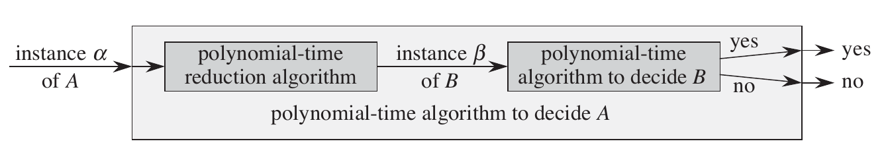

# CS3230

## Correctness

- **Loop Invariant**: true at beginning of an iteration, and remains true at the beginning of the next iteration

### Iterative Algorithms

1. **Initialisation**: invariant is true before the first iteration of the loop
2. **Maintenance**: invariant remains true before the next iteration
3. **Termination**: when the algo terminates, the invariant provides a useful property for showing correctness

### Recursive Algorithms

Prove by **strong induction**, eg. with a statement $P(n)$,

1. **Base case**: prove base case $P(k_0)$ is true
    - $k_0$ is commonly $0$ or $1$
2. **Induction step**: prove $P(k+1)$ is true under the assumption that $P(k_0),P(k_0+1),\dots,P(k)$ are all true

## Efficiency

### Simplicity vs. Efficiency

- When the problem only occurs a few times and is small, we prefer a simple algorithm
- When the problem occurs many times and is big, we prefer an efficient algorithm

### Analysis

- Big $O$: asymptotic upper bound (may or may not be tight)
  - $f(n) = O(g(n))$ if $\exists$ $c, n_0 > 0$ st. $0 \leq f(n) \leq cg(n)$, $\forall n\geq n_0$
- Big $\Omega$: asymptotic lower bound
  - $f(n) = \Omega(g(n))$ if $\exists$ $c, n_0 > 0$ st. $0 \leq cg(n) \leq f(n)$, $\forall n\geq n_0$
- Big $\Theta$: asymptotic tight bounds (may or may not be tight)
  - $f(n) = \Omega(g(n))$ if $\exists$ $c_1, c_2, n_0 > 0$ st. $0 \leq c_1g(n) \leq f(n) \leq c_2g(n)$, $\forall n\geq n_0$
- Small $o$: asymptotic upper bound (but not tight; strictly $<$)
  - $f(n) = o(g(n))$ if $\exists$ $c, n_0 > 0$ st. $0 \leq f(n) < cg(n)$, $\forall n\geq n_0$
- Small $\omega$: asymptotic lower bound (but not tight; strictly $>$)
  - $f(n) = \Omega(g(n))$ if $\exists$ $c, n_0 > 0$ st. $0 \leq cg(n) < f(n)$, $\forall n\geq n_0$

$\Theta(g(n)) = O(g(n)) \cap \Omega(g(n))$

## Recurrences & Master Theorem

### Logarithm Properties

- $a = b^{\log_b a}$
- $\log_c(ab) = \log_ca + log_cb$
- $log_ba^n = nlog_ba$
- $log_ba = \frac{\log_ca}{\log_cb}$
- $log_b\frac{1}{a} = -\log_ba$
- $log_ba = \frac{1}{log_ab}$
- $a^{\log_bc} = c^{\log_ba}$
- $\lg n = \Theta(\ln n) = \Theta(\log_{10}n)$
  - Base of logarithm does not matter in asymptotics
- $\lg(n!) = \Theta(n\lg n)$

### Exponentials

- $a^{-1}=\frac{1}{a}$
- $(a^m)^n = a^{mn}$
- $a^ma^n = a^{m+n}$
- $e^x \geq 1+x$
- $n^k=o(a^n), \forall k>0, a>1$
  - Any exponential function $a^n$ with base $a > 1$ grows faster than any polynomial function $n^k$

### Series

- Arithmetic: $\sum_{k=1}^{n}k = \frac{1}{2}n(n+1) = \Theta(n^2)$
- Geometric: $\sum_{k=1}^{\infty}x^k = \frac{1}{1-x}$, when $|x| < 1$
- Harmonic: $H_n = \sum_{k=1}^n\frac{1}{k} = \log n + O(1) = \Theta(\log n)$
  - $H_{\log(n)} = \sum_{k=1}^{\log(n)}\frac{1}{k} = \log(\ln n) + O(1)= \Theta(\log\log n)$
- Telescoping: $\sum_{k=0}^{n-1}(a_k-a_{k+1}) = a_0 - a_n$

### Factorials

- $n! = \sqrt{2\pi n}(\frac{n}{e})^n(1+\Theta(\frac{1}{n}))$
- $\omega(2^n) = n! = o(n^n)$
  - $n!$ is lower bounded by $2^n$ and upper bounded by $n^n$

### Limit

Assume $f(n), g(n) > 0$,

- $\lim_{n\rightarrow \infty}\frac{f(n)}{g(n)}=0 \implies f(n)=o(g(n))$
- $\lim_{n\rightarrow \infty}\frac{f(n)}{g(n)}<\infty \implies f(n)=O(g(n))$
- $0<\lim_{n\rightarrow \infty}\frac{f(n)}{g(n)}<\infty \implies f(n)=\Theta(g(n))$
  - As $n \rightarrow\infty$, $\frac{f(n)}{g(n)}$ converges to a defined number
- $\lim_{n\rightarrow \infty}\frac{f(n)}{g(n)}>0 \implies f(n)=\Omega(g(n))$
- $\lim_{n\rightarrow \infty}\frac{f(n)}{g(n)}=\infty \implies f(n)=\omega(g(n))$
- L'Hopital's: $\lim_{x\rightarrow \infty}\frac{f(x)}{g(x)} = \lim_{x\rightarrow \infty}\frac{f'(x)}{g'(x)}$

### Calculus

Assumes $\lg = \log_2$ unless otherwise stated,

- $\frac{d}{dx}\log_bx = \frac{1}{x\ln b}$
- $\frac{d}{dx}\lg \lg n = \frac{1}{n\ln 2 \ln n}$
- $\frac{d}{dx}\lg^px = \frac{p\ln^{p-1}x}{x\ln^p(p-1)}$
- $\frac{d}{dx}e^{nx} = ne^{nx}$

### Properties of Big $O$

#### Transitivity

- $f(n) = \Theta(g(n)) \wedge g(n) = \Theta(h(n)) \implies f(n) = \Theta(h(n))$
- $f(n) = O(g(n)) \wedge g(n) = O(h(n)) \implies f(n) = O(h(n))$
- $f(n) = \Omega(g(n)) \wedge g(n) = \Omega(h(n)) \implies f(n) = \Omega(h(n))$
- $f(n) = o(g(n)) \wedge g(n) = o(h(n)) \implies f(n) = o(h(n))$
- $f(n) = \omega(g(n)) \wedge g(n) = \omega(h(n)) \implies f(n) = \omega(h(n))$

#### Reflexivity

- $f(n) = \Theta(f(n))$
- $f(n) = O(f(n))$
- $f(n) = \Omega(f(n))$

#### Symmetry

- $f(n) = \Theta(g(n)) \iff g(n) = \Theta(f(n))$

#### Complementarity

- $f(n) = O(g(n)) \iff g(n) = \Omega(f(n))$
- $f(n) = o(g(n)) \iff g(n) = \omega(f(n))$

#### Useful Bounds

- $O(\lg(n!)) \equiv O(n\lg n) \ll O(n^2) \ll O((\lg n)!) \ll O(2^n) \ll O(n!)$
- $O(\lg n) \ll O(n^\epsilon)$ (for any $\epsilon > 0$, ie. $\epsilon = 0.1$)

### Master Theorem

$T(n) = aT(\frac{n}{b}) + f(n)$, where $a \geq 1$, $b > 1$ are constans and $f(n)$ is an asymptotically positive function.

1. $f(n) = O(n^{\log_ba-\epsilon})$ for some constant $\epsilon > 0 \implies T(n) = \Theta(n^{\log_ba})$
    - $f(n)$ must be **polynomially smaller** than $n^{\log_ba}$ by a factor of $n^\epsilon$ for some constant $\epsilon > 0$
2. $f(n) = \Theta(n^{\log_ba}\lg^kn)$ for some $k\geq 0 \implies T(n) = \Theta(n^{\log_ba}\lg^{k+1} n)$
3. $[f(n) = \Omega(n^{\log_ba+\epsilon})$ for some constant $\epsilon > 0] \wedge [af(\frac{n}{b}) \leq cf(n)$ for some constant $c < 1$ and all sufficiently large $n] \implies T(n) = \Theta(f(n))$
    - $f(n)$ must be **polynomially larger** AND satisfy condition that $af(\frac{n}{b}) \leq cf(n)$

Intuitively, we compare the function $f(n)$ with the function $n^{\log_ba}$ and the larger of the functions determine the solution. Eg. if $f(n)$ is smaller, then $f(n)$ is upper bounded by $n^{\log_ba}$ (which is larger) and thus, case 1 is the answer: $T(n) = \Theta(n^{\log_ba})$.

Master thorem **can fail** to work: these 3 cases do not cover all possibilities of $f(n)$. There is a gap between cases 2 and 3 when $f(n)$ is asymptotically larger, but not polynomially larger, than $n^{\log_ba}$.

#### Negative Example

Eg. for $T(n) = 2T(\frac{n}{2}) + n\lg n$, $f(n) = n\lg n$ is asymptotically larger than $n^{\log_ba} = n$ but **not polynomially larger** (and thus, **case 3 cannot apply**). Prove:

1. Let $g(n) = n^{\log_ba+\epsilon} = n^{1+\epsilon} = n \times n^\epsilon$, for some constant $\epsilon > 0$
2. Assume $f(n)$ is indeed polynomially larger than $g(n)$
    - ie. $\exists\,\epsilon>0$ st. $f(n) = \Omega(n^{\log_ba+\epsilon}) = \Omega(g(n))$
3. To find the asymptotic bounds, take $\lim_{n\rightarrow\infty}\frac{f(n)}{g(n)}$
    - $\frac{f(n)}{g(n)} = \frac{n\lg n}{n\times n^\epsilon} = \frac{\lg n}{n^\epsilon}$
    - $f'(n) = \frac{1}{n\ln 2}$, $g'(n) = \epsilon n^{\epsilon-1}$
    - Using L'Hopital's, $\lim_{n\rightarrow\infty}\frac{f(n)}{g(n)}=\lim_{n\rightarrow\infty}\frac{f'(n)}{g'(n)} = \lim_{n\rightarrow\infty}\frac{1}{n\ln 2 \times \epsilon n^{\epsilon-1}} = 0$
4. Since $\lim_{n\rightarrow\infty}\frac{f(n)}{g(n)} = 0$, $f(n)=o(g(n)) \therefore$ **contradiction**
    - ie. $f(n)$ is asymptotically smaller than $g(n)$ which contradicts our assumption at line (2)
5. Thus, $f(n)$ is not polynomially larger than $g(n)$ and case 3 does not apply

#### Steps to Take

$$T(n) = a\cdot T \left( \frac{n}{b} \right) + f(n)$$

**Case 1**: $f(n)$ is **asymptotically smaller** than $n^{\log_ba}$, ie. $\lim_{n\rightarrow\infty}\frac{f(n)}{n^{\log_ba}}<\infty$

1. Let $g(n) = n^{\log_ba-\epsilon}$, for some constant $\epsilon > 0$
2. Check if $f(n)$ is **polynomially smaller** than $n^{\log_ba}$, ie. $f(n)=O(g(n))$
3. $\lim_{n\rightarrow\infty}\frac{f(n)}{g(n)} < \infty \implies f(n)=O(g(n))$
4. $f(n)=O(g(n)) \implies T(n) = \Theta(n^{\log_ba})$
5. If $f(n)$ is not polynomially smaller, recurrence cannot be solved by Master Theorem

**Case 2**: $f(n)$ is **asymptotically equal** to $n^{\log_ba}\lg^kn$ for some $k\geq0$, ie. $0<\lim_{n\rightarrow\infty}\frac{f(n)}{n^{\log_ba}\lg^kn}<\infty$

1. $T(n) = \Theta(n^{\log_ba}\lg^{k+1} n)$

**Case 3**: $f(n)$ is **asymptotically larger** than $n^{\log_ba}$, ie. $\lim_{n\rightarrow\infty}\frac{f(n)}{n^{\log_ba}}>0$

1. Let $g(n) = n^{\log_ba+\epsilon}$, for some constant $\epsilon > 0$
2. Check if $f(n)$ is **polynomially larger** than $n^{\log_ba}$, ie. $f(n)=\Omega(g(n))$
3. $\lim_{n\rightarrow\infty}\frac{f(n)}{g(n)} > 0 \implies f(n=\Omega(g(n))$
4. Check if **regularity condition** holds, ie. $af(\frac{n}{b}) \leq cf(n)$ for some $c < 1$ and for all sufficiently large $n$
5. $f(n)=\Omega(g(n)) \wedge af(\frac{n}{b}) \leq cf(n) \implies T(n) = \Theta(f(n))$
6. If either condition not satisfied, recurrence cannot be solved by Master Theorem

### Substitution Technique

$$T(n)=2T\left(\frac{n}{2}\right)+\Theta(n)$$

- **Guess**: $T(n)=O(n\lg n)$
  - ie. $\exist c>0, T(n)\leq cn\lg n$
- **Assume**: that our guess is true for $\forall m<n$
  - ie. $\exist c>0, T(m)\leq cm\lg m$
- **Prove**: $T(n)\leq cn\lg n$ under the above assumption
  1. Let $m=\frac{n}{2}$ (since $\frac{n}{2}$ is clearly less than $n$, our assumption holds)
  2. $T(\frac{n}{2}) \leq c\frac{n}{2}\lg\frac{n}{2}$
  3. $2T(\frac{n}{2}) \leq cn\lg\frac{n}{2}$
  4. Substituting into original recurrence: $T(n)\leq cn\lg\frac{n}{2}+n$
  5. $T(n)\leq cn(\lg n - \lg 2)+an$
  6. $T(n)\leq cn(\lg n - 1)+an$
  7. $T(n)\leq cn\lg n - cn +an$
  8. $T(n)\leq cn\lg n - (c-a)n \leq cn\lg n$ for any sufficiently large $c>a$
  9. Thus, we have proven our statement, initial guess must be true

#### Negative Example (Wrong Guess)

- **Guess**: $T(n)=O(n)$
- **Assume**: that our guess is true for $\forall m<n$
- **Prove**: $T(n)\leq cn$ under the above assumption
  1. Let $m=\frac{n}{2}$ (since $\frac{n}{2}$ is clearly less than $n$, our assumption holds)
  2. $T(\frac{n}{2}) \leq c\frac{n}{2}$
  3. $2T(\frac{n}{2}) \leq cn$
  4. Substituting into original recurrence: $T(n)\leq cn+an$
  5. However, $cn+an \not\leq cn$, thus we have failed to prove our statement

## Divide & Conquer

1. Divide the problem into a number of subproblems that are smaller instances of the same problem
2. Conquer the subproblems by solving them recursively. If the subproblem sizes are small enough, just solve the subproblems in a straightforward manner
3. Combine the solutions to the subproblems into the solution for the original problem

### Technique

1. Make 2 subproblems become just 1 subproblem
    - eg. from $T(n)=2T(\frac{n}{2})+1 = \Theta(n)$ to $T(n)=T(\frac{n}{2})+1 = \Theta(\log n)$

### Matrix Multiplication

Given $A=[a_{ij}], B =[b_{ij}]$ and $C=[c_{ij}]=A\times B$,
$c_{ij}=\sum_{k=1}^na_{ik}\times b_{kj}$

## Sorting

### Lower Bound for Comparison Sort

View comparison sorts in terms of a decision tree. Because any correct sorting algorithm must be able to produce each permutation of its input, there are $n!$ number of leaves.

Consider a decision tree of height $h$ with $l$ reachable leaves corresponding to a comparision sort on $n$ elements. Because each of the $n!$ permutations of the input appears as some leaf, we have $n! \leq l$. Since a binary tree of height $h$ has no more than $2^h$ leaves, we have $n! \leq l \leq 2^h$

1. $n! \leq l \leq 2^h$
2. $h \geq \lg(n!)$
3. $h = \Omega(n \lg n)$, by Stirling's Approximation

### Counting Sort

Assume that each of the $n$ input elements is an integer in the range $0$ to $k$, for some integer $k$.

```python
CountingSort(A, B, k)
    let C[0...k] = new array
    for i = 0 to k
        C[i] = 0
        # Initialise array C
    for j = 1 to A.length
        C[A[j]] = C[A[j]] + 1
        # C[i] now contains the number of elements == i
    for i = 1 to k
        C[i] = C[i] + C[i - 1]
        # C[i] now contains the number of elements <= i
    for j = A.length downto 1
        B[C[A[j]]] = A[j]
        C[A[j]] = C[A[j]] - 1
```

- Time: $\Theta(n+k)$, or $\Theta(n)$ if $k = O(n)$

### LSD Radix Sort

- Let $A$ be an integer array of length $n$ where the largest integer is $k$
- Let each integer be represented in base $b$
- Let $d$ be the number of digits in the largest integer $k$
  - In base $b$, $d = \lceil\log_bk\rceil$

```python
RadixSort(A, d)
    for i = 1 to d
        stable sort array A on digit i (via counting sort)
```

In the algorithm, notice that we are simply doing counting sort on each digit from least significant to most significant. Since a digit can take on $b$ values (from $0$ to $b-1$), the run time for each iteration of counting sort is $O(n+b)$. We do this for $d$ times, and as such we have the following run time:

$$
O(d(n+b)) = O(\log_bk(n+b))
$$

The question then becomes in choosing the correct value for $b$ so as to minimise the run time. It can be shown (via differentiation) that when $b=n$, the run time is minimised.

**Theorem**: if $k$ is polynomial with respect to $n$ (ie. $k=n^{O(1)}$), then Radix Sort can sort in $O(n)$ time.  
**Proof**: we can set $b=n$ and as such, $O(\log_nk(n+n)) = O(n\log_nk)$. Since $k=n^{O(1)}$, $O(n\log_nk) = O(n\log_nn^{O(1)}) = O(n)$.

**Theorem**: given $n$ $b$-bit numbers and any positive integer $r \leq b$, Radix Sort correctly sorts these numbers in $\Theta(\frac{b}{r}(n+2^r)$ time if the stable sort it uses takes $\Theta(n+k)$ time for inputs in the range $0$ to $k$.  
**Proof**: each key has $d=\lceil\frac{b}{r}\rceil$ digits of $r$ bits each. Each digit is an integer in the range $o$ to $2^r-1$, so we can use counting sort with $k=2^r-1$. Each pass of counting sort takes $\Theta(n+k)=\Theta(n+2^r)$ time and since there are $d$ passes: $\Theta(d(n+k)) = \Theta(\frac{b}{r}(n+2^r))$.

> Sub routine used (ie. counting sort) **must be stable**

#### MSD vs LSD

Using MSD radix sort can also correctly sort. For LSD, $k$ buckets are maintained for every loop. However, for MSD, since it is a recursive function, $k$ buckets for each recursive call have to be made. In order for MSD Radix Sort to be fast, $k$ must be a small constant less than $n$. LSD is stable, whereas MSD isn't.

Source: <https://www.quora.com/Why-is-it-wrong-for-Radix-Sort-to-sort-by-the-most-significant-digit>

## Randomised Algorithms

An algorithm is randomised if its behaviour is determined not only by its input but also by values produced by a random-number generator

1. Monte Carlo Algorithm: a randomised algorithm whose output may be incorrect with a certain probability; runtime bounds hold deterministically
2. Las Vegas Algorithm: a randomixed algorithm that always gives correct results, or informs about the failure; runtime differs depending on the input

### Probabilistic Analysis

- Running time of a randomised algo depends on the RNG
- For the same input, the running time can be different depending on the random numbers
- The "average" running time of a randomised algo over all possible random numbers is called the **expected running time**

#### Examples

1. **Non-randomised**: standard QuickSort
   - Guaranted to find the exact solution
   - Running time is dependent on the input
2. **Monte Carlo**: finding $\pi$ by randomly filling a square with dots and finding the ratio of dots out and in the circle
   - Only gives an approximation of $\pi$ (which is technically not the correct/definite answer)
3. **Las Vegas**: binary search on sorted array but using random indices
   - Guaranteed to find the correct answer eventually, but running time depends on the random numbers and is independent on the input array
   - Worst case $O(n)$; expected $\Theta(\log n)$

### Indicator Random Variable

$$
\begin{aligned}
  I[A]&=
  \begin{cases}
    1, &\text{if } A \text{ occurs}\\
    0, &\text{otherwise}
  \end{cases}\\
E[I[A]] &= Pr(A)
\end{aligned}
$$

Let $X \sim B(n, p)$ for an event $A$,

- $X = \sum_1^n I[A]$
- $E[X] = E[\sum_1^n I[A]]$
- $E[X] = \sum_1^n E[I[A]]$, by linearity of expectation
- $E[X] = \sum_1^n Pr(A) = \sum_1^n p = np$

#### Example: Expected Length of Hash Table Chain

Given a hash table $T$ with $m$ slots that stores $n$ elements, the load factor $\alpha = \frac{n}{m}$ is the average number of elements in a chain.

The has function $h$ is a randomised procedure satisfying the universal hashing assumption: for any pair of distinct keys $u$, $v$,

$$Pr(h(u) = h(v)) \leq \frac{1}{m}$$

For a key $x$ contained in $T$, the expected length of the chain at $h(x)$ is at most $1 + \alpha$

1. Let $C_y = I[h(y) = h(x)]$
2. Note that $E[C_y] = Pr(h(y) = h(x)) \leq \frac{1}{m}$
3. Length of chain at $h(x) = 1 + \sum_{y \neq x, y \in T}C_y$
4. Thus, $E[h(x)] = E[1 + \sum_{y \neq x, y \in T}C_y]$
    - $= 1 + \sum_{y \neq x, y \in T}E[C_y]$
    - $= 1 + \sum_{y \neq x, y \in T} Pr(h(y) = h(x))$
    - $= 1 + \sum_{y \neq x, y \in T} \frac{1}{m}$
    - $= 1 + \frac{n-1}{m}$
    - $\leq 1 + \alpha$

#### Example: Birthday Paradox/Hash Collisions

Given $n$ possible birthdays and $k$ people, find $E[X]$, the expected number of people who share the same birthday.

Given hash table of size $n$ and $k$ keys, find $E[X]$, the expected number of collisions (assuming SUHA).

Note that **collisions are counted over distinct pairs**: if four people share the same exact birthday (or if four keys hashes to the exact same bin), we count it as $6$ collisions (since there are $6$ unique pairs).

For each pair $(i,j)$ of the $k$ people in the room, we define the indicator random variable $X_{ij}$,

$$
X_{ij} =
\begin{cases}
1, \text{ if person $i$ and person $j$ have the same birthday}\\
0, \text{ otherwise}
\end{cases}
$$

By the property of indicator variables, we also have,

$$
\begin{aligned}
E[X_{ij}] &= Pr(\text{person $i$ and person $j$ have the same birthday})\\
  &= \frac{1}{n}
\end{aligned}
$$

We now let $X$ be the random variable that counts the number of pairs of individuals having the same birthday,

$$
X = \sum_{i=1}^{k-1}\sum_{j=i+1}^k X_{ij}
$$

Note that the two summations are just a result of the number of unique pairs of $(i,j)$. The number of unique pairs can also be seen as $\binom{k}{2} = \frac{k(k-1)}{2}$. Thus,

$$
\begin{aligned}
E[X] &= \sum_{i=1}^{k-1}\sum_{j=i+1}^k E[X_{ij}]\\
  &= \frac{k(k-1)}{2} \cdot \frac{1}{n}\\
  &= \frac{k(k-1)}{2n}
\end{aligned}
$$

As such, given $n=365$ days and $k=28$ number of people, the expected number of pairs people who share the same birthday $E[X]\geq 1$.

### Analysis of Randomised Quicksort

The running time of Quicksort is dominated by time spent in the Partition procedure. Each time the Parition procedure is called, it selecs a pivot element, and this element is never included in any future recursive calls to Quicksort and Partition. Thus, there can be at most $n$ calls to Partition over the entire execution of the Quicksort algorithm.

Let $X$ be the number of comparison performed over the entire execution of Quicksort on an $n$-element array. Then the running time of Quicksort is $O(n + X)$.

Observe that each pair of elements is compared at most once. Elements
are compared only to the pivot element and, after a particular call of Partition finishes, the pivot element used in that call is never again compared to any other elements.

- Let $X_{ij} = I[z_i$ is compared to $z_j]$,
- Since each pair is compared at most once, $X= \sum_{i=1}^{n-1}\sum_{j=i+1}^{n}X_{ij}$
- $E[X]= E[\sum_{i=1}^{n-1}\sum_{j=i+1}^{n}X_{ij}]$
- $E[X]= \sum_{i=1}^{n-1}\sum_{j=i+1}^{n}E[X_{ij}]$
- $E[X]= \sum_{i=1}^{n-1}\sum_{j=i+1}^{n}Pr(z_i$ is compared to $z_j)$

Thus, our work now is to find $Pr(z_i$ is compared to $z_j)$. Consider an array with numbers 1 to 10 in any order, and suppose first pivot element is 7. Then the first call to Partition will separate the numbers into 2 sets, $\{1,\dots,6\}$ and $\{8,9,10\}$. Note that the pivot element 7 is compared to all other elements, but no number from the first set is or ever will be compared to any number from the second set.

In general, once a pivot $x$ is chosen with $z_i < x < z_j$, $z_i$ and $z_j$ cannot be compared at any subsequent time. Thus, $z_i$ and $z_j$ are compared iff the first element to be chosen as a pivot from $Z_{ij}$ is either $z_i$ or $z_j$.

$$
\begin{aligned}
Pr(z_i \text{ is compared to } z_j) &= Pr(z_i \text{ is first pivot chosen from } Z_{ij}) \\ &+ Pr(z_j \text{ is first pivot chosen from } Z_{ij}) \\
  &= \frac{1}{j-i+1} + \frac{1}{j-i+1} \\
  &= \frac{2}{j-i+1}
\end{aligned}
$$

Thus, combining the equations,

$$
\begin{aligned}
E[X] &= \sum_{i=1}^{n-1}\sum_{j=i+1}^{n}\frac{2}{j-i+1} \\
  &= \sum_{i=1}^{n-1}\sum_{k=1}^{n-1}\frac{2}{k+1},\text{ where } k=j-1 \\
  &< \sum_{i=1}^{n-1}\sum_{k=1}^{n}\frac{2}{k} \\
  &= \sum_{i=1}^{n-1}O(\lg n), \text{ (harmonic series)} \\
  &= O(n\lg n)
\end{aligned}
$$

## Order Statistics

The $i^{th}$ order statistic of a set of $n$ elements is the $i^{th}$ smallest element.

- Minimum: first order statistic, $i = 1$
- Maximum: $n^{th}$ order statistic, $i = n$
- Median: lower, $i=\lfloor (\frac{n+1}{2} \rfloor$ OR upper, $i=\lceil (\frac{n+1}{2} \rceil$

### Randomised Quickselect

Given an array $A[l,\dots,h]$ and the $i^{th}$ smallest element in $A$ to find,

```python
randomisedSelect(A, l, h, i)
    if l == h # base case, one element array
        return A[l]
    p = randomisedPartition(A, l, h)
    k = p - l + 1
    if i == k # pivot value is the answer
        return A[p]
    elif i < k
        # only search low partition
        return randomisedSelect(A, l, p - 1, i)
    else
        # only search high partition
        return randomisedSelect(A, p + 1, h, i - k)
```

- $A[p]$ is the pivot element
- Call to `randomisedPartition` partitions $A[l,\dots,h]$ into 2 possibly empty subarrays $A[l,\dots,p-1]$ and $A[p+1,\dots,h]$
- $k$ is the number of elements in $A[l,\dots,p]$, ie. the number of elements in the low side of the partition including $A[p]$

### Analysis of Quickselect

Absolute worse case running time is $\Theta(n^2)$ if we are extremely lucky. But the linear expected running time is $\Theta(n)$.

Any element is equally likely to be selected as the pivot. Thus, for each $k$ such that $1 \leq k \leq n$, the subarray $A[l,\dots,p]$ has $k$ elements (all $\leq A[p]$) with probability $\frac{1}{n}$. For $1,2,\dots,n$, define indicator random variable $X_k$ where

$$X_k = I[\text{the subarray } A[l,\dots,p] \text{ has exactly $k$ elements}]$$

$$E[X_k] = \frac{1}{n}$$

To obtain an upper bound, we assume the $i^{th}$ element is always on the side of the partition with the greatest number of elements. $X_k$ is 1 for exactly 1 value of $k$ and 0 for all other values of $k$. When $X_k=1$, the 2 subarrays have sizes $k-1$ and $n-k$. Thus,

$$
\begin{aligned}
T(n) &\leq \sum_{k=1}^n X_k \times [T(max(k-1,n-k)) + O(n)] \\
  &= \sum_{k=1}^n X_k \times T(max(k-1,n-k)) + O(n)\\
  E[T(n)] &\leq E[\sum_{k=1}^n X_k \times T(max(k-1,n-k)) + O(n)] \\
  &= \sum_{k=1}^n E[X_k \times T(max(k-1,n-k))] + O(n) \\
  &= \sum_{k=1}^n E[X_k] \times E[T(max(k-1,n-k))] + O(n) \\
  &= \sum_{k=1}^n \frac{1}{n} \times E[T(max(k-1,n-k))] + O(n) \\
\end{aligned}
$$

For $max(k-1,n-k)$,

$$
max(k-1,n-k) =
\begin{cases}
  k-1, \text{ if k } > \lceil\frac{n}{2}\rceil \\
  n-k, \text{ if k } \leq \lceil\frac{n}{2}\rceil
\end{cases}
$$

If $n$ is even, each term from $T(\lceil\frac{n}{2}\rceil)$ up to $T(n-1)$ appears exactly twice in the summation, and if $n$ is odd, all these terms appear twice and $T(\lfloor\frac{n}{2}\rfloor)$ appears once. Thus,

$$E[T(n)] \leq \frac{2}{n}\sum_{k=\lfloor\frac{n}{2}\rfloor}^{n-1} E[T(k)] + O(n)$$

We want to prove that $E[T(n)] \leq cn$ for some constant $c>0$. Assume that $T(n) = O(1)$ for $n$ less than some constant (to be picked later). Pick a constant $a$ such that the function described by the $O(n)$ term above is bounded from above by $an, \forall n>0$.

$$
\begin{aligned}
E[T(n)] &\leq \frac{2}{n}\sum_{k=\lfloor\frac{n}{2}\rfloor}^{n-1} ck + an \\
  &= \frac{2c}{n} \left( \sum_{k=1}^{n-1}k - \sum_{k=1}^{\lfloor\frac{n}{2}\rfloor-1}k \right) + an \\
  &= \frac{2c}{n} \left( \frac{(n-1)n}{2} - \frac{(\lfloor\frac{n}{2}\rfloor-1)\lfloor\frac{n}{2}\rfloor}{2} \right) + an \\
  &\leq \frac{2c}{n} \left( \frac{(n-1)n}{2} - \frac{(\frac{n}{2}-2)(\frac{n}{2}-1)}{2} \right) + an \\
  &= \frac{2c}{n} \left( \frac{n^2-n}{2} - \frac{\frac{n^2}{4}-\frac{3n}{2}+2}{2} \right) + an \\
  &= \frac{c}{n} \left( \frac{3n^2}{4} + \frac{n}{2} - 2 \right) + an \\
  &= c \left( \frac{3n}{4} + \frac{1}{2} - \frac{2}{n} \right) + an \\
  &\leq \frac{3cn}{4} + \frac{c}{2} + an \\
  &= cn - \left( \frac{cn}{4} - \frac{c}{2} - an \right)
\end{aligned}
$$

Thus, to prove that $E[T(n)] \leq cn$, we need to show that for sufficiently large $n$, $\frac{cn}{4} - \frac{c}{2} - an \geq 0$.

$$
\begin{aligned}
\frac{cn}{4} - \frac{c}{2} - an &\geq 0 \\
n \left( \frac{c}{4} - a \right) & \geq \frac{c}{2}
\end{aligned}
$$

As long as we choose a constant $c$ so that $\frac{c}{4} - a > 0$ (ie. $c>4a$), we can divide both sides by $\frac{c}{4}-a$, giving

$$n\geq \frac{\frac{c}{2}}{\frac{c}{4}-a} = \frac{2c}{c-4a}$$

Thus, if we assume that $T(n)=O(1)$ for $n<\frac{2c}{c-4a}$, then $E[T(n)] = O(n)$. We conclude that we can find any order statistic, and in particular the median, in expected linear time, assuming that the elements are distinct.

> *Can an adversay construct an input of size $n$ to force randomised quickselect to run in $\Omega(n^2)$ time?*
>
> False! Randomised algorithm **depends** on the randomisation, not on the input. Since the adversary has no way of controlling the randomisation, it has no way to force the algo to run in $\Omega(n^2)$ time.

### Median of Medians ($k^{th}$ Largest Element)

An approximate selection algorithm for the median, used as a subroutine to get a good-enough pivot for quickselect to achieve a worst case running time of $O(n)$.

1. Divide the $n$ elements of the input array into $\lfloor\frac{n}{5}\rfloor$ groups of 5 elemnts each, and at most one group made up of the remaning $n \mod 5$ elements
2. Find the median of each of the $\lceil\frac{n}{5}\rceil$ groups via insertion sort of each group
3. Now, find the lower median-of-medians $x$ of the $\lceil\frac{n}{5}\rceil$ medians found in step 2

At least half of the medians found in step 2 are more than or equal to median-of-medians $x$. Thus, at least half of the $\lceil\frac{n}{5}\rceil$ groups contribute at least 3 elements each that are greater than $x$, except for the one group that has fewer than 5 elements, and the one group containing $x$ itself. Discounting these two groups, it follows that the number of elements greater than x is at least

$$ 3 \left( \left\lceil\frac{1}{2}\left\lceil\frac{n}{5}\right\rceil\right\rceil - 2 \right) \geq \frac{3n}{10}-6$$

Thus, with a chosen pivot using median-of-medians, at least $\frac{3n}{10}-6$ elements are less than $x$ and at most $\frac{7n}{10}+6$ elements are greater than $x$.

### Analysis of Quickselect using Median of Medians

Steps 1 and 2 takes $O(n)$ time, and step 3 takes $T(\lceil\frac{n}{5}\rceil)$ time. After the partition using $x$, the call to Quickselect will take at most $T(\frac{7n}{10}+6)$ time. Let us assume that any input fewer than 140 elements requires $O(1)$ time.

$$
T(n) \leq
\begin{cases}
  O(1) &\text{ if n } < 140 \\
  T(\lceil\frac{n}{5}\rceil) + T(\frac{7n}{10}+6) + O(n) &\text{ if n } \geq 140
\end{cases}
$$

We need to prove $T(n)\leq cn$ for some suitably large constant $c$ and for all $n>0$. Assume $T(n)\leq cn$ for some suitable large constant $c$ and $n<140$. We also pick a constant $a$ such that the function described by the $O(n)$ term above (steps 1 and 2) is bounded above by $an$ for all $n>0$. Thus,

$$
\begin{aligned}
T(n) &\leq c\left\lceil\frac{n}{5}\right\rceil + c\left(\frac{7n}{10}+6\right) + an\\
  &\leq \frac{cn}{5} + \frac{7cn}{10} + 6 + an \\
  &= \frac{9cn}{10} + 7c + an \\
  &= cn + \left( -\frac{cn}{10} + 7c + an \right)
\end{aligned}
$$

which is at most $cn$ if $-\frac{cn}{10}+7c+an\leq 0$. Thus,

$$
\begin{aligned}
-\frac{cn}{10}+7c+an &\leq 0, \text{ equation 1} \\
\text{ when } n>70, c &\geq 10a\left( \frac{n}{n-70} \right)
\end{aligned}
$$

Because we assume $n\geq140$, $\frac{n}{n-70}\leq2$, and so choosing $c\geq20a$ will satisfy equation 1 above. The worst case running time of Quickselect using Median-of-Medians is thus linear.

## Amortised Analysis

### Aggregate Method

1. Show that a sequence of $n$ operations takes **worst-case** time $T(n)$ in total
2. The amortised cost per operation is thus worst-case $\frac{T(n)}{n}$

#### Example: Incrementing Binary Counter


### Accounting Method

- Amount we charge an operation is the **amortised cost**; different operations may have different amortised cost
- When amortised cost $>$ actual cost, assign difference as **credit**
- Credit can help pay for later operations whose amortised cost $<$ actual cost
- Credit **must not become negative**

$$
\sum_{i=1}^nt(i) \leq \sum_{i=1}^nc(i), \forall n \\
\text{for $n^{th}$ operation, } t(n) \leq \sum_{i=1}^nc(i)-\sum_{i=1}^{n-1}t(i)
$$

#### Example: Incrementing Binary Counter

**Invariant**: credit never drops below 0

**Observe**: at any point, every 1 bit in the counter will contribute 1 credit

**Proof**:

1. Every time we set a bit $0 \rightarrow 1$, we pay $2$ credits
2. $1$ credit is used to flip the bit while $1$ credit is stored
3. Every time we reset a bit from $1 \rightarrow 0$, we use $1$ credit to flip the bit
4. Hence, amount of credit is the number of $1$'s in the binary counter
5. Since the number of $1$'s is non-negative, this shows that the credit is always non-negative

### Potential Method

We will perform $n$ operations, starting with an initial data structure $D_0$. For each $i=1,2,\dots,n$, we let $c_i$ be the actual cost of the $i^{th}$ operations to $D_{i-1}$.

- $\Phi$: **potential function** which maps each data structure $D_i$ to a real number $\Phi(D_i)$
- $\Phi(D_i)$: **potential** associated with data structure $D_i$

Amortised cost $\hat{c}_i$ of the $i^{th}$ operation with respect to potential function $\Phi$ is defined by

$$\hat{c}_i = c_i + [\Phi(D_i) - \Phi(D_{i-1})]$$
  
Thus, the total amortised cost of the $n$ operations is

$$
\begin{aligned}
\sum_{i=1}^n \hat{c}_i &= \sum_{i=1}^n (c_i + \Phi(D_i) - \Phi(D_{i-1}))\\
  &= \sum_{i=1}^n c_i + \Phi(D_n) - \Phi(D_0)
\end{aligned}
$$

We need to show that

$$
\begin{aligned}
\Phi(D_0) &= 0\\
\Phi(D_i) &\geq 0, \forall i
\end{aligned}
$$

#### Recipe

- Select a suitable $\Phi$ so that for the costly operation, $\Delta\Phi_i$ is negative to such an extent that it nullifies or reduces the effect of the actual cost

#### Example: Incrementing Binary Counter


#### Example: Stack Operations

- Push($x$): pushes an element $x$ to the stack
- PopAll(): pops all elements from the stack

Define potential function $\Phi$ on a stack to be the number of objects in the stack. For the empty stack $D_0$, $\Phi(D_0)=0$.

Since the number of objects in the stack is never negative, the stack $D_i$ that results after the $i^{th}$ operation has non-negative potential, and thus,

$$
\begin{aligned}
\Phi(D_i) &\geq 0\\
  &\geq \Phi(D_0)  
\end{aligned}
$$

The total amortised cost of $n$ operations with respect to $\Phi$ therefore represents an upper bound on the actual cost.

If the $i^{th}$ operation on a stack containing $s$ objects is a Push operation, then the potential difference is

$$
\begin{aligned}
\Phi(D_i) - \Phi(D_{i-1}) &= (s+1) - s\\
  &= 1
\end{aligned}
$$

Thus, by using the equation for the amortised cost of the $i^{th}$ operation, the amortised cost of the Push operation is given by

$$
\begin{aligned}
\hat{c}_i &= c_i + [\Phi(D_i) - \Phi(D_{i-1})]\\
  &= 1 + [1]\\
  &= 2
\end{aligned}
$$

If the $i^{th}$ operation on a stack containing $s'$ objects is a PopAll operation, then actual cost of the operation is $s'$ (ie. $c_i = s'$), and the potential difference is

$$
\begin{aligned}
\Phi(D_i)-\Phi(D_{i-1}) &= 0 - s'\\
  &= -s'
\end{aligned}
$$

Thus, by using the equation for the amortised cost of the $i^{th}$ operation, the amortised cost of the PopAll operation is given by

$$
\begin{aligned}
\hat{c}_i &= c_i + [\Phi(D_i) - \Phi(D_{i-1})]\\
  &= s' + [-s']\\
  &= 0
\end{aligned}
$$

Since the amortised cost of each of the two operations is of order $O(1)$, the total amortised cost of a sequence of $n$ operations is $O(n)$. Since we also have shown that $\Phi(D_0)=0$ and $\Phi(D_i)\geq\Phi(D_0)$, this total amortised cost of $n$ operations is an upper bound on the total actual cost. The worst-case cost of $n$ operations is therefore $O(n)$.

## Dynamic Array

- Double the size of the array every time the array overflows
- Worst case time to execute **one insertion** is $O(n)$
- Observe that only when the table overflows then a new array of double the size is created
- It will take $O(1)$ time for insertions till next overflow

### Analysis of Insert Operation (Aggregate Method)

$$
\text{Let cost of $i^{th}$ operation } t(i) =
\begin{cases}
  i, &\text{if } i - 1 \text{ is an exact power of } 2\\
  1, &\text{otherwise}
\end{cases}
$$

Thus,

$$
\begin{aligned}
\text{Cost of }n\text{ operations} &= \sum_{i=1}^nt(i)\\
  &\leq n + \sum_{j=0}^{\log(n-1)}2^j\\
  &\leq n + \left(1 + 2 + 4 + \dots + \frac{n}{2} + n\right)\\
  &\leq n + (2n)\\
  &\leq 3n
\end{aligned}
$$

Thus, amortised cost of each insertion $= \frac{O(n)}{n} = O(n)$

### Analysis of Insert Operation (Accounting Method)

**Invariant**: credit never drops below 0

**Observe**: at any point, every insert operation will contribute $n$ credits. Find this constant $n$.

**Proof**:

1. For every Insert operation at a cell,
   - 1 credit to actually insert into current table
   - 2 credits for creating another 2 cells
   - 1 credit for copying itself
   - 1 credit for copying left half
2. When table overfills, table has to be doubled, and whole table has to be copied again, which is paid for by the 4 additional credits of each insert operation
3. Thus, when every insert operation is set to 5 credits, the credit will never be non-negative and the amortised running time is constant

## Dynamic Programming

### Example: Computing Fibonacci

#### Recursive Approach

```py
fib(n):
    if n <= 2: f = 1
    else: f = fib(n - 1) + fib(n - 2)
    return f
```

Let $T(n)$ be the number of instructions executed by `fib(n)`.

$$
\begin{aligned}
T(n) &= T(n-1) + T(n-2) + \Theta(1) \text{ for } n>1\\
  &\geq 2T(n-2) + \Theta(1) \text{ since $T(n-1) \geq T(n-2)$}\\
  &\geq 2^{\frac{n}{2}}
\end{aligned}
$$

Thus, $T(n)$ is at least exponential in $n$. The exact bound is $\phi^n$ (where $\phi$ is the golden ratio).

> Intuition: multiplying by $2$ each time, and subtracting by $2$ each time. We can subtract $2$ from $n$ exactly $\frac{n}{2}$ times. Thus, $2^\frac{n}{2}$.


- During execution of recursive `fib`, observe that the whole recursion tree is visited
- Number of instructions must be at least number of nodes in this recursion tree

#### Memoized DP Approach

```py
memo = {} # initialise empty dictionary
fib(n):
    if n in memo: return memo[n]
    if n <= 2: f = 1
    else: f = fib(n - 1) + fib(n - 2)
    memo[n] = f
    return f
```

Notice that lines $4$ and $5$ are exactly the same as in the recursive approach.

#### Iterative DP Approach

```py
fib = {} # initialise empty dictionary
for k in range(1, k + 1):
    if k <= 2: f = 1
    else: f = fib[k - 1] + fib[k - 2]
    fib[k] = f
return fib[n]
```

Notice again that lines $3$ and $4$ are exactly the same as in the recursive approach.

Let $T(n)$ be the number of instructions executed,

$$
\begin{aligned}
T(n) &= T(n-1) + \Theta(1)\\
  &= \Theta(n)
\end{aligned}
$$


### Example: Longest Common Subsequence (LCS)

Given: 2 sequences $A[1..n]$ and $B[1..m]$

Aim: compute a (not "the", since there can be multiple) longest sequence $C$ such that $C$ is subsequence of both $A$ and $B$

$A :$ **H**I**E**ROG**L**YPHO**LO**GY  
$B :$ MIC**H**A**EL**ANGE**LO**  
$LCS(A,B) = C :$ HELLO

#### Recursive Solution

Given: 2 sequences $A[1..n]$ and $B[1..m]$

Base Cases

$$LCS(i,0)=\emptyset$$

$$LCS(0,j)=\emptyset$$

General Case

$$
\begin{aligned}
a_n &= b_m \implies LCS(n,m) = LCS(n-1,m-1) :: a_n\\
a_n &\neq b_m \implies LCS(n,m) = \text{Max}[LCS(n-1,m), LCS(n,m-1)]
\end{aligned}
$$

Thus total time $= O(m2^n)$.

#### Recursive Solution for Length of LCS

Given: 2 sequences $A[1..n]$ and $B[1..m]$

Aim: find length of the LCS of $A$ and $B$, $L(i,j)$ recursively.

Base Cases

$$L(i,0)=0$$

$$L(0,j)=0$$

General Case

$$
\begin{aligned}
a_n &= b_m \implies L(n,m) = L(n-1,m-1) + 1\\
a_n &\neq b_m \implies L(n,m) = \text{Max}[L(n-1,m), L(n,m-1)]
\end{aligned}
$$

```py
L(n, m):
    # base case
    if n == 0 or m == 0:
        return 0
    # general case
    if A[n] == B[m]:
        return L(n - 1, m - 1) + 1
    else:
        return Max(L(n - 1, m), L(n, m - 1))
```

$$
\begin{aligned}
T(n,m) &= T(n-1,m) + T(n,m-1) + c\\
  &\geq \binom{n+m}{n}\\
  &> 2^n \text{ (assuming $m \approx n$)}
\end{aligned}
$$

This time complexity is no different from the brute force approach as we are solving **overlapping subproblems** multiple times:


Thus, we can apply dynamic programming approach:

```py
L(n, m):
    # dp is a 2D array, n is col, m is row
    dp = Array[n, m]
    for i = 0 to n:
        dp[i, 0] = 0 # init bottom row of dp to 0
    for i = 0 to m:
        dp[0, i] = 0 # init left col of dp to 0
    for j = 1 to m:
        for i = 1 to n:
            # general case in recursion
            if A[i] == B[j]:
                dp[i, j] = dp[i - 1, j - 1] + 1
            else:
                dp[i, j] = Max(dp[i - 1, j], dp[i, j - 1])
```


- Total time $= O(nm)$
- Total Space $= O(nm)$

### Optimal Substructure

A problem exhibits optimal substructure if an optimal solution to the problem contains within it optimal solutions to subproblems. For example, solving problem $S_n$ requires solving $S_{n-1}$ first, and subsequently $S_{n-2},\dots$.

To prove that an optimal substructure exists:

1. Show that a solution to the problem consists of making a choice, and making this choice leaves one or more subproblems to be solved
2. Assume that the choice that leads to an optimal solution is given (do not concern yourself yet with how to determine this choice, just assume it has been given)
3. Given this choice, determine which subproblems ensue and how to best characterise the resulting space of subproblems
4. Show that the solutions to the subproblems used within an optimal solution to the problem must themselves be optimal by using a "cut-and-paste" technique:
   1. Assume each of the subproblem solution is not optimal
   2. By "cutting out" the non-optimal solution to the subproblems and "pasting in" the optimal one, we can get a better solution to the original problem
   3. This contradicts our assumption of line 2 that we already have an optiaml solution  
   4. Thus, assumption that subproblem solution is not optimal must be incorrect; the subproblem solutions must themselves be optimal

### Designing Dynamic Algorithms

1. Find the **optimal substructure**
   - Express the solutions recursively
2. Find the **overlapping subproblems**
   - Observe that there are only polynomial number of distinct subproblems
   - However, the recursive algorithm takes non-polynomial/exponential time because it is solving the same subproblems multiple times
3. Thus, we compute the recursive solution **iteratively in a bottom-up fashion (or top-down with memoization)**

### Example: Longest Palindrome Subsequence

Use the LCS algorithm to give an $O(n^2)$ time algorithm to find the longest palindrom subsequence of an input string. For example, for `character`, the output should be `carac`.

Solution: run LCS algorithm on both the input string, and the reverse of the input string. Thus, running time $= O(n \cdot n)$

### Example: Knapsack Problem

Given: weight-value pairs $(w_1,v_1),(w_2,v_2),\dots,(w_n,v_n)$, and target weight $W$

Ouput: a subset $S \subseteq \{1,2,\dots,n\}$ that maximises value $\sum_{i \in S} v_i$ such that $\sum_{i \in S}w_i \leq W$

Observe that there are $2^n$ many subsets, and the brute force approach will take $O(2^n)$ time.

**Find the optimal substructure**:

Let $m[i,j]$ be the maximum value that can be obtained by using a subset of items in $\{1,2,\dots,i\}$ with total weight no more than $j$. Thus, our objective is to find $m[n,w]$

Base case: $i = 0$ or $j = 0$

$$m[i,j] = 0$$

Case 1: item $i$ is taken (ie. $w_i \leq j$)

$$
m[i,j] = \text{Max}\{ m[i-1,j-w_i] + v_i, m[i-1,j] \}
$$

Case 2: item $i$ is not taken (ie. $w_i > j$)

$$
m[i,j] = m[i-1,j]
$$

**Compute the solution iteratively in a bottom-up fashion**:

```py
knapsack(v, w, W):
    m = Array[n, W] # m is a n*W array
    for j = 0 to W:
        m[o, j] = 0
    for i = 1 to n:
        m[i, 0] = 0

    for i = 1 to n:
        for j = 0 to W:
            if j >= w[i]:
                m[i, j] = Max(m[i - 1, j - w[i]] + v[i], m[i - 1, j])
            else:
                m[i, j] = m[i - 1, j]

    return m[n, W]
```

- Time taken to fill up a table entry $= O(1)$
- Total time $= O(nW)$
- Total space $= O(nW)$

### Example: Single Source Shortest Path

Given: directed graph $G=(V,E)$ with with some edge weight $\omega$, and a soruce vertex $s \in V$.

Notations:

- $n=|V|$, $m=|E|$
- $\delta(u,v)$: distance from $u$ to $v$
- $P(u,v)$: shortest path from $u$ to $v$

Objectives:

1. Compute $\delta(s,v)$ for all $v\in V\backslash\{s\}$
1. Compute $P(s,v)$ for all $v\in V\backslash\{s\}$

#### Dijkstra's Algorithm

If all edge weights $\omega$ are **positive**, Dijkstra's can solve this in $O(m + n\log n)$ time.

Two crucial facts exploited:

1. The nearest neighbour is also the vertex nearest to $s$
2. Optimal subpath property: given a shortest path $P(s,v)$ that passes through $u$, $P(s,u)$ and $P(u,v)$ are themselves shortest paths

However, if there are **negative** edges weights, the properties are violated:

1. The nearest neighbour is not necessarily the vertex nearest to $s$. There can exist some other path with negative edge weights that are not the direct neighbour of $s$
2. $\delta(s,y)=5$ by going $s \rightarrow u \rightarrow v \rightarrow x \rightarrow y$, but $\delta(s,v)=40$ (green path) and is not the subpath of $P(s,y)$, given by $s \rightarrow u \rightarrow v$, which will yield distance of $60$


#### Bellman-Ford Algorithm

**Theorem**: all shortest paths in $G$ (with negative edge weights) possess optimal substructure property **if there are no negative cycles**.

Let $L(v,i)$ denote the weight of the shortest path from $s \rightsquigarrow v$ having at most $i$ edges. Limit the number of edges because there can exist some other path which takes $>i$ edges which is shorter.

SSSP can now be converted to compute $L(v, n-1)$ for each $v$. Since there are no cycles, each vertex can only be visited at most once, and thus $n-1$ edges will be used.

**Recursive formulation**:

1. If $L(v,i)$ has $<i$ edges: $L(v,i)=L(v,i-1)$
2. If $L(v,i)$ has exactly $i$ edges: $L(v,i)=min_{(x,v)\in E}(L(x,i-1)+\omega(x,v))$

$Bellman\text{-}Ford$

1. For each $v \in V \backslash\{s\}$:
   1. If $(s,v)\in E$: $L[v,1] = \omega(s,v)$
   2. Else: $L[v,1] = \infty$
2. $L[s,1]=0$
3. For $i=2$ to $n-1$:
   1. For each $v\in V$:
      1. $L[v,i]=L[v,i-1]$
      2. For each $(x,v)\in E$:
         1. $L[v,i] = min(L[v,i],L[x,i-1]+\omega(x,v)$

**Time**: $O(mn)$, in the innermost for loop (step $3.1.2$), we are just using $deg(v)$ time. Since we do this for each $v$, step $3.1$ will take overall $\sum_{v \in V} deg(v) = 2m$ time. Another way to look at it is that in step $3.1$, we are simply relaxing every edge once.  
**Space**: $O(n^2)$

## Greedy Algorithms

A greedy algorithm obtains an optimal solution to a problem by making a sequence of choices. At each decision point, the algorithm makes a choice that **seems best at the moment** (ie. the local best). This heuristic strategy **does not** always produce an optimal solution.

### Example: Longest Increasing Subsequence (LIS)

Example: $10,3,7,2,4,6,11,8,5,9$  
Output: $2,4,6,8,9$

1. Sort the $n$ numbers to form sorted list, $O(n\log n)$
2. Use DP apporach to find LCS between sorted and original sequence, $O(n^2)$

### Example: Solitaire (LIS via Patience Sorting)

You are given some shuffled cards. Cards must be drawn individually and placed in a pile such that the order of cards in the pile is in decreasing rank. Find the least number of piles required.

Greedy strategy: always try to place a card on the leftmost pile. In no such pile exists, create a new pile on the right side.

Observe that:

- Cards in each pile are in decreasing order
- Any increasing subsequence of the deck contains at most one card from each pile
  - Piles are in decreasing order and any card that is in the top of a pile has come after cards at the bottom
  - Thus, length of LIS $\leq$ minimum number of piles

We know that:

1. Minimum number of piles $\leq$ number of piles in greedy strategy
2. Number of piles in greedy strategy $\leq$ length of LIS

Combining these and the observation above, minimum number of piles $\leq$ number of piles in greedy strategy $\leq$ length of LIS $\leq$ minimum number of piles. As such, minimum number of piles $=$ number of piles in greedy strategy $=$ length of LIS $=$ minimum number of piles

#### Algorithm and Analysis

1. Use a stack to implement each pile
   - At most $n$ stacks, $1$ for each of the $n$ cards
2. Place card on the leftmost allowed pile, else create a new pile
   - Since the top cards of each stack are in sorted order, binary search can be used, $O(n\log n)$

Time: $O(n\log n)$

### Designing Greedy Algorithms

1. Cast the optimisation problem as one in which we make a choice and are left with one subproblem to solve
2. Prove that there is always an optimal solution to the original problem that makes the greedy choice, so that the greedy choice is always safe
3. Demonstrate optimal substructure by showing that, having made the greedy choice, what remains is a subproblem with the property that if we combine an optimal solution to the subproblem with the greedy choice we have made, we arrive at an optimal solution to the original problem

> Beneath every greedy algorithm, there is almost always a more cumbersome dynamic-programming solution

### Proving Correctness of Greedy Algorithms

Proof by contradiction:

1. Assume that there exists an optimal solution that is better than our greedy solution
2. Show that some parts of the optimal solution is different from greedy solution (assuming optimal is better, some steps taken by optimal *must* be different from greedy)
3. Show that this different steps will result in optimal solution being worse than greedy and hence contradicting our assumption that optimal is better than greedy

Refer here for detailed proof of Fractional Knapsack and Activity Scheduling: <https://www2.cs.duke.edu/courses/fall17/compsci330/lecture6note.pdf>

> Alternatively, proof by induction and other methods learnt can be used too

### Example: Huffman Code

Given: alphabet set $A : \{ a_1,a_2,\dots,a_n \}$

How many bits are needed to encode a text file with $m$ characters?

Trivial answer: $m\lceil\log_2n\rceil$ bits

> Can we use fewer bits to store set $A$?  
> No.
>
> Can we use fewer bits to store a text file?  
> Yes, due to the huge variation in the frequency of alphabets in a text.

Intuitively, use shorter bit encodings for more frequent alphabets and longer bit encodings for less frequent alphabets.


A coding $\gamma(A)$ is called **Prefix Coding** if there does not exists $x,y \in A$ such that $\gamma(x)$ is a prefix of $\gamma(y)$.

**Problem**: given a set of $A$ of $n$ alphabets and their frequencies, compute a coding $\gamma$ such that:

1. $\gamma$ is a prefix coding
2. $ABL(\gamma)$ is minimum

Solution: labelled binary tree


> Similarly, given a prefix code, we can also work backwards to find the labelled binary tree.

**Theorem**: for each prefix code of a set $A$ of $n$ alphabets there exists a binary tree $T$ on $n$ leaves such that:

1. There is a bijective mapping between the alphabets and the leaves
2. The label of a path from root to a leaf node corresponds to the prefix code of the corresponding alphabet

Thus, we can express the $ABL$ of $\gamma$ in terms of its binary tree $T$,

$$
\begin{aligned}
ABL(\gamma) &= \sum_{x\in A}f(x)\cdot |\gamma(x)|\\
  &= \sum_{x\in A} f(x) \cdot \text{depth}_T(x)
\end{aligned}
$$

In other words, if we are able to find the smallest correct labelled binary tree, we would also solve the problem of optimal prefix codes.

**Lemma**: the binary tree corresponding to the optimal prefix coding must be a **full** binary tree (every internal node must have degree exactly $2$). Thus, using this lemma, any full binary tree will guarantee that $ABL$ is minimised.

Intuitively, more frequent alphabets should be closer to the root.

Let $A = a_1,a_2,\dots,a_n$ be $n$ alphabets in increasing order of frequencies.  
Let $A = a_3,\dots,a',\dots,a_n$ be $n-1$ alphabets in increasing order of frequencies with $f(a') = f(a_1) + f(a_2)$.  

Thus, $Optimum_{ABL}(A) = Optimum_{ABL}(A') + f(a_1) + f(a_2)$

#### Algorithm

$OPT(A)$

1. If $|A| = 2$
   1. return $(a_1,a_2)$
2. Else,
   1. Let $a_1$ and $a_2$ be the two alphabets with least frequencies [initial $O(n\log n)$ time to sort]
   2. Remove $a_1$ and $a_2$ from $A$
   3. Create a new alphabet $a'$, where $f(a') = f(a_1) + f(a_2)$
   4. Insert $a'$ into $A$ to form $A'$ [do binary search to insert, $O(\log n)$]
   5. Build optimum tree $T = OPT(A')$
   6. Replace node $a'$ in $T$ by $(a_1 \leftarrow^0 o \rightarrow^1 a_2)$
   7. return $T$

Time: $O(n \log n)$

#### Proof of Correctness

Given $OPT_{ABL}(A')$,

$$
\begin{aligned}
ABL(A) &= OPT_{ABL}(A') + f(a_1) + f(a_2)\\
OPT_{ABL}(A) &\leq OPT_{ABL}(A') + f(a_1) + f(a_2) \Rightarrow (1)
\end{aligned}
$$

Given $OPT_{ABL}(A)$,

$$
\begin{aligned}
ABL(A') &= OPT_{ABL}(A) - f(a_1) - f(a_2)\\
OPT_{ABL}(A') &\leq OPT_{ABL}(A) - f(a_1) - f(a_2)\\
OPT_{ABL}(A) &\geq OPT_{ABL}(A') + f(a_1) + f(a_2) \Rightarrow (2)
\end{aligned}
$$

Thus, by equation $(1)$ and $(2)$, $OPT_{ABL}(A) = OPT_{ABL}(A') + f(a_1) + f(a_2)$

### Example: Fractional Knapsack

Given input weight-value pairs $(w_1,v_1),(w_2,v_2),\dots,(w_n,v_n)$ and maximum weight $W$, find the maximum possible sum of values $V$ that could be achieved such that $W$ is not exceeded.

**Optimal Substructure**: If we remove $w$ kg of an item $j$ from the optimal knapsack, then the remaining load must be the optiam knapsack weighing at most $W-w$ kg that one can take from $n-1$ original items and $w_j-w$ kg of item $j$.

**Greedy Choice Property**: an optimal solution is one that has the highest total value density (highest value per kg). Since we are always adding as much of the highest value density we can, we are going to end up with the highest total value density. Suppose otherwise that we had some other solution that used some amount of the lower value density object. However, we could easily substitute these lower value density objects with some of the higher value density objects meaning our original solution coud not have been optimal.

#### Algorithm

1. Sort items by decreasing order of the value density: $O(n\log n)$
2. If target weight $W$ is not yet met, recursively take as much of the highest value density objects: $O(n)$

Total time: $O(n\log n)$

## Problem Reduction & Intractability

Consider  a decision problem $A$, which we would like to solve in polynomial time. We call the input to a particular problem an **instance** of that problem; for example, in Fractional Knapsack, an instance would be the weight-value pairs and the target weight.

Now, suppose that we already know how to solve a different decision problem $B$ in polynomial time, $p(n)$-time. Finally, suppose that we have a procedure that transforms any instance $\alpha$ of $A$ into some instance $\beta$ of $B$ with the following characteristics:

1. The transformation takes polynomial time
2. The answers are the same: answer for $\alpha$ is "yes" if and only if the answer for $\beta$ is also "yes"



We call such a procedure a polynomial-time reduction algorithm and it provides us a way to solve problem $A$ in polynomial time:

1. Given an instance $\alpha$ of problem $A$, use a polynomial-time reduction algorithm to transform it to an instance $\beta$ of problem $B$
2. Run the polynomial-time decision algorithm for $B$ on the instance $\beta$
3. Use the answer for $\beta$ as the answer for $\alpha$

### Lemma

If there is a $p(n)$-time reduction from $A$ to $B$ for some polynomial function $p(n)=O(n^c)$ for some constant $c$, we denote it as,

$$
A \leq_p B
$$

Thus, if $B$ has a polynomial time algorithm, then so does $A$. By contraposition, if $A$ does not have a polynomial time algorithm, then $B$ does not have a polynomial time algorithm. Note that the converse is *not true*.

> In practice, poly-time algorithms generally have runtime $O(n)$ or $O(n^2)$ or $O(n^3)$, and not some arbitrarily large one like $O(n^{100})$.

### Example: Matrix Multiplication and Squaring


### Polynomial vs. Pseudo-Polynomial

For polynomial time, we mean that the runtime is **polynomial in the length of the encoding of the problem instance**.

An algorithm that runs in time **polynomial in the numeric value of the input** but is **exponential in the length of the input** is called a **pseudo-polynomial** time algorithm.

<https://stackoverflow.com/questions/19647658/what-is-pseudopolynomial-time-how-does-it-differ-from-polynomial-time>

### Reduction from Decision to Optimisation

- **Decision Problems**: outputs a boolean value (ie. `true` or `false`)
- **Optimisation Problems**: outputs either a maximal or minimal quantity

Given an optimisation problem, we can convert it into a decision problem. For example, finding if a path of length $\leq k$ exists, or finding if a knapsack solution with value $> k$ exists. The decision problem is no harder than the optimisation problem: given the value of the optimal solution, simply check it against the decision $k$.

Thus, if we can provide evidence that a decision problem is hard, we also provide evidence that its related optimisation problem is hard. Likewise, if we can prove that the optimisation problem is easy, its related decision problem is easy as well.

### Example: Hamiltonian Cycle (HC)

Given an undirected graph $G=(V,E)$, a cycle is said to be Hamiltonian if:

- It originates and terminates at the same vertex
- Each vertex in $V$ is visited exactly once

**Optimisation**: compute cycle of maximum length  
**Decision**: does there exist a cycle of size $n$?

### Example: Travelling Salesman Problem (TSP)

Given an undirected complete graph $G=(V,E)$, with non-negative cost on edges, a tour is a sequence of vertices such that:

- It originates and terminates at the same vertex
- Each vertex in $V$ is visited exactly once
- There is an edge between every consecutive pair of vertices in the sequence

**Optimisation**: compute TSP tour of minimum cost  
**Decision**: does there exist a TSP tour of cost at most $b$?

### Example: Reduction from HC to TSP

At first glance, these 2 problems look quite different. HC takes as instance an undirected graph, while TSP takes as instance an undirected complete graph with weighted edges.

However, we can transform $G$:

1. Let $G=(V,E)$ be the instance of the original HC problem
2. Build a complete graph $G'$ on $V$ vertices
3. For each pair $(u,v)$ in $G'$:
   - If $(u,v)\in E$, set cost $c(u,v)=1$
   - Else, set cost $c(u,v)=2$ (any cost $>1$ will work)

**Theorem**: $G$ has a HC if and only if $G'$ has a TSP tour of cost at most $n$.

**Proof (forward direction)**: if $G$ has a HC, then $G'$ has a TSP tour cost of at most $N$

1. Let $C$ be a HC in $G$
2. $G$ is a subgraph of $G'$
3. So $C$ must be present in $G'$ as well
4. $C$ is a tour since each vertex appears exactly once in $C$
5. Cost of each edge of $C$ is $1$ since each edge of $C$ is present in $G$ as well
6. So the tour $C = n$

**Proof (backward direction)**: if $G'$ has a TSP tour cost of at most $n$, then $G$ has a HC

1. Let $C$ be a TSP tour of at most $n$ in $G'$
2. Cost of each edge in $G'$ is at least $1$
3. There are $n$ edges in $C$
4. By 1, 2, and 3, each edge of $C$ must have weight exactly $1$
5. Thus, each edge of $C$ is present in $G$ as well
6. So $C$ is present in $G$ as well
7. Since each vertex appears exactly once in $C$, so $C$ is a HC as well

**Reduction**: on original instance $G$, reduction function $f$ constructs $G'$ from $G$ (method given above) and gives new instance $(G',n)$ as a TSP decision problem. Since $f$ takes polynomial time, HC $\leq_p$ TSP.

## NP-Completeness

### P

The set of all **decision problems** that **can be solved in polynomial time**.

### NP

The set of all **decision problems** for which the instances to the problem **can be verified in polynomial time**, but which **no known polynomial-time algorithm exists**.

> Note that there is no proof that no polynomial-time algorithm exists for this class.

**Proving NP**: given a problem $P$, show that there exists a polynomial time algorithm $V$, that is able to verify for every possible input $X$ whether $X$ is correct or not.

**Theorem**: If any NP-complete problem is polynomial-time solvable, then P $=$ NP. Equivalently, if any problem in NP is not polynomial-time solvable, then no NP-complete problem is polynomial-time solvable.

### NP-Complete

The set of all **decision problems** $X$ in NP for which it is **possible to reduce any other NP problem $Y$ to $X$ in polynomial time**. Such a problem is the hardest problem of all the NP problems.

**Proving NP-completeness**: let $X$ be a problem which we wish to show to be NP-complete.

1. Prove that $X \in$ NP
2. Pick a problem $A$ which is already known to be NP-complete
3. Show that $A \leq_p X$

### NP-Hard

The set of all (not necessarily decision) problems $X$ **not in** NP for which **there is an NP-complete problem $Y$, such that $Y$ is reducible to $X$ in polynomial time**. In other words, NP-hard is at least as hard as NP-complete problems

### Example: Circuit Satisfiability Problem

**Theorem**: every problem from NP can be reduced to circuit satisfiability.

**Proof sketch**: consider any problem $X \in$ NP.

1. What we know is that it has an efficient certifier, say $Q$
2. Any algorithm which outputs "yes"/"no" can be represented as a DAG where
   - Internal nodes are gates
   - Leaves are binary inputs
   - Output is `1`/`0`

### Example: CNF-SAT

- **Literal**: a boolean variable or its negation
  - $x_i$,$\neg{x_i}$
- **Clause**: a disjunction (OR) of literals
  - $C_i=x_1 \vee \neg{x_2}$
- **Conjunctive Normal Form (CNF)**: a formula $\Phi$ that is a conjunction (AND) of clauses
  - $\Phi = C_1 \wedge C_2 \wedge C_3$
- **CNF-SAT**: given a CNF formula $\Phi$, does it have a satisfying truth assignment?
  - ie. is there a way to assign all the literals such that $\Phi$ evaluates to
- **3-SAT**: SAT where each clause contains exactly 3 literals corresponding to different variables
  - ie. $\Phi = (x_1 \vee \neg{x_2} \vee x_3) \wedge (\neg{x_1} \vee x_2 \vee x_3)$

$$
\textbf{Theorem: }\text{Circuit Satisfiability} \leq_p \text{CNF-SAT} \leq_p \text{3-SAT}
$$

So, 3-SAT is NP-complete.

### Example: Subset Sum (Reduction via Partition)

**Proof of NP**: let the certificate be the actual subset found. It is trivial to verify the certificate by just summing up the elements in the subset and checking if the sum is the target value.

**Proof of NP-complete**: We shall use the Partition problem and reduce it to Subset Sum. Ie. Partition $\leq_p$ Subset Sum

**Transformation**: given an input instance for Partition (eg. a multiset $A = \{a_1,a_2,\dots,a_n\}$),

1. Calculate $T = \frac{\sum_{i=1}^n a_i}{2}$ (trivially, this takes polynomial time)
2. Use $(A,T)$ as the instance for Subset Sum

**Theorem**: there is a valid Partition for $A$ iff there is a valid Subset Sum for $(A,T)$.

**Proof (forward direction)**: if there is a valid Partition for $A$, then there is a valid Subset Sum for $(A,T)$:

1. Since there is a valid partition, $A$ can be split into two mutually disjoint subsets such that the sum of integers in each subset is equal
2. Thus, the sum of each subset must therefore be half the total sum of all integers in $A$
3. Thus, there exists a subset that sums to $T$ in $A$, and Subset Sum for $(A,T)$ is valid

**Proof (backward direction)**: if there is a valid Subset Sum for $(A,T)$, then there is a valid Partition for $A$:

1. Let $S_1$ be the valid subset found by Subset Sum
2. $\forall s \in S_1,\, \sum s = T$
3. Let $S_2$ be the set of integers in A excluding the integers in $S_1$ (ie. $S_2 = A / S_1$)
4. Clearly, the sum of all integers in $S_2$ is $2T - T = T$
5. Thus, $S_1$ and $S_2$ are the Partitions of $A$ (ie. two mutually disjoint subsets of $A$ such that the sum of integers in each subset are equal to each other)

<!-- TODO: reduction of 3-SAT to Independent-Set  -->

## Approximation Algorithms

An algorithm has an **approximation ratio** of $\rho(n)$ if for any input of size $n$, the cost $C$ of the solution produced by the algorithm is within a factor of $\rho(n)$ of the cost $C^*$ of an optimal solution:

$$
\begin{aligned}
&\frac{C}{C^*} \leq \rho(n) \rightarrow \text{ for minimisation, } \rho(n) \geq 1 \\
&\frac{C}{C^*} \geq \rho(n) \rightarrow \text{ for maximisation, } \rho(n) \leq 1
\end{aligned}
$$

> Basically, the approximation algorithm with $\rho(n)$ that is as close to $1$ as possible is the better algorithm.

### Approximation Scheme

An **approximation scheme** for an optimization problem is an approximation algorithm that takes as input not only an instance of the problem, but also a value $\epsilon > 0$ such that for any fixed $\epsilon$, the scheme is a $(1+\epsilon)$-approximation algorithm.

We say that an approximation scheme is a **polynomial-time approximation scheme** if for any fixed $\epsilon > 0$, the scheme runs in time polynomial in the size $n$ of its input instance. For example, given a $(1+\epsilon)$-approximation algorithm, the polynomial running time might be $O(n^{\frac{2}{\epsilon}})$. If $\epsilon$ decreases to increase the accuracy of the algorithm, the running time will increase very rapidly.

We say that an approximation scheme is a **fully polynomial-time approximation scheme** if it is an approximation scheme and its running time is polynomial in both $\frac{1}{\epsilon}$ and the size $n$ of the input instance. For example, the scheme might have a running time of $O((\frac{1}{\epsilon})^2 n^3)$. With such a scheme, any constant-factor decrease in $\epsilon$ comes with a corresponding constant-factor increase in the running time.

### Example: Vertex Cover Problem

A vertex cover of an undirected graph $G=(V,E)$ is a subset of $V' \subseteq V$ such that if $(u,v)$ is an edge of $G$, then either $u\in V'$ or $v \in V'$ (or both). The problem is to find a vertex cover $V'$ with minimum size. This is the optimisation version of the NP-complete decision problem of finding if a vertex cover of size at most $k$ exists.

#### Algorithm

$Approx\text{-}Vertex\text{-}Cover$

1. Initialise $C = \emptyset$
2. $E' = G.E$ (set $E'$ to be a copy of the edges in $G$)
3. While $E' \neq \emptyset$:
   1. Let $(u,v)$ be an arbitrary edge of $E'$
   2. $C = C \cup \{u,v\}$
   3. Remove from $E'$ every edge incident on $u$ or $v$
4. Return $C$

Using adjacency lists to represent $E'$, the running time is $O(V+E)$


---

**Theorem**: Approx-Vertex-Cover is a polynomial-time 2-approximation algorithm

**Proof**: firstly, the set $C$ returned is a valid vertex cover since the algorithm loops until every edge in $G$ has been covered by some vertex in $C$.

Let $A$ denote the set of *edges* that the approximation algorithm picks. Let $C^*$ be the optimal vertex cover discovered by an optimal algorithm. In order to cover the edges in $A$, $C^*$ must include at least one endpoint of each edge in $A$. No two edges in $A$ share an endpoint, since once an edge is picked, all other edges that are incident on its end points are deleted from $E'$. Thus, no two edges in $A$ are covered by the same vertex from $C^*$, and we have the lower bound on the size of an optimal vertex cover:

$$
|C^*| \geq |A|
$$

For the approximation algorithm, each execution of picking an arbitrary edge picks an edges for which neither of its endpoints is already in $C$. Picking an edge is equivalent to picking two of its vertices. Thus it is easy to see that the upper bound on the size of the vertex cover returned by the approximation algorithm is:

$$
|C| = 2|A|
$$

Combining the two equations,

$$
\begin{aligned}
|C| &= 2|A| \leq 2|C^*|\\
|C| &\leq 2|C^*|\\
\frac{C}{C^*} &\leq 2
\end{aligned}
$$
