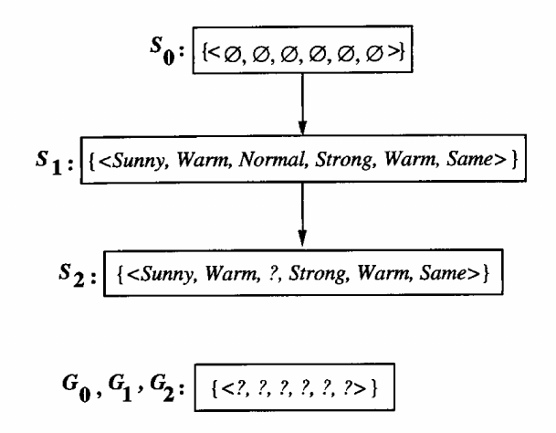
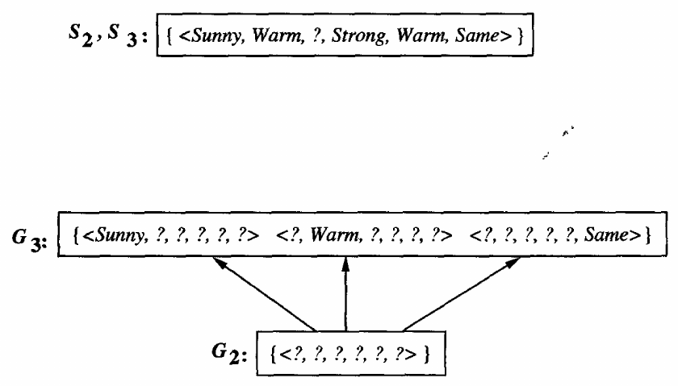
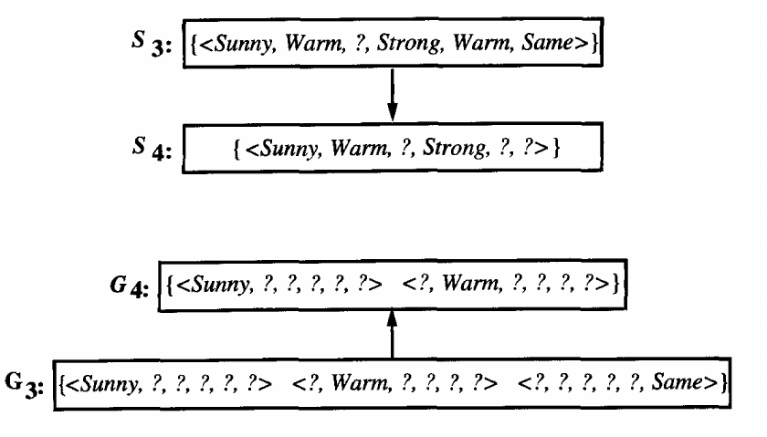
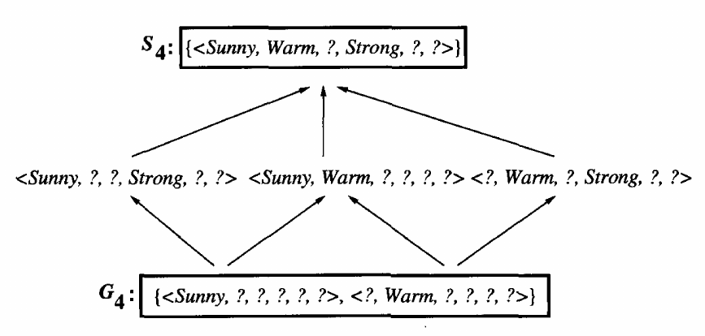
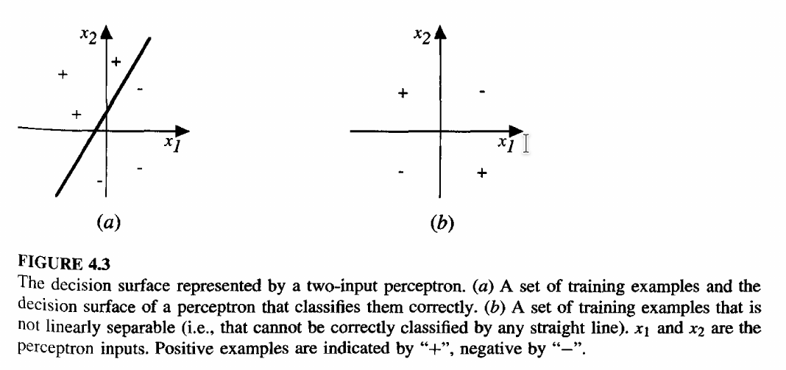
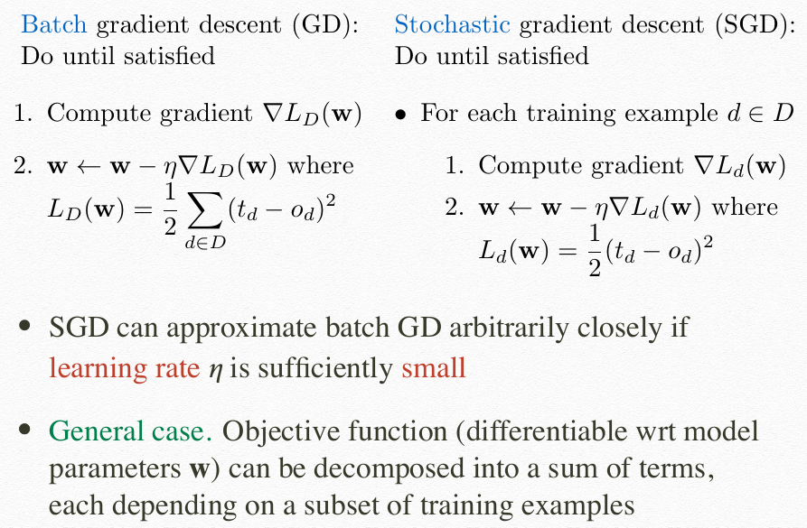
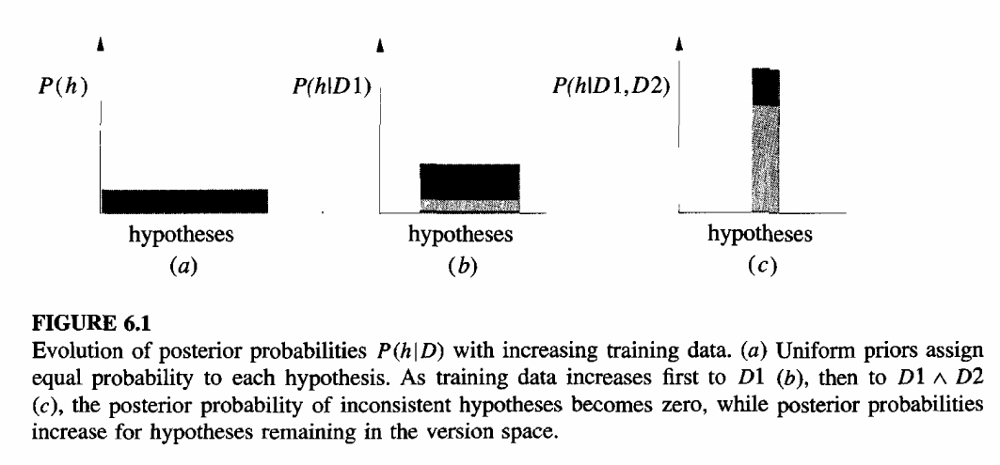
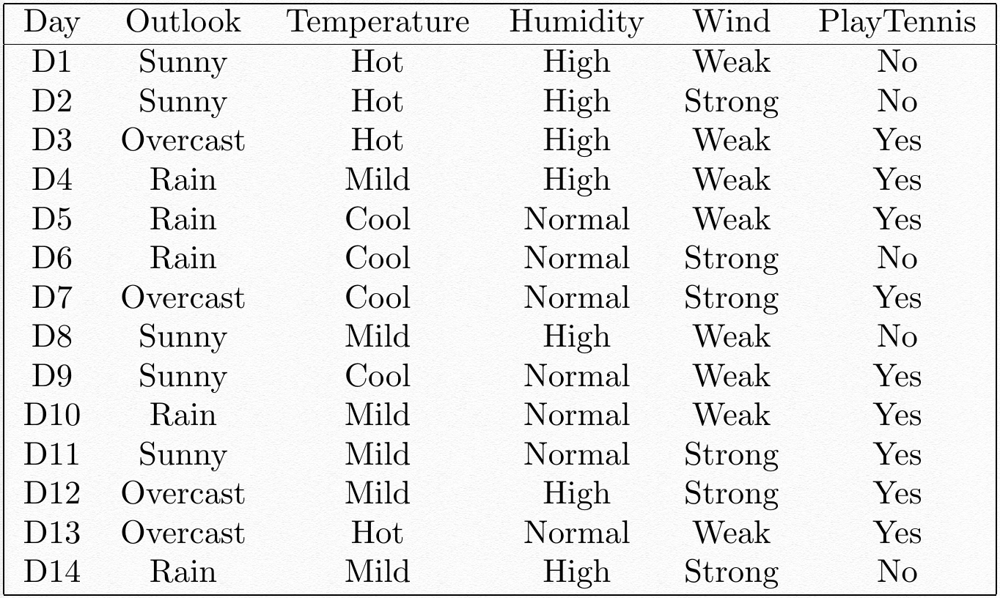
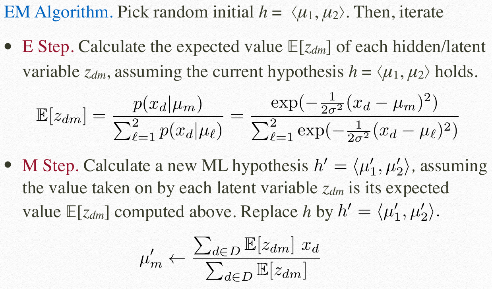
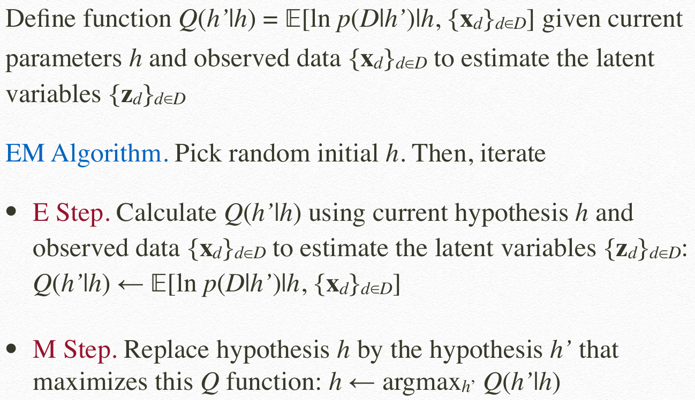

# CS3244 Notes

## Concept Learning

- Simple: assumes error-free, noise-free data
- White-box model: prediction is interpretable and explainable
- A boolean-valued function over a set of input instances (each comprising input attributes)
- A form of supervised learning: infer an unknown boolean-value function from set of training examples

### Definitions

- **Expressiveness**: a quadratic function ($ax^2+bx+c$) is more expressive than a linear function ($y=mx+c$), since more functions can be represented with the quadratic function
- **Input Instances**, $X$: each instance $x \in X$ is represented by the input attributes describing $X$
  - eg. $X$ = `sky` (with possible $x$ values `sunny`, `cloudy`, `rainy`, etc.)
  - eg. given $X=[T/F]$, $Y=[0/1/2]$, number of possible input instances $= 2 \times 3 = 6$
- **Unknown Target Concept/Function** $c$, a boolean-valued function over a set of input instances
  - eg. EnjoySport: $c : X \rightarrow \{0,1\}$
- **Noise-free training examples**, $D$: +ve and -ve examples of the target function
- **Hypothesis**, $h$: a conjunction of constraints on input attributes
- **Hypothesis Space**, $H$: contains all possible $h \in H$
  - As expressiveness increase, $H$ increase, and usually needs more data to find target concept function $c$
- **Synthetically Distinct Hypotheses**: add 2 other values, $?$ and $\emptyset$ to each input instance
  - eg. given $X=[T/F]$, $Y=[0/1/2]$, number of synthetically distinct hypotheses $= 4 \times 5 = 20$
- **Semantically Distinct Hypotheses**: since $\emptyset$ normally only taken in the hypothesis where all input instances are $\emptyset$ (eg. $\langle \emptyset, \emptyset, \emptyset \rangle$ but not $\langle Sunny, \emptyset, Strong \rangle$), add only $?$ to each input instance
  - eg. given $X=[T/F]$, $Y=[0/1/2]$, number of semantically distinct hypotheses $= 1 + 3 \times 4 = 13$
  - Presence of empty set $\emptyset$ means hypothesis $h$ matches nothing, thus $\langle ?, \emptyset, ? \rangle=\langle ?, ?, \emptyset \rangle = \langle \emptyset, \emptyset, \emptyset \rangle$
- **Satisfy**: input instance $x \in X$ **satisfies** a hypothesis $h \in H$ iff $h(x) = 1$, thus only consider 1 other value $?$ in each input instance
- **Consistent**: $h$ is **consistent** with a set of training examples $D$ iff $h(x) = c(x)$ $\forall \langle x,c(x) \rangle \in D$

### Satisfies $\neq$ Consistent

Let $h = \langle ?,cold,high,?,?,? \rangle$,
Example in lec 2 slide 4 says $c(x) = 0$
Not consistent: $1 = h(x) \neq c(x) = 0$
But satisfies: $x$ satisfies $h$ as $h(x) = 1$

<!-- pagebreak -->

## Search

Goal: search for a hypothesis $h \in H$ that is **consistent** with $D$

- Every hypothesis containing 1 or more $\emptyset$ symbols represents an empty set of input instance, hence classifying every instance as a -ve example

### Definitions

- $h_j \geq_g h_k$: $h_j$ is **more general than or equal to** $h_k$ iff any input instance $x$ that satisfies $h_k$ also satisfies $h_j$
  - $\forall x \in X, (h_k(x)=1) \rightarrow (h_j(x)=1)$
  - Intuitively, it means $h_j$ is a superset of $h_k$
  - Negated form: $\exists x \in X, (h_k(x)=1) \wedge (h_j(x)=0)$
  - $\geq_g$ relation also defines a partial order (reflexive, antisymmetric, transitive)
- $h_j >_g h_k$: $h_j$ is **strictly more general** than $h_k$ iff ($h_j \geq_g h_k) \wedge (h_k \not\geq_g h_j)$
- $h_j >_g h_k$: $h_k$ is **strictly more specific** than $h_j$
- **Version Space**, $VS_{H,D}$ wrt. hypothesis space $H$ and training example $D$: the subset of $h \in H$ consistent with $D$
  - $VS_{H,D} = \{h\in H | h \text{ is consistent with } D\}$
  - $VS_{H,D}$ contains all consistent hypotheses
- **General Boundary**, $G$ of $VS_{H,D}$: the set of maximally general members of $H$ consistent with $D$
- **Specific Boundary**, $S$ of $VS_{H,D}$: the set of maximally specific members of $H$ consistent with $D$

### Propositions

1. $h$ is consistent with $D$ iff every +ve training instance satisfies $h$ and every -ve training instance does not satisfy $h$
2. Suppose that $c \in H$. Then $h_n$ is consistent with $D =\{\langle x_k, c(x_k) \rangle\}_{k=1,\dots,n}$
3. An input instance $x$ satisfies every hypothesis in $VS_{H,D}$ iff $x$ satisfies every member of $S$
4. An input instance $x$ satisfies none of the hypotheses in $VS_{H,D}$ iff $x$ satisfies none of the members of $G$

## Find-S Algo

Idea: Start with most specific hypothesis. Whenever it wrongly classifies a +ve training example as −ve, “minimally” generalize it to satisfy its input instance.

1. Init $h$ to most specific hypothesis in $H$ (ie. $h = \langle \emptyset , \dots, \emptyset \rangle$)
2. For each positive training instance $x$ (ie. ignore -ve training intances),
    1. For each attribute constraint $a_i$ in $h$,
        1. If $x$ satisfies constraint $a_i$ in $h$,
            1. Do nothing
        2. Else,
            1. Replace $a_i$ in $h$ by the next more general constraint that is satisfied by $x$
3. Output hypothesis $h$

### Limitations

1. Unable to tell whether Find-S has indeed learnt the target concept
2. Unable to tell when training examples are inconsistent (since Find-S assumes noise free traning examples)

## Candidate-Elimination Algo

Idea: start with most general and specific hypotheses. Each training example "minimally" generalises $S$ and specialises $G$ to remove inconsistent hypotheses from version space.

1. For each training example $d$
    1. If $d$ is a +ve example
        1. Remove from $G$ any hypothesis inconsistent with d
        2. For each $s \in S$ not consistent with $d$
            1. Remove $s$ from $S$
            2. Add to $S$ all minimal generalizations $h$ of $s$ s.t. $h$ is consistent with $d$, and some member of $G$ is more general than $h$
            3. Remove from $S$ any hypothesis that is more general than another hypothesis in $S$
    2. Else if $d$ is a −ve example
        1. Remove from $S$ any hypothesis inconsistent with d
        2. For each $g \in G$ not consistent with $d$
            1. Remove $g$ from $G$
            2. Add to $G$ all minimal specializations $h$ of $g$ s.t. $h$ is consistent with $d$, and some member of $S$ is more specific than $h$ (==why?==)
            3. Remove from $G$ any hypothesis that is more specific than another hypothesis in $G$

In lines 1.1.1.3 and 1.2.1.3, why is it enough to ascertain that "$h$ is consistent with $d$", and that there is no need to make for certain that "$h$ is consistent with **all previous** $d$"?

Intuition for line 1.2.1.2: make as many $?$ as possible and still classify the -ve training example as $0$. To answer why: graphically, $G$ must contain $S$, adding to $G$ the minimal specializations $h$ will end up shrinking $G$. Thus, $G$ cannot shrink to less than $S$.

### Properties

- $S$ and $G$ might reduce to $\emptyset$ with sufficiently large data, due to
    1. Error/noise in training data (+ve wrongly labeled as -ve)
    2. Insufficiently expressive hypothesis representation (biased hypothesis space $c \not\in H$)
- Majority vote is the most probable classification, assuming all hypotheses in $H$ are equally probable a priori
- Works for any hypothesis space (even conjunctions of hypothesis)
- Requires at least $\lceil\log_2(VS_{H,D})\rceil$ training examples to find target concept $c$
  - Since version space reduces by at most half with each training example (==why?==)
- Any query from inside $G$ but outside $S$ will reduce the version space (by at most half)
- Any query from inside $S$ or outside $G$ will NOT reduce the version space

### Example

1. $\langle Sunny, Warm, Normal, Strong, Warm, Same \rangle, EnjoySport = Yes$
2. $\langle Sunny, Warm, High, Strong, Warm, Same \rangle, EnjoySport = Yes$

---

3. $\langle Rainy, Cold, High, Strong, Warm, Change \rangle, EnjoySport = No$

---
<!-- pagebreak -->

4. $\langle Sunny, Warm, High, Strong, Cool, Change \rangle, EnjoySport = Yes$

---

Final version space $VS_{H,D}$

## Inductive Bias

### Intuition

We wish to assure that the hypothesis space $H$ contains the unknown target concept $c$. Thus, we need to enrich $H$ to include *every teachable concept*, ie. capable to representing every possible subset of the instances of $X$ (also known as the power set of $X$).

However, this will make the learning algorithm unable to generalise beyond the observed eamples. $S$ will just contain disjunctions of the +ve examples and $G$ will just contain hypothesis that rules out the -ve examples.
<!-- pagebreak -->
### Definition

Let $L$ be a concept learning algorithm for the set of instances $X$. Let $c$ be an arbitrary concept defined over $X$, and let $D_c=\{\langle x, c(x)\rangle\}$ be an arbitrary set of training examples of $c$. Let $L(x_i,D_c)$ denote the classification assigned to the instance $x_i$ by $L$ after training on the data $D_c$.

The *inductive bias* of $L$ is any minimal set of assertions $B$ such that for any target concept $c$ and corresponding training examples $D_c$,

$$\forall x_i \in X, (B \wedge D_c \wedge x_i) \vdash L(x_i, D_c)$$

where the $y \vdash z$ notation indicates that $z$ follows deductively from $y$, ie. that $z$ is provable from $y$

### Inductive Bias of Candidate-Elimination

$$B=\{c \in H \}$$

- Assumes the target concept $c$ is contained in the given hypothesis space $H$

## Decision Tree

|                       |                  Concept Learning                  |                                          DT Learning                                           |
| :-------------------: | :------------------------------------------------: | :--------------------------------------------------------------------------------------------: |
|  **Target Concept**   |                   Binary Outputs                   |                                        Discrete Outputs                                        |
|   **Training Data**   |                     Noise-free                     |                                        Robust to noise                                         |
| **Hypothesis Space**  |                     Restricted                     |                                      Complete, expressive                                      |
|  **Search Strategy**  | Complete: version space; Refine search per example | Incomplete: prefer shorter tree (soft bias); Refine search using all examples; No backtracking |
| **Exploit Structure** |            General to Specific ordering            |                                   Simple to complex ordering                                   |

- Continuous values (non integer values like 2.2321) have to be classified into a discrete set of possible cataegories, eg. (0-5, 5-10)
  - This can lead to classification problems
- Hypothesis Space (number of distinct binary decision trees) with $m$ boolean attributes,
  - = number of distict truth tables with $2^m$ rows
  - = $2^{2^m}$
- Decision trees can express any function of the input attributes

<!-- pagebreak -->

### Decision-Tree-Learning algo

- function $DTL(examples, attributes, parent\_examples)$ returns $tree$
  - if $examples$ is empty
    - return $PluralityValue(parent\_examples)$
  - else if all $examples$ have the same classification
    - return the classification
  - else if $attributes$ is empty
    - return $PluralityValue(examples)$
  - else
    - $A \leftarrow \text{argmax}_{a\in attributes} Importance(a, examples)$
    - $tree \leftarrow$ a new decision tree with root test $A$
    - for each value $v_k$ of $A$, Do
      - $exs \leftarrow \{e:e\in examples \wedge e.A = v_k\}$
      - $subtree \leftarrow DTL(exs, attribues-A, examples)$
      - add a branch to $tree$ with label $(A=v_k)$ and substree $subtree$
    - return $tree$

Intuition: find a small tree consistent with the training examples by greedily choosing the "most important" attribute as root of (sub)tree

- **Most Important Attribute**: a good attribute splits the examples into subsets that are ideally all +ve or all -ve, ie. after splitting, it should make the classification clearer
- Forms a **Learned Decision Tree**: a substantially simpler tree compared to the "true" decision tree. More complex hypotheses may not be classified correctly (as compared to the "true" tree)

### Entropy

Measures the **uncertainity of classification**:

$$H(C) = -\sum_{i=1}^kP(c_i)\log_2P(c_i)$$

- $H(C) = 1$: maximum uncertainty, equal proportion of +ve and -ve examples
- $H(C) = 0$: no uncertainty, only +ve OR -ve examples

#### Example

Suppose $S$ is a collection of 14 examples of some boolean concept, including 9 positive and 5 negative examples (ie. $[9+,5-]$), then the entropy of $S$ relative to this boolean classification is

$$H([9+,5-]) = -\frac{9}{14}\log_2\frac{9}{14} - \frac{5}{14}\log_2\frac{5}{14}$$

<!-- pagebreak -->

### Information Gain

A chosen attribute $A$ divides the training set $E$ into subsets $E_1, \dots, E_d$ corresponding to the $d$ distinct values of $A$. Each subset $E_i$ has $p_i$ +ve and $n_i$ -ve examples

$$
\begin{aligned}
H(C|A) &= \sum_{i=1}^d\frac{p_i+n_i}{p+n} B\left(\frac{p_i}{p_i+n_i}\right)\\
\text{where } B\left(\frac{p_i}{p_i+n_i}\right) &= -\frac{p_i}{p_i+n_i}\log_2\frac{p_i}{p_i+n_i} - \frac{n_i}{p_i+n_i}\log_2\frac{n_i}{p_i+n_i}
\end{aligned}
$$

- $B(\frac{p_i}{p_i+n_i})$: **entropy** of the child node
- $\frac{p_i+n_i}{p+n}$: **weight**, or the proportion of examples that is dedicated to attribute value $i$

Information gain of target concept $C$ from the attribute test on $A$ is the ***expected reduction in entropy***:

$$
\begin{aligned}
Gain(C,A) &= B\left(\frac{p}{p+n}\right) - H(C|A)\\
\text{where } B\left(\frac{p}{p+n}\right) &= -\frac{p}{p+n}\log_2\frac{p}{p+n} - \frac{n}{p+n}\log_2\frac{n}{p+n}
\end{aligned}
$$

- $B(\frac{p}{p+n})$: **entropy** of this node
- $H(C|A)$: **expected remaining entropy** after testing $A$

### Constructing a Decision Tree

1. Using $Gain(C,A) = B\left(\frac{p}{p+n}\right) - H(C|A)$, find for all attributes $A$, the highest $Gain$
2. Use the attribute $A$ with the highest $Gain$ as root
3. Branch out to all values of $A$, seeing which value will result in a definite answer
4. If definite answer for a value $v$ branch (ie. all training examples are $+$ or $-$ for $v$)
   1. Simply branch out to the classification
5. If no definite answer for a value $v$ branch (ie. needs to have a new subtree for $v$)
   1. Using $v$, construct a new table for the subset of attributes that contain $v$
   2. Repeat from step 1 to create a new subtree with these subset of attributes
6. If no more subset of attributes can be formed, use Plurality-Value of the attributes to determine the classification

### Inductive Bias of Decision-Tree-Learning

Assumes:

1. Shorter trees are preferred
2. Trees that place high information gain attributes close to the root are preferred

<!-- pagebreak -->

- If only (1) is considered, is is the exact inductive bias of BFS for the shortest consistent DT, which can be prohibitively expensive
- Bias is a preference for some hypotheses, rather than a restriction of hypothesis space
- Simple hypotheses are preferred: Occam's Razor, long/complex hypothesis that fits data may be coincidence

### Overfitting

Hypothesis $h \in H$ overfits the set $D$ of training examples iff

$$\exists h' \in H\{h\}, (error_D(h) < error_D(h')) \wedge (error_{D_X}(h) > error_{D_X}(h'))$$

In other words, a hypothesis $h \in H$ is said to overfit the training data if there exists some alternative hypothesis $h' \in H$, such that $h$ has smaller error than $h'$ over the training examples, but $h'$ has a smaller error than $h$ over the entire distribution of instances.

#### Causes

- Training examples contain random errors or noise
  - A more complex tree is drawn that fits these noisy examples but which do not fit the true concept
- Limited data
  - Data is costly, problem is more acute than noisy training examples

#### Solutions

- Stop growing DT when expanding a node is not statistically significant
- Allow DT to grow, then **post-prune** it

### Reduced-Error Pruning

- Idea: partition data into training and validation sets
- Produces smallest version of most accurate subtree
- Needs ample data

Do until further pruning is harmful:

1. Evaluate impact on validation set of pruning each possible node
2. Greedily remove the one that most improves validation set accuracy

### Rule Post-Pruning

1. Infer the DT from the training set, growing the tree until the training data is fit as well as possible and allowing overfitting to occur
2. Convert the learned tree into an equivalent set of rules by creating one rule for each path from the root node to a leaf node
3. Prune each rule by removing any preconditions that result in improving its estimated accuracy
4. Sort the pruned rules by their estimated accuracy, and consider them in this sequence when classifying subsequent instances

### Handling Continuous-Valued Attributes

Define discrete-valued input attributes to partition the values into a discrete set of intervals for testing.

For **attributes with many values**, use $GainRatio$:

$$GainRatio(C,A) = \frac{Gain(C,A)}{SplitInformation(C,A)}$$

$$SplitInformation(C,A) = -\sum_{i=1}^d\frac{|E_i|}{|E|}\log_2\frac{|E_i|}{|E|}$$

### Handling Attributes with Differing Costs

Attributes like `Temperature`, `BiopsyResult`, `BloodTestResult`, vary significantly in their costs. In such cases, we prefer low-cost attributes where possible, relying on high-cost attributes only when needed to produce reliable classifications.

Replace $Gain$ by

$$ \frac{Gain^2(S,A)}{Cost(A)} $$

$$ \frac{2^{Gain(S,A)}-1}{(Cost(A)+1)^w} $$

where $w \in [0,1]$ is a constant that determines the *relative importance of cost versus information gain*.

### Handling Missing Attributes Values

Use training example anyways and sort through DT

- If node $n$ tests $A$, then assign most common value of $A$ among other examples sorted to node $n$
- Assign most common value of $A$ among other examples sorted to node $n$ with same value of output/target concept
- Assign probability $p_i$ to each possible value of $A$
  - Assign fraction $p_i$ of example to each descendant in DT

<!-- pagebreak -->

## Neural Networks

A robust approach to approximating real-valued, discrete-valued, and vector-valued target functions. Extremely popular in NLP, speech recognition, computer vision, and healthcare.

- Many neuron-like threshold switching units
- Many weighted interconnections among units
- Highly parallel, distributed process
- Emphasis on tuning weights automatically

Appropriate for problems with the following characteristics:

- Instances are represented by many attribute-value pairs
- Target function output may be discrete, real, or a vector of several real or discrete attributes
- Training examples may contains errors
- Long training times are acceptable
- Fast evaluation of the learned target function may be required
- Ability of humans to understand the learned target function is not important

### Perceptron

Given inputs $x_1$ through $x_n$, the output $o(x_1,\dots,x_n)$ computed by the perceptron is

$$
o(x_1,\dots,x_n) =
\begin{cases}
  1  &\text{if } w_0 + w_1x_1+\dots+w_nx_n > 0 \\
  -1 &\text{otherwise}
\end{cases}
$$

where each $w_i$ is the $weight$ that determines the contribution of input $x_i$ to the perceptron output. The quantity $(-w_0)$ is a threshold that the weighted combinations of the inputs $w_1x_1 + \dots + w_nx_n$ must surpass in order for the perceptron to output a 1. To simplify notation in vector form:

$$
o(x_1,\dots,x_n) =
\begin{cases}
  1  &\text{if } \vec{w} \cdot \vec{x} > 0 \\
  -1 &\text{otherwise}
\end{cases}\\
\text{where } \vec{w} = (w_0,\dots,w_n)^\intercal \in H = \R^{n+1}\\
\text{and } \vec{x} = (1,x_1,\dots,x_n)^\intercal \in X = \R^n
$$

Line show in (a) is the line

$$\vec{w}\cdot\vec{x}=0$$

$$x_2=-\frac{w_1}{w_2}x_1-\frac{w_0}{w_2}$$

The weight vector $\vec{w}$ is orthogonal to the line in (a) and points towards the positive training examples. The direction it is pointing at will determine the polarity of $w_1$ and $w_2$. For example, in graph (a), since $\vec{w}$ points in the $-$ve direction of $x_1$ and $+$ve direction of $x_2$, $w_1$ is $-$ve and $w_2$ is $+$ve respectively.

Assuming $|w_1| = |w_2| = 1$, line equation can be simplified to $x_2=1x_1+(-w_0)$. In other words, line has a gradient of $1$ and $x_2$-intercept of $-w_0$. Thus, since line lies above the origin, $x_2$-intercept is positive, and thus $w_0$ is negative.

> **Note: points that lie directly on the line are classified as negative examples**

### Perceptron Training Rule

Intuition: we want to determine a weight vector that causes the perceptron to produce the correct $\pm1$ output for each of the given training examples.

Idea: initialise $w$ randomly, apply perceptron training rule to every training example, and iterate through all training examples, modifying the perceptron weights till $w$ is consistent with all training examples.

Weights are modified at each step according to the perceptron training rule, which revises the weight $w_i$ associated with input $x_i$ according to the rule

$$
w_i \leftarrow w_i + \Delta w_i\\
\text{where } \Delta w_i = \eta(t-o)x_i
$$

for $i=0,1,\dots,n$ where

- $t = c(x)$ is the target output for the training example $\langle x,c(x) \rangle$
- $o=o(x)$ is the perceptron output
- $\eta$ is a sufficiently small $+$ve constant called **learning rate**
- $\Delta w_i$ is non-zero only if there is a misclassification

### Gradient Descent (GD)

Intuition: search $H$ to find weight vector that best-fits the possibly not linearly separable training examples.

Consider a simpler linear unit: $o(\vec{x})=\vec{w}\cdot \vec{x}$

Learn $w$ that minimises **loss function** (ie. **sum of squared errors**),

$$ L_D(\vec{w}) = \frac{1}{2}\sum_{d\in D}(t_d - o_d)^2 $$

- $D$ is the set of training examples
- $t_d$ is the target output for training example $d$
- $o_d$ is the output of linear unit for training example $d$

Idea: find $\vec{w}$ that minimises $L$ by first initialising it randomly and then repeatedly updating it in the direction of the steepest descent.

This direction can be found by computing the derivative of $L$ with respect to each component of the vector $\vec{w}$,

$$ \nabla L_D(\vec{w}) = \left[ \frac{\partial L_D}{\partial w_0},\dots, \frac{\partial L_D}{\partial w_n}  \right] $$

with the training rule

$$
\vec{w} \leftarrow \vec{w} + \Delta\vec{w}\\
\text{where } \Delta\vec{w} = -\eta\nabla L_D(\vec{w})
$$

which will yield

$$ \Delta w_i = \eta\sum_{d\in D}(t_d - o_d) x_{id} $$

#### Algorithm

Idea: initialise $\vec{w}$ randomly, apply linear unit training rule to all training examples, and repeat

Each training example $d \in D$ is a pair of the from $\langle \vec{x}, t \rangle$, where $\vec{x}$ is the vector of input values, and $t$ is the target output value. $\eta$ is the learning rate.

- Initialise each $w_i$ to some small random value
- Until the termination condition is met, Do
  - Initialise each $\Delta w_i$ to zero
  - For each $d \in D$, Do
    - Input the instance $\vec{x}$ to the unit and compute the output $o$
    - For each linear unit weight $w_i$, Do
      - $\Delta w_i \leftarrow \Delta w_i + \eta(t-o)x_i$
  - For each linear unit weight $w_i$, Do
    - $w_i \leftarrow w_i + \Delta w_i$

### Summary So Far

- Perceptron training rule is guaranteed to converge if
  - Training examples are linearly separable
  - Learning rate $\eta$ is sufficiently small
- Linear unit training rule utilising gradient descent is guaranteed to converge to hypothesis with min. squared error/loss
  - If learning rate $\eta$ is sufficiently small
  - Even when training examples are noisy and/or linearly non-separable by $H$
- Key practical difficulties in applying GD:
  1. Converging to a local minimum can sometimes be quite slow (require many thousands of GD steps)
  2. If there are multiple local minima in the error surface, then there is no guarantee that the procedure will find the global minimum

### Stochastic Gradient Descent (SGD)

- SGD approximates the GD search by updating weights incrementally, following the calculation of the error for *each* individual example

### Multilayer Networks of Sigmoid Units

- Sigmoid function, $\sigma(net)=\frac{1}{1+e^{-net}}$
  - Output ranges between $0$ and $1$
  - Output increases monotonically with its input
  - $net \geq 0 \implies \text{output}\geq \frac{1}{2}$
- $\frac{\partial\sigma(net)}{\partial(net)} = \sigma(net)(1-\sigma(net))$

<!-- pagebreak -->

### Error/Loss Gradient for 1 Sigmoid Unit

$$
\begin{aligned}
\frac{\partial L_D}{\partial w_i} &= \frac{\partial}{\partial w_i}\frac{1}{2} \sum_{d\in D}(t_d - o_d)^2\\
  &= \frac{1}{2} \sum_{d\in D}\frac{\partial}{\partial w_i}(t_d - o_d)^2 \\
  &= \frac{1}{2} \sum_{d\in D} 2(t_d-o_d) \frac{\partial}{\partial w_i}(t_d - o_d) \\
  &= \sum_{d\in D} (t_d-o_d) \left( -\frac{\partial o_d}{\partial w_i} \right) \\
  &= -\sum_{d\in D} (t_d-o_d) \frac{\partial o_d}{\partial net_d} \frac{\partial net_d}{\partial w_i} \\
\frac{\partial o_d}{\partial net_d} &= \frac{\partial\sigma(net_d)}{\partial net_d} = o_d(1-o_d)\\
\frac{\partial net_d}{\partial w_i} &= \frac{\partial(\vec{w}\cdot\vec{x}_d)}{\partial w_i} = x_{id}\\
\frac{\partial L_D}{\partial w_i} &= -\sum_{d \in D}(t_d-o_d)o_d(1-o_d)x_{id}
\end{aligned}
$$

### Feedforward Networks of Sigmoid Units

User GD to learn $\vec{w}$ that minimises squared error/loss:

$$
L_D(\vec{w}) = \frac{1}{2}\sum_{d\in D}\sum_{d\in K}(t_{kd}-o_{kd})^2
$$

- $K$: set of output units in the network
- $t_{kd}$: target output of sigmoid unit associated with $k$-th output unit and training example $d$
- $p_{kd}$: output of sigmoid unit associated with $k$-th output unit and training example $d$

### Backpropogation Algorithm

Idea: init $\vec{w}$ randomly, propogate input forward, and errors backward through the network for each training example

- Initialise all network weights to small random numbers (eg. between $-0.05$ and $0.05$)
- Until satisfied, Do
  - For each training example $\langle\vec{x},(t_k)_{k\in K}^\top \rangle$, Do  
    1. Input instance $\vec{x}$ to the network and compute output of every sigmoid unit in the hidden and output layers  
    2. For each output unit $k$, compute error $\delta_k \leftarrow o_k(1-o_k)(t_k-o_k)$
    3. For each hidden unit $h$, compute error $\delta_h \leftarrow o_h(1-o_h)\sum_{k\in K}w_{hk}\delta_k$
    4. Update each weight $w_{hk} \leftarrow w_{hk}+\Delta w_{hk}$ where $\Delta w_{hk} = \eta\delta_k o_h$
    5. Update each weight $w_{ih} \leftarrow w_{ih}+\Delta w_{ih}$ where $\Delta w_{ih} = \eta\delta_h x_i$

<!-- TODO: add derivative of Backpropagation -->

### Summary of Backpropagation

- $L_D$ has **multiple local minima**
  - GD is guaranteed to converge to some local minima, but not necessarily to the global minimum
  - In practice, GD still often performs well, especially after using multiple random initialisations of $\vec{w}$
- Often include **weight momentum**, $\alpha \in [0,1)$:
  - $\Delta w_{hk} \leftarrow \eta\delta_k o_h + \alpha\Delta w_{hk}$
  - $\Delta w_{ih} \leftarrow \eta\delta_k x_i + \alpha\Delta w_{ih}$
- Easily generalised to feedforward networks of arbitrary depth
  - Step 3: Let $K$ denote all units in the next deeper layer whose inputs include output of $h$
  - Step 5: Let $x_i$ denote the output of unit $i$ in previous layer that is input to $h$
- Expressive hypothesis space; requires limited depth feedforward networks
  - Every Boolean function can be represented by a network with one hidden layer but may require exponential hidden units in no. of inputs
  - Every bounded continuous function can be approximated with arbitrarily small error by a network with one hidden layer
  - Any function can be approximated to arbitrary accuracy by a network with two hidden layers
- Approximate inductive bias
  - Smooth interpolation between data points

### Alternative Loss/Error Functions

**Penalise large weights**:

$$
L_D(\vec{w})=\frac{1}{2}\sum_{d\in D}\sum_{k\in K}(t_{kd}-o_{kd})^2+\gamma\sum_{j,l}w^2_{jl}
$$

- $\gamma\sum_{j,l}w^2_{jl}$ is the regularisation term; an additional term on top of the loss function
- $\gamma$ is the tradeoff parameter
  - To focus on lowering the weights $w$, raise $\gamma$
    - So that it looks like a linear function/generalises well
  - To focus on reducing the squared loss, lower $\gamma$
    - So that we can predict as accurately as possible wrt. training data (but might end up overfitting)

**Train on target values as well as slopes**:

$$
L_D(\vec{w})=\frac{1}{2}\sum_{d\in D}\sum_{k\in K} \left[ (t_{kd}-o_{kd})^2 + \mu\sum_{i=1}^n\left( \frac{\partial t_{kd}}{\partial x_{id}} - \frac{\partial o_{kd}}{\partial x_{id}} \right)^2 \right]
$$

- $(t_{kd}-o_{kd})^2$ is the target value
- $\mu\sum_{i=1}^n\left( \frac{\partial t_{kd}}{\partial x_{id}} - \frac{\partial o_{kd}}{\partial x_{id}} \right)^2$ is the slope
- $\mu$ is the tradeoff parameter

**Tie together weights**: eg. phoneme recognition networks

<!-- pagebreak -->

## Bayesian Inference

- Each observed training example can incrementally decrease or increase the estimated probability that a hypothesis is correct
- Prior knowledge can be combined with observed data to determine the final probability of a hypothesis
  - Accomodates hypotheses that make probabilistic predictions (eg. "this pneumonia patient has a 94% chance of complete recovery")
- New input instances can be classified by combining predictions of multiple hypotheses weighted by their probabilities/beliefs

### Bayes' Theorem/Belief Update

$$
P(h|D)=\frac{P(D|h)P(h)}{P(D)}
$$

- $P(h)$: prior belief of hypothesis $h$
  - Initial probability that $h$ holds before observing training data
  - May reflect any background knowledge we have about the chance that $h$ is correct. If no such prior knowledge, then each hypothesis might simply get the same prior probability
- $P(D|h)$: likelihood of data $D$ given $h$
  - Denotes the probability of observing $D$ given some world in which hypothesis $h$ holds
- $P(D) = \sum_{h\in D}P(D|h)P(h)$: marginal likelihood/evidence of $D$
  - Probability of $D$ given no knowledge about which hypothesis holds
- $P(h|D)$: posterior belief of $h$ given $D$
  - Reflects our confidence that $h$ holds after we have seen the training data $D$

### *Maximum A Posteriori* (MAP) Hypothesis

Defintion: any maximally probable hypothesis $h \in H$ given the training data $D$,

$$
\begin{aligned}
h_{\text{MAP}} &= \text{argmax}_{h\in H}P(h|D)\\
  &=\text{argmax}_{h\in H} \frac{P(D|h)P(h)}{P(D)}\\
  &=\text{argmax}_{h\in H} P(D|h)P(h)
\end{aligned}
$$

> $\text{argmax}_{h\in H}P(D|h)P(h)$ denotes the hypothesis $h$ such that $P(D|h)P(h)$ is maximised.

If every hypothesis in $H$ is equally probable (ie. $\forall h_i,h_j \in H, P(H_i)=P(H_j)$), then we can simplify and get the **Maximum Likelihood** (ML) hypothesis (defined as any hypothesis that maximises $P(D|h)$),

$$
h_{\text{ML}}=\text{argmax}_{h\in H}P(D|h)
$$

<!-- pagebreak -->

### Probability Formula

#### Chain Rule

Joint probability $P(A_1,\dots,A_n)$ of a conjunction of $n$ events $A_1,\dots,A_n$,

$$
P(A_1,\dots,A_n) = \prod_{i=1}^n P(A_i|A_1,\dots,A_{i-1})
$$

#### Inclusion-Exclusion Principle

$$
\begin{aligned}  
P(A \cup B) = &P(A) + P(B) - P(A \cap B)\\
P(A \cup B \cup C) = &P(A) + P(B) + P(C)\\
  &- [P(A \cap B) + P(A \cap C) + P(B \cap C)]\\
  &+ P(A \cap B \cap C)
\end{aligned}
$$

#### Bayes Theorem

$$
\begin{aligned}
P(h|D) &= \frac{P(D|h)P(h)}{P(D)} \\
  &= \frac{P(D|h)P(h)}{P(D|h)P(h) + P(D|h^c)P(h^c)}
\end{aligned}
$$

#### Law of Total Probability/Marginalisation

If events $A_1, \dots, A_n$ are mutually exclusive with $\sum_{i=1}^n P(A_i)=1$,

$$
\begin{aligned}
P(B) &= \sum_{i=1}^n P(B \cap A_i)\\
  &= \sum_{i=1}^n P(B|A_i)P(A_i)
\end{aligned}
$$

### Brute-Force MAP Hypothesis Learner

1. For each hypothesis $h \in H$, compute posterior belief
   - $P(h|D) = \frac{P(D|h)P(h)}{P(D)}$
2. Output hypothesis $h_{\text{MAP}}$ with highest posterior belief
   - $h_{\text{MAP}} = \text{argmax}_{h\in H}P(h|D)$

<!-- pagebreak -->

### Consistent Learners

A learning algorithm is a consistent learner if it outputs a hypothesis that commits zero errors over the training examples.

Every consistent learner outputs a MAP hypothesis if we assume

1. A uniform prior probability distribution over $H$
2. Deterministic, noise free training data

### Relation to Concept Learning

Assumptions:

1. Training data $D$ is noise free
2. Target concept $c$ is contained in the hypothesis space $H$
3. No *a priori* reason to believe that any hypothesis is more probable than any other

Thus, it is reasonable for us to assign the same prior probability to every hypothesis $h \in H$,

$$
P(h) = \frac{1}{|H|}, \forall h \in H
$$

> **Are there other probability distributions for $P(h)$ under which Find-S outputs MAP hypotheses?**
>
> Yes
>
> - Because FIND-S outputs a maximally specific hypothesis from the version space, its output hypothesis will be a MAP hypothesis relative to any prior probability distribution that favors more specific hypotheses
> - More precisely, we can have a probability distribution $P(h)$ that assigns $P(h_1)\geq P(h_2)$ if $h_1$ is more specific than $h_2$

The probability of data $D$ given hypothesis $h$ is $1$ if $D$ is consistent with $h$, and $0$ otherwise,

$$
P(D|h)=
\begin{cases}
  1, &\text{if } c(x_d)=h(x_d), \forall \langle x_d, c(x_d) \rangle \in D \\
  0, &\text{otherwise}
\end{cases}
$$

Thus, for the posterior belief $P(h|D)$,

Case 1: $h$ is inconsistent with $D$,

$$
\begin{aligned}
P(h|D) &= \frac{P(D|h)P(h)}{P(D)}\\
  &= \frac{0 \times P(h)}{P(D)}\\
  &= 0
\end{aligned}
$$

<!-- pagebreak -->

Case 2: $h$ is consistent with $D$,

Define $VS_{H,D}$ as the subset of hypotheses from $H$ that are consistent with $D$. Since hypotheses $h \in H$ are mutually exclusive, we can derive $P(D)$ from the law of total probability, $\forall i \neq j, P(h_i \cap h_j) = 0$,

$$
\begin{aligned}
P(D) &= \sum_{h_i \in H}P(D|h_i)P(h_i)\\
  &= \sum_{h_i \in VS_{H,D}}1\cdot\frac{1}{|H|} + \sum_{h_i \not\in VS_{H,D}}0\cdot\frac{1}{|H|}\\
  &= \sum_{h_i \in VS_{H,D}}1\cdot\frac{1}{|H|}\\
  &= \frac{|VS_{H,D}|}{|H|}
\end{aligned}
$$

Thus,

$$
\begin{aligned}
P(h|D) &= \frac{P(D|h)P(h)}{P(D)}\\
  &= \frac{1 \times \frac{1}{|H|}}{P(D)}\\
  &= \frac{1 \times \frac{1}{|H|}}{\frac{|VS_{H,D}|}{|H|}}\\
  &= \frac{1}{|VS_{H,D}|}
\end{aligned}
$$

Conclusion: **every consistent hypothesis is a MAP hypothesis**.

<!-- pagebreak -->

### Learning a Continuous-Valued Function

Consider any real-valued target function $f$ and training examples $D= \{\langle \vec{x}_d,t_d \rangle\}$, where $t_d$ is a noisy target output for training example $d$,

- $t_d = f(\vec{x}_d) + \epsilon_d$
- $\epsilon_d$ is a random noise variable drawn independently for each $\vec{x}_d$ according to $\epsilon_d \sim N(0,\sigma^2$

Then the maximum likelihod hypothesis $h_{ML}$ is one that minimises the sum of squared errors:

$$
h_{ML}=\text{argmin}_{h\in H}\frac{1}{2}\sum_{d\in D}(t_d-h(\vec{x}_d))^2
$$

> $\text{argmax}_h [-F(h)] = \text{argmin}_h [F(h)]$

### Learning to Predict Probabilities

Consider target function/concept $c : X \rightarrow \{0,1\}$ and training examples $D = \{\langle x_d,t_d \rangle\}$ where $t_d=c(x_d)$. For example,

- $X$ denotes patients in terms of their symptoms and $c(x)$ is of value 1 if patient $x$ survives, and 0 otherwise
- $X$ denotes loan applicants in terms of their past credit history and $c(x)$ is of value 1 if loan applicant $x$ repays loan, and 0 otherwise

We want to learn a neural network to output $P(c(x)=1)$ via the maximum likelihood hypothesis $h_{ML}$:

$$
h_{ML}=\text{argmax}_{h\in H}\sum_{d\in D}t_d \ln h(x_d) + (1-t_d)\ln(1-h(x_d))
$$

### Minimum Description Length Principle (MDL)

Occam's Razor: prefer shortest hypothesis that fits the data:

$$
\begin{aligned}
h_{MAP} &= \text{argmax}_{h\in H}P(D|h)P(h) \\
  &= \text{argmax}_{h\in H} \log_2P(D|h) + \log_2P(h)\\
  &= \text{argmin}_{h\in H} -\log_2P(D|h)-\log_2P(h)
\end{aligned}
$$

- $-\log_2P(h)$: description length of $h$ under optimal code for $H$
- $-\log_2P(D|h)$: description length of $D$ given $h$ under optimal code for describing data $D$

$$
h_{MDL}=\text{argmin}_{h\in H}L_{C_1}(h) + L_{C_2}(D|h)
$$

- $L_C(x)$: description length of $x$ under encoding $C$

Example: given $H=$ decision trees

- $L_{C_1}(h)$: number of bits to describe tree $h$
- $L_{C_2}(D|h)$: number of bits to describe $D$ given $h$
  - $L_{C_2}(D|h)=0$ if examples classified perfectly by $h$. Otherwise, only misclassifications need to be described
- By minimising $length(tree)$ and $length(misclassifications(tree))$, $h_{MDL}$ trades off tree size for training errors to mitigate overfitting

### Bayes-Optimal Classifier

Given a new instance $x$, what is its most probable classification given the training data $D$?

$h_{MAP}$ is the most probably hypothesis, but not the most probable classification.

Example: consider $H$ with 3 possible hypotheses:

$$
P(h_1|D)=0.4 \;\;\;\;\;\;
P(h_2|D)=0.3 \;\;\;\;\;\;
P(h_3|D)=0.3
$$

$h_{MAP}=h_1$ because posterior belief is highest. Suppose that new instance $x$ is given and:

$$
h_1(x) = + \;\;\;\;\;\;
h_2(x) = - \;\;\;\;\;\;
h_3(x) = -
$$

Thus, in terms of prediction, the MAP hypothesis will say that it is $+$ve for this instance $x$.

**Bayes-optimal classification**: for all hypotheses, do marginalisation over all the hypotheses,

$$
\text{argmax}_{t\in T}P(t|D)=\text{argmax}_{t\in T}\sum_{h\in H}P(t|h)p(h|D)
$$

Let $T=\{+,1\}$. Then,

$$
P(h_1|D)=0.4 \;\;\;\;\;\;
P(-|h_1)=0 \;\;\;\;\;\;
P(+|h_1) = 1
\\
P(h_2|D)=0.3 \;\;\;\;\;\;
P(-|h_2)=1 \;\;\;\;\;\;
P(+|h_2) = 0
\\
P(h_3|D)=0.3 \;\;\;\;\;\;
P(-|h_3)=1 \;\;\;\;\;\;
P(+|h_3) = 0
$$

$$
\sum_{h\in H}P(+|h)P(h|D)=(0.4\times 1) + (0.3\times 0) + (0.3 \times 0) = 0.4\\
\sum_{h\in H}P(-|h)P(h|D)=(0.4\times 0) + (0.3\times 1) + (0.3 \times 1) = 0.6\\
\text{Thus, }\text{argmax}_{t\in\{ +,- \}}\sum_{h\in H}P(t|h)P(h|D)=0.6
$$

> Bayes-optimal classifier provides best performance but is computationally costly if $H$ is large

### Gibbs Classifier

1. Sample a hypothesis $h$ from posterior belief $P(h|D)$
2. Use $h$ to classify new instance $x$

Supposing target concepts are sampled from some prior over $H$, expected misclassification error of Gibbs classifier is at most twice that of Bayes-optimal classifier

### Naive Bayes Classifier

Limitations:

1. Moderate or large amount of training data needed
2. Input attributes are conditionally independent given classification

Consider target function/concept $c : X \rightarrow T$, where each instance $x \in X$ is represented by input attributes $x=(x_1,\dots,d_x)^T$. The most probable classification of new instance $x$ is

$$
\begin{aligned}
t_{MAP} &=\text{argmax}_{t\in T}P(t|x_1,\dots,x_n) \\
  &=\text{argmax}_{t\in T}\frac{P(x_1,\dots,x_n|t)P(t)}{P(x_1,\dots,x_n)} \\
  &=\text{argmax}_{t\in T}P(x_1,\dots,x_n|t)P(t)
\end{aligned}
$$

Thus,

$$
t_{NB}=\text{argmax}_{t\in T}P(t)\prod_{i=1}^nP(x_i|t)
$$

**Naive-Bayes-Learn(D)**:

1. For each value of target output $t$:
   1. $\hat{P}(t) =$ estimate $P(t)$ using $D$
   2. For each value of attribute $x_i$:
      1. $\hat{P}(x_i|t) =$ estimate $P(x_i|t)$ using $D$

**Classify-New-Instance(x)**:

1. $t_{NB} = \text{argmax}_{t\in T}\hat{P}(t)\prod_{i=1}^n\hat{P}(x_i|t)$

#### Example

Predict target concept $PlayTennis$ of new instance (Outlook = Sunny, Temperature = Cool, Humidity = Hight, Wind = Strong)

$$
P(Yes)P(Sunny|Yes)P(Cool|Yes)P(High|Yes)P(Strong|Yes) \\
=\frac{9}{14} \times \frac{2}{9} \times \frac{3}{9} \times \frac{3} {9} \times \frac{3}{9} = 0.005291
$$

$$
P(No)P(Sunny|No)P(Cool|No)P(High|No)P(Strong|No) \\
=\frac{5}{14} \times \frac{3}{5} \times \frac{1}{5} \times \frac{4} {5} \times \frac{3}{5} = 0.02057
$$

Thus, $t_{NB} = No$ (take the higher $P$)

$$
\text{Normalised posterior, }P(No|Sunny,Cool,High,Strong)=\frac{0.02057}{0.02057+0.005291} = 0.7954
$$

#### Properties

1. Conditional independence assumption is often violated, but still works surprisingly well in practice
2. Estimated posteriors $\hat{P}(t|x)$ need not be correct; only need that $\text{argmax}_{t\in T}\hat{P}(t)\prod_{i=1}^n\hat{P}(x_i|t) = \text{argmax}_{t\in T}P(t)P(x_1,\dots,x_n|t)$
3. If none of the training instance with target ouput value $t$ have attribute value $x_i$, then $\hat{P}(x_i|t) = 0$ and $\hat{P}(t)\prod_{i=1}^n\hat{P}(x_i|t) = 0$

Solution for problem 3: use bayesian estimate $\hat{P}(x_i|t) = \frac{|D_{tx_i}|+mp}{|D_t|+m}$, where

- $|D_t|$ is number of training examples with target output value $t$
- $|D_{tx_i}|$ is number of training examples with target output value $t$ and attribute values $x_i$
- $p$ is prior estimate for $\hat{P}(x_i|t)$
- $m$ is weight given to prior $p$

### Expectation Maximisation (EM)

Used when:

- Data is only partially observable
- Unsupervised clustering (target output unobservable)
- Supervised learning (some input attributes unobservable)
- To find max likelihood parameters of a model involving hidden/latent variables that cannot be directly observed from the data
  - eg. depression is a hidden variable (training data will most likely not have such a data)

Given:

- Instances from $X$ generated by a mixture of $M$ Gaussians with the same known variance $\sigma^2$
- Unknown means $\langle \mu_1,\dots,\mu_M \rangle$ of the $M$ Gaussians
- Do not know which instance $x_d$ is generated by which Gaussian

Determine ML estimates of $\langle \mu_1,\dots,\mu_M \rangle$

Consider full description of each instance as $d=\langle x_d,z_{d1},z_{d2} \rangle$ where,

- $z_{dm}$ is unobservable and is of value 1 if $m$-th Gaussian is selected to generate $x_d$, and 0 otherwise (basically it is an indicator variable)
- $x_d$ is observable

#### EM Algorithm

Converges to local ML hypothesis $h'$ and provides estimates of hidden/latent variables $z_{dm}$.

#### General EM Algorithm

